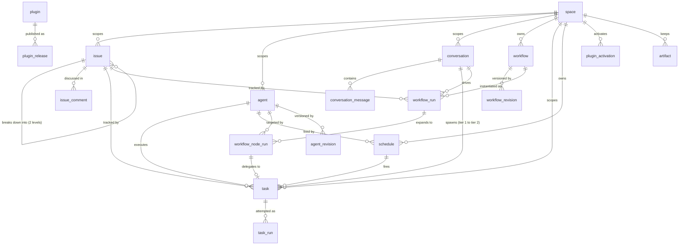
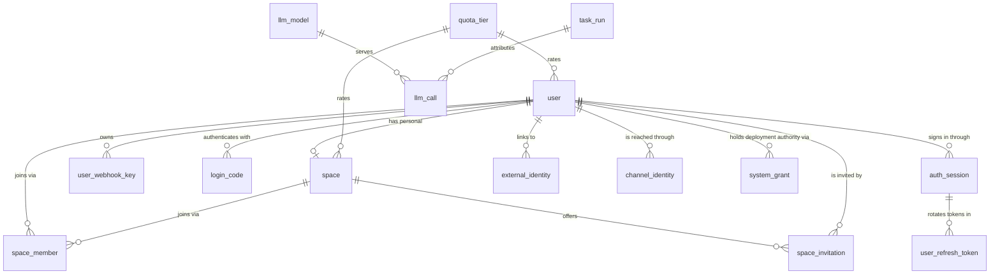

# Data Model

> **简体中文：** [阅读中文镜像](../../zh-CN/contribute/architecture/data-model.md)
> **Audience:** contributors · **Status:** current

The BuildMax server database model, its main tables, and the rules for changing
them. The `xxxRow` structs under `internal/infra/db` are the complete schema;
read them before changing a table.

For the layering around persistence — which package owns contracts versus the
implementation — see [store.md](store.md). For why the entities are shaped this
way, see [../../design/product-vision.md](../../design/product-vision.md) and
[../../design/space-governance.md](../../design/space-governance.md).

## Where The Schema Lives

There is no `.sql` file describing the current schema. The source of truth is
the set of unexported `xxxRow` structs in `internal/infra/db`, and their GORM
tags. `New` in `internal/infra/db/store.go` calls `AutoMigrate` over them at
server startup, so the running database is whatever those structs say.

The CLI and Desktop surfaces do not use this database at all. Sessions, traces,
and settings are files under `<BUILDMAX_HOME>`; see
[session.md](session.md). Everything below exists only in a server deployment.

## Conventions

These hold for every table. They are not repeated in the per-table sections.

**Two identifiers, one role each.** `id` is an auto-increment
`bigint unsigned` primary key. It is the relational key: every reference in
this document joins on it, and it never leaves `internal/infra/db`. `public_id`
is the handle every boundary sees — an API path, a JWT claim, a log line, an
object key — and it stores 96 bits of crypto-random data as its canonical text
form: 20 lowercase base32 characters (`ivyoh5qcfu6ypfkhyedq`) in a
`char(20) CHARACTER SET ascii COLLATE ascii_bin` column, written in the tables
below as `char(20) ascii_bin`. Storing the text keeps a direct `SELECT`
readable; `ascii_bin` keeps comparison memcmp, and the store writes only the
canonical lowercase form. A read rooted at a handle resolves it once through
the unique index and is numeric after that. Why, and which tables have a
handle at all, is in
[../../design/entity-identity.md](../../design/entity-identity.md) — the
storage form is its §17 amendment.

**Not every row has a handle.** A join row, a revision, and a catalog record
are addressed by something else: `space_member` by its pair, `agent_revision`
and `workflow_revision` by parent plus revision number, `plugin` by name, and
`plugin_release` by name plus version. Those tables have no `public_id`.

**Some references stay text.** A column ending in `_id` is a `bigint unsigned`
reference unless it is polymorphic, externally owned, or a value rather than a
reference — an audit actor whose type column admits an operator, an executor
that may be an agent or a workflow, a provider's tool-call ID, an
agent session that names a file. Each one is called out in its table below, and
the full list with its reasons is in `internal/architecture`, where a test
fails when a reference is added as text without one.

**Agent session IDs are not handles.** `task.session_id` and `task_run.session_id`
are `varchar(36)` UUIDs pointing at a session file under the run's
`BUILDMAX_HOME` rather than at any table. By contrast,
`user_refresh_token.session_id` names an `auth_session.public_id` and is the
session claim in access tokens issued under that login.

**No database-level foreign keys.** No row struct declares a GORM relation, so
`AutoMigrate` emits no `FOREIGN KEY` constraints, and a test in
`internal/architecture` fails when one does. Every reference described in
this document is a plain indexed column that application code is responsible
for keeping consistent. Deleting a parent row does not cascade, and a numeric
reference must not be read as implying that it would. That is decided rather
than deferred: [entity identity](../../design/entity-identity.md) §8 reviewed
the store's deletion semantics — no hard delete removes a referenced parent —
and leaves the constraints to the change that first ships a real deletion
feature, where the order has to be written down anyway.

**Timestamps are `DATETIME(6)` columns**, never `TIMESTAMP`, never an integer,
and never `DATE` unless the value genuinely has no time of day. In Go they are
`time.Time`, and on the wire RFC 3339. Columns tagged `autoCreateTime` /
`autoUpdateTime` are filled by GORM; the rest are set explicitly with
`time.Now().UTC()`. A nullable timestamp is a `*time.Time`, and its absence is
meaningful — `ended_at IS NULL` means still running, not unknown, and there are
no sentinel zeros. Every connection speaks UTC: `db.New` forces `loc=UTC` and a
`time_zone` of `+00:00` on whatever DSN it is given, so a `DATETIME` written by
the server and one read by an operator's shell are the same instant. Durations,
quotas, and counts are not instants and stay `bigint`, with the unit in the
name. The reasoning is in
[timestamp representation](../../design/timestamp-representation.md).

**Nullability is narrower than the Go type suggests.** `AutoMigrate` only emits
`NOT NULL` where a tag says so. A non-pointer Go field without `not null` maps
to a nullable column that application code never actually writes `NULL` into —
it writes the zero value. The `Null` column below reports the *database*
constraint; treat "yes" on a non-pointer field as "nullable in DDL, empty
string or 0 in practice".

**Names.** Table names are singular. Columns and JSON fields are `snake_case`.
Enumerated values are stored as strings, not integers, and the constants live in
the domain's `internal/core/*` package — the spelling is inconsistent by table
and is called out in each section (`task_run.status` shouts, `issue.status`
does not).

## Entity Relationships

The work graph — what a user actually creates and runs:

Identity, authorization, and platform tables:

Space is the authorization boundary: a request is allowed because the caller has
a `space_member` row for the resource's `space_id`. Issue is the primary
user-facing work object. Conversation owns foreground chat and may create or
project a Task. Task plus task_run is the durable Agent execution plane and its
result is authoritative without a Conversation. See
[Agent execution and Task threads](../../design/agent-execution-and-task-threads.md)
for the ownership rationale.

## Identity And Authorization

### `user`

One row per person. An operator or an allowed OIDC first sign-in may create it;
native self-registration is disabled by default (see
[../../deploy/authentication.md](../../deploy/authentication.md)).

| Column | Type | Null | Notes |
|---|---|---|---|
| `id` | `bigint unsigned` | no | Auto-increment primary key, internal |
| `public_id` | `char(20) ascii_bin` | no | Public handle, unique |
| `email` | `varchar(255)` | no | Unique; the login identifier |
| `name` | `varchar(255)` | yes | Display name |
| `password_hash` | `varchar(255)` | yes | argon2id, PHC-encoded. `NULL` until a password is set |
| `password_set_at` | `datetime(6)` | yes |  |
| `quota_tier` | `varchar(64)` | yes | References `quota_tier.tier_name` |
| `last_login_at` | `datetime(6)` | yes |  |
| `last_login_platform` | `varchar(32)` | yes | Where the last login came from |
| `disabled_at` | `datetime(6)` | yes | Non-`NULL` means every credential this account holds is refused |
| `created_at` | `datetime(6)` | yes | `autoCreateTime` |

Indexes: PK `id`; unique `email`; unique `public_id`.

`disabled_at` is read on every authenticated request, which is why it is a
column on this row rather than a side table: the check has to be one
primary-key read. Disabling is not deletion — nothing is removed, and enabling
clears the column and nothing else. What each credential does about it is in
[../../design/system-administration.md](../../design/system-administration.md)
section 8.

`last_login_at` and `last_login_platform` are written by the login handler,
which calls `UpdateLoginMeta` once the token pair is issued. A failure there is
logged and does not fail the login: the person is signed in either way, and
losing one timestamp is not worth refusing them. They record the most recent
login only — the login audit trail is `audit_event`, which keeps every one.

`password_hash` is nullable and read only by the code that verifies a login,
through `identity.PasswordStore` rather than as a field on `identity.User`. It never
rides along on a user object, so no handler can serialize it by accident.
Nullable also lets an account linked through OIDC exist without a local password;
its provider identity is recorded in `external_identity`.

### `external_identity`

An OIDC issuer and subject linked to a local user. Both protocol values are
case-sensitive; email and name are snapshots from the latest sign-in, not
identity keys.

| Column | Type | Null | Notes |
|---|---|---|---|
| `id` | `bigint unsigned` | no | Internal primary key |
| `public_id` | `char(20) ascii_bin` | no | Public handle, unique |
| `user_id` | `bigint unsigned` | no | Linked `user.id` |
| `issuer` | `varchar(255) utf8mb4_bin` | no | OIDC issuer URL |
| `subject` | `varchar(255) utf8mb4_bin` | no | OIDC subject within that issuer |
| `last_seen_email` | `varchar(320)` | yes | Attribute snapshot, not an identity key |
| `last_seen_name` | `varchar(255)` | yes | Attribute snapshot |
| `last_login_at` | `datetime(6)` | yes | Most recent sign-in through this link |
| `created_at` | `datetime(6)` | yes | `autoCreateTime` |

Indexes: PK `id`; unique `public_id`; unique (`issuer`, `subject`); unique
(`issuer`, `user_id`).

### `space`

The ownership and authorization boundary for every Portal resource.

| Column | Type | Null | Notes |
|---|---|---|---|
| `id` | `bigint unsigned` | no | Internal primary key |
| `public_id` | `char(20) ascii_bin` | no | Public handle, unique |
| `name` | `varchar(255)` | no | Display name |
| `personal_for_user_id` | `bigint unsigned` | yes | Set on a user's personal space; unique, so a user has at most one |
| `quota_tier` | `varchar(64)` | yes | References `quota_tier.tier_name` |
| `plugin_curation` | `varchar(16)` | no | Default `'open'`; `open` or `curated`, see `plugin_activation` |
| `agent_instructions` | `text` | yes | Space-level instructions appended to every background Agent run; empty means no layer |
| `agent_instructions_revision` | `bigint` | no | Advances whenever `agent_instructions` changes; starts at 0 |
| `default_sandbox_network_tier` | `varchar(64)` | yes | Tier an agent that declares no network tier inherits; empty means none, see `agent` |
| `default_sandbox_filesystem_tier` | `varchar(64)` | yes | Filesystem counterpart of `default_sandbox_network_tier` |
| `created_by` | `bigint unsigned` | no | `user.id` |
| `created_at` | `datetime(6)` | yes | `autoCreateTime` |
| `updated_at` | `datetime(6)` | yes | `autoUpdateTime` |

Indexes: PK `id`; unique `personal_for_user_id`; unique `public_id`.

Every user gets a personal space named `My Space`
(`space.DefaultPersonalName`). It is a real space row, not a special case in
the authorization code, which is why quota and membership work identically for
solo and shared use.

That arrangement is deliberate and load-bearing. Before spaces existed, issues,
agents, and conversations hung off `user_id`, and a Portal request resolved as
`JWT -> user_id -> store query -> ownership check`. Space replaced that in April
2026 — before the public history was squashed, so `git log` does not show the
transition — with one rule: every working resource belongs to a space, and a
solo user simply owns a space of one. The point was to make sharing a
membership change rather than a data migration.

Two consequences bind new code:

- **Do not add a user-scoped path around a space-scoped resource.** A handler
  that resolves ownership from `user_id` alone reintroduces the model Space
  replaced, and it will diverge from quota, membership, and every authorization
  check that reads `space_member`.
- **Solo users must never have to learn the concept.** The personal space is
  created for them and named for them; surfacing space selection, invitations,
  or roles on a path a single user must walk is a regression, not a feature.

### `space_member`

The membership join table, and the row every authorization check looks for.

| Column | Type | Null | Notes |
|---|---|---|---|
| `id` | `bigint unsigned` | no | Internal primary key |
| `space_id` | `bigint unsigned` | no | `space.id` |
| `user_id` | `bigint unsigned` | no | `user.id` |
| `role` | `varchar(32)` | no | `owner`, `admin`, or `member` |
| `created_at` | `datetime(6)` | yes | `autoCreateTime` |

Indexes: PK `id`; unique `uq_space_member_space_user` on (`space_id`, `user_id`).

Roles are `space.RoleOwner` / `RoleAdmin` / `RoleMember`. The column
is `NOT NULL` but accepts the empty string, and `core/space.EffectiveRole` reads
such a row as a member: the row is what says somebody belongs to the space, and
member is the least the three roles can mean. Nothing writes one — the space
service defaults an unset role before storing it — so that reading exists for
rows a release before the default may have left behind. Space
approvals are planned but not implemented. The audit trail is implemented in
`audit_event`; neither approval nor audit state belongs in this membership row.

### `space_invitation`

A pending offer of space membership against an account that already exists.
See [space membership lifecycle](../../design/space-membership-lifecycle.md).

| Column | Type | Null | Notes |
|---|---|---|---|
| `id` | `bigint unsigned` | no | Internal primary key |
| `public_id` | `char(20) ascii_bin` | no | Public handle, unique |
| `space_id` | `bigint unsigned` | no | `space.id` |
| `user_id` | `bigint unsigned` | no | `user.id` of the invited account |
| `role` | `varchar(32)` | no | `member` or `admin`; never `owner` — see `SetMemberRole` |
| `invited_by` | `bigint unsigned` | no | `user.id` of the sender |
| `expires_at` | `datetime(6)` | no | Three days from creation by default (`space.InvitationTTLDefault`) |
| `accepted_at` | `datetime(6)` | yes | Non-`NULL` means claimed; mutually exclusive with `revoked_at` |
| `revoked_at` | `datetime(6)` | yes | Non-`NULL` means withdrawn before acceptance |
| `created_at` | `datetime(6)` | yes | `autoCreateTime` |

Indexes: PK `id`; unique `public_id`; index `space_id`; index `user_id`.

There is no `status` column. `accepted_at`, `revoked_at`, and `expires_at`
are the whole state, the same shape `user.disabled_at` and
`system_grant.revoked_at` already use for "off until proven otherwise".
`corespace.Invitation.Pending` reads all three together.

The row never carries a code or a code hash: unlike `login_code`, a space
invitation targets an account that can already authenticate on its own, so
there is nothing to issue or deliver. Accepting one
(`AcceptInvitation`) is atomic with creating the resulting `space_member`
row — an invitation marked accepted with no membership to show for it would
be evidence of a bug no caller could act on.

### `system_grant`

One deployment-scoped authority held by one user, attached to no space. This is
the only table in the schema that grants anything outside a Space, and it grants
operation of the deployment rather than access to its contents — see
[../../design/system-administration.md](../../design/system-administration.md).

| Column | Type | Null | Notes |
|---|---|---|---|
| `id` | `bigint unsigned` | no | Internal primary key |
| `public_id` | `char(20) ascii_bin` | no | Public handle, unique |
| `user_id` | `bigint unsigned` | no | `user.id` |
| `role` | `varchar(32)` | no | `system_admin` is the only value this build accepts |
| `granted_by` | `varchar(64)` | no | Opaque: a user's handle, or `buildmax-server` when the operator command made the grant — the same string the matching audit event carries |
| `granted_at` | `datetime(6)` | no |  |
| `revoked_at` | `datetime(6)` | yes | `NULL` while the grant is in force |
| `live_marker` | `tinyint unsigned` | yes | Fixed non-`NULL` value while active; cleared on revocation |

Indexes: PK `id`; index `granted_at`; unique `idx_system_grant_live` on
(`user_id`, `role`, `live_marker`); index `user_id`; unique `public_id`.

Nothing deletes from this table. Revoking sets `revoked_at`, so the row stays
as the record that the authority existed and when it ended. The unique index
includes `live_marker` on purpose: its fixed value limits each (user, role) to
one live grant. Revocation clears it; MySQL treats those `NULL`s as distinct,
allowing any number of retired grants even when their revocation times match.

`role` is a column rather than a boolean so a second deployment role can be
added without a migration. Only roles `identity.ValidSystemRole` accepts are
stored, so the column cannot become a way to invent authority.

### `login_code`

Single-use email login codes. Rows are consumed, not deleted on use.

| Column | Type | Null | Notes |
|---|---|---|---|
| `id` | `bigint unsigned` | no | Internal primary key |
| `code_hash` | `varchar(128)` | no | Hash of the emailed code, unique — the plaintext is never stored |
| `user_id` | `bigint unsigned` | no | `user.id` |
| `expires_at` | `datetime(6)` | no | default TTL is one hour (`identity.LoginCodeTTLDefault`) |
| `used_at` | `datetime(6)` | yes | Non-`NULL` means already redeemed; a second attempt fails |
| `created_at` | `datetime(6)` | yes | `autoCreateTime` |

Indexes: PK `id`; unique `code_hash`; index `expires_at`; index `user_id`.

### `auth_session`

One durable login session. Its public ID is the `sid` claim in access tokens
and the `session_id` stored with each refresh token. An authenticated request
checks that this session is active, so revocation also rejects previously
issued access tokens.

| Column | Type | Null | Notes |
|---|---|---|---|
| `id` | `bigint unsigned` | no | Internal primary key |
| `public_id` | `char(20) ascii_bin` | no | Public session handle, unique |
| `user_id` | `bigint unsigned` | no | `user.id` |
| `platform` | `varchar(32)` | yes | Surface that opened the session |
| `auth_method` | `varchar(32)` | yes | Proof used to open the session |
| `absolute_expires_at` | `datetime(6)` | no | Hard lifetime ceiling |
| `last_seen_at` | `datetime(6)` | yes | Best-effort activity time |
| `revoked_at` | `datetime(6)` | yes | Non-`NULL` after revocation |
| `created_at` | `datetime(6)` | yes | `autoCreateTime` |

Indexes: PK `id`; unique `public_id`; index `user_id`; index `absolute_expires_at`.

### `user_refresh_token`

Signing in returns a signed access token, which has no token row, plus a
refresh token represented by a hashed row here. Both belong to the durable
`auth_session`; revoking that row rejects access and refresh attempts.

Every exchange spends the presented refresh token and issues a new one in the
same session. Its public ID is preserved through every rotation.

| Column | Type | Null | Notes |
|---|---|---|---|
| `id` | `bigint unsigned` | no | Internal primary key |
| `token_hash` | `varchar(128)` | no | Hash of the token, unique — the plaintext is returned once and never stored |
| `user_id` | `bigint unsigned` | no | `user.id` |
| `session_id` | `varchar(64)` | no | `auth_session.public_id`, preserved across every rotation |
| `platform` | `varchar(32)` | yes | Which surface logged in — a label for the reader, not enforced |
| `expires_at` | `datetime(6)` | no | default TTL is 30 days (`identity.RefreshTokenTTLDefault`) |
| `used_at` | `datetime(6)` | yes | Non-`NULL` means already exchanged |
| `revoked_at` | `datetime(6)` | yes | Non-`NULL` means retired by a logout or a reuse report |
| `replaced_by` | `varchar(128)` | yes | Hash of the token issued in exchange; lets an operator walk a chain back to its login |
| `created_at` | `datetime(6)` | yes | `autoCreateTime` |

Indexes: PK `id`; index `expires_at`; index `session_id`; unique `token_hash`;
index `user_id`.

A token presented after it was already exchanged means two holders, so the
store revokes the whole session rather than guessing which one is legitimate.
The exception is a short grace window after an exchange, which exists because
the CLI and Desktop share one credentials file between processes and refreshing
twice at once is normal there. Rows are swept once they expire; revoked rows are
kept until then, so a reuse report still has a chain to inspect.

### `user_webhook_key`

API keys for the inbound webhook surface documented in
[../../reference/webhook.md](../../reference/webhook.md).

| Column | Type | Null | Notes |
|---|---|---|---|
| `id` | `bigint unsigned` | no | Internal primary key |
| `public_id` | `char(20) ascii_bin` | no | Public handle, unique |
| `user_id` | `bigint unsigned` | no | `user.id` — keys are user-scoped, not space-scoped |
| `key_hash` | `varchar(128)` | no | Unique; the secret is shown once at creation and never again |
| `name` | `varchar(255)` | yes | Human label |
| `created_at` | `datetime(6)` | yes | `autoCreateTime` |

Indexes: PK `id`; unique `key_hash`; index `user_id`; unique `public_id`.

### `channel_identity`

Links one chat-platform account to one user, so messages from it act as that
user. It is not a sign-in credential. See
[instant-messaging channels](../../design/instant-messaging-channels.md).

| Column | Type | Null | Notes |
|---|---|---|---|
| `id` | `bigint unsigned` | no | Internal primary key |
| `public_id` | `char(20) ascii_bin` | no | Public handle, unique |
| `user_id` | `bigint unsigned` | no | `user.id`; a user may link several chat accounts |
| `platform` | `varchar(32) ascii_bin` | no | `telegram` |
| `tenant` | `varchar(128) utf8mb4_bin` | no | Scopes the account id on platforms with per-organization ids; empty on Telegram |
| `external_user_id` | `varchar(128) utf8mb4_bin` | no | The platform's immutable account id, never a display name |
| `handle` | `varchar(255)` | yes | Display name at link time, for recognition only |
| `created_at` | `datetime(6)` | yes | `autoCreateTime` |

Indexes: PK `id`; unique `uq_channel_identity_external` on (`platform`,
`tenant`, `external_user_id`) — a chat account speaks for at most one user;
index `user_id`; unique `public_id`.

### `channel_pairing`

A link request a chat account started and a signed-in user has not confirmed.
Rows live for ten minutes; creating one sweeps expired rows.

| Column | Type | Null | Notes |
|---|---|---|---|
| `id` | `bigint unsigned` | no | Internal primary key |
| `code_hash` | `char(64) ascii_bin` | no | SHA-256 of the code; unique; the code itself is never stored |
| `platform` | `varchar(32) ascii_bin` | no | |
| `tenant` | `varchar(128) utf8mb4_bin` | no | |
| `external_user_id` | `varchar(128) utf8mb4_bin` | no | The requesting chat account |
| `chat_id` | `varchar(128) utf8mb4_bin` | no | Where the bot confirms the link |
| `handle` | `varchar(255)` | yes | Shown to the person confirming |
| `expires_at` | `datetime(6)` | no | Indexed |
| `created_at` | `datetime(6)` | yes | `autoCreateTime` |

Indexes: PK `id`; unique `code_hash`; unique `uq_channel_pairing_external` on
(`platform`, `tenant`, `external_user_id`) — one pending request per chat
account; index `expires_at`.

### `quota_tier`

Rate limits, referenced by name from `user.quota_tier` and `space.quota_tier`.
This is the one table whose primary key is not `id`.

| Column | Type | Null | Notes |
|---|---|---|---|
| `tier_name` | `varchar(64)` | no | Primary key |
| `max_runs_per_period` | `bigint` | no | Task runs allowed per window |
| `max_tokens_per_period` | `bigint` | no | Prompt plus completion tokens per window |
| `max_storage_bytes` | `bigint` | no | Live Artifact storage cap; zero means unlimited and has no period window |
| `period_days` | `bigint` | no | Window length |

Indexes: PK `tier_name`.

`SeedDefaultQuotaTiers` inserts `free_trial` (10 runs, 100,000 tokens, 30 days)
and `pro` (1,000 runs, 10,000,000 tokens, 30 days) at startup, but only when
the table is empty — an operator who edits a tier will not have it overwritten
on restart.

There is deliberately **no usage table**. `SpaceUsageInWindow` aggregates on
read: it counts `task_run` rows joined to `task` by space, sums their
`prompt_tokens` and `completion_tokens`, and adds the title-generation tokens
recorded on tasks created in the same window. Metering therefore has no second
write path that can drift out of sync with the runs themselves.

### `audit_event`

Governance evidence: that an action happened and who performed it. Writes are
append-only; a configured retention sweep may delete old events by age and
records each prune. No action can edit an existing event.

| Column | Type | Null | Notes |
|---|---|---|---|
| `id` | `bigint unsigned` | no | Internal primary key |
| `public_id` | `char(20) ascii_bin` | no | Public handle, unique |
| `space_id` | `bigint unsigned` | yes | Empty for actions with no space, such as a login |
| `created_at` | `datetime(6)` | no |  |
| `actor_type` | `varchar(16)` | no | `user`, `worker`, or `system` |
| `actor_id` | `varchar(64)` | no | User ID, or a process name for `system` |
| `action` | `varchar(64)` | no | `user.login`, `user.logout`, `user.password_set`, `auth.refresh_reuse`, `space.member_added`, `llm_model.created`, `access.denied`, … |
| `target_type` | `varchar(32)` | yes | Kind of target, including values that are not rows |
| `target_id` | `varchar(64)` | yes | Opaque target handle or name |
| `task_run_id` | `varchar(20)` | yes | Public handle of the run on whose behalf the action occurred |
| `detail` | `varchar(255)` | yes | A short non-sensitive note — a role name, a model name |

Indexes: PK `id`; index `action`; index `actor_id`; index `task_run_id`; index `idx_audit_space_time`
on (`space_id`, `created_at`); unique `public_id`.

Action strings are persisted and therefore permanent: renaming one rewrites
history for every reader that filters on it. They are declared in
`internal/core/audit/audit.go`.

**No prompts, generated content, tool output, or credentials.** This table
answers a governance question; run diagnostics belong to the durable run trace
and per-call accounting to `llm_call`. Recording the same fact in two places
would give it two retention policies and two chances to disagree.

Writes go through `internal/service/audit`, which logs a failed insert rather
than failing the action that caused it. That is a deliberate trade with a real
cost: the table records what happened while the database was reachable, not
every action that occurred. A deployment needing the stronger property has to
make the write part of the same transaction as the action.

### `schema_migration`

One row per applied migration. It is the record of what has been done to a
database, and the reason each migration runs at most once.

| Column | Type | Null | Notes |
|---|---|---|---|
| `id` | `varchar(191)` | no | Primary key; the migration's permanent identifier. 191 is MySQL's longest indexable `varchar` under `utf8mb4` |
| `applied_at` | `datetime(6)` | no |  |

Indexes: PK `id`.

Rows are never deleted. A missing row means that migration runs again, which is
what makes recovery from a crash mid-migration work and what makes deleting a
row a way to corrupt a database.

The table also tells a binary that the database is ahead of it: an ID here that
the binary does not know is a migration from a later release. See
[Forward Only During Alpha](#forward-only-during-alpha).

## Work Objects

### `issue`

The primary user-facing work object.

| Column | Type | Null | Notes |
|---|---|---|---|
| `id` | `bigint unsigned` | no | Internal primary key |
| `public_id` | `char(20) ascii_bin` | no | Public handle, unique |
| `user_id` | `bigint unsigned` | no | Owning user |
| `space_id` | `bigint unsigned` | yes | Owning space; the authorization key |
| `parent_issue_id` | `bigint unsigned` | yes | `issue.id` of the parent; `NULL` for a top-level issue |
| `title` | `varchar(255)` | no | |
| `description` | `text` | no | |
| `status` | `varchar(32)` | no | `todo`, `in_progress`, `done` |
| `owner_id` | `bigint unsigned` | yes | Accountable person; `user.id` |
| `executor_kind` | `varchar(32)` | yes | `agent` or `workflow` |
| `executor_id` | `varchar(64)` | yes | Interpreted according to `executor_kind`: an `agent_id` or `workflow_id` |
| `created_by` | `bigint unsigned` | no | `user.id` |
| `version` | `bigint unsigned` | no | Optimistic-concurrency token, starts at 1 |
| `created_at` | `datetime(6)` | yes | `autoCreateTime` |
| `updated_at` | `datetime(6)` | yes | `autoUpdateTime` |

Indexes: PK `id`; index `parent_issue_id`; index `idx_issue_space_updated` on
(`space_id`, `updated_at`); index `user_id`; index `owner_id`; unique `public_id`.

`version` makes every update conditional. An update carries the version it was
built from, the store writes with `WHERE public_id = ? AND version = ?` and sets
`version = version + 1`, and a caller whose version no longer matches gets
`coreissue.ErrVersionConflict` — a 409 — instead of overwriting a change it
never read. There is no unconditional update path: an update with no version
fails, because the zero value matches no row. `updated_at` was not reused for
this; it is a display and ordering value whose exact round trip through RFC 3339
is not something a correctness check should rest on.

`owner_id` is a resolved reference: an owner is always a user row, so it is a
plain indexed `bigint unsigned` like any other. The `executor_kind` /
`executor_id` pair is a polymorphic reference — no index or constraint ties it
to a specific table, so validation lives in `internal/service/issue`. Owner and
executor are independent: an issue can have an accountable person, a selected
Agent or Workflow, both, or neither.

`parent_issue_id` is a self-reference forming an adjacency list, and the
hierarchy is capped at **two levels**: a parent must itself have
`parent_issue_id IS NULL`. Nothing in the schema enforces that — the invariants
live in `internal/service/issue`, which also rejects a parent in another space, a
self-parent, and giving a parent to an issue that already has children. Progress
(`child_count`, `done_child_count`) is computed per response with a grouped
query and never stored. See
`internal/service/issue` for the authoritative validation.

### `issue_comment`

One statement about an issue, addressed to people.

| Column | Type | Null | Notes |
|---|---|---|---|
| `id` | `bigint unsigned` | no | Internal primary key |
| `public_id` | `char(20) ascii_bin` | no | Public handle, unique |
| `issue_id` | `bigint unsigned` | no | `issue.id` |
| `author_kind` | `varchar(16)` | no | `user`, `agent`, `local_agent`, or `system` |
| `author_id` | `varchar(64)` | no | `user_id` or `agent_id`; the reporting person for `local_agent`; empty for `system` |
| `body` | `text` | no | Markdown source, stored raw; capped at 16 KiB by the service |
| `source_task_id` | `bigint unsigned` | yes | Set on an `agent` comment; never on a `local_agent` one, which names no run |
| `source_task_run_id` | `bigint unsigned` | yes | Set on an `agent` comment; never on a `local_agent` one, which names no run |
| `created_at` | `datetime(6)` | yes | `autoCreateTime` |
| `edited_at` | `datetime(6)` | yes | `NULL` until the body is changed |

Indexes: PK `id`; index `idx_issue_comment_issue_created` on (`issue_id`,
`created_at`); unique `public_id`.

Ordering is by `created_at`, then `id` — a thread reads oldest first, and a
public handle is random rather than time-ordered.

The row carries **no `space_id`**. A comment's space is its issue's space, and
every handler already loads the issue to authorize; denormalizing the
authorization key would give it a second place to be wrong. This follows
`conversation_message`, which resolves its space through its conversation.

Deletion is hard — there is no `deleted_at` and no tombstone. Editing is
restricted to the person who wrote the comment; an agent or system comment is
the record of what a run reported and is editable by nobody, though a space owner
may delete one.

### `agent`

A stored agent definition: a name plus system instructions that a task can run
under.

| Column | Type | Null | Notes |
|---|---|---|---|
| `id` | `bigint unsigned` | no | Internal primary key |
| `public_id` | `char(20) ascii_bin` | no | Public handle, unique |
| `user_id` | `bigint unsigned` | no | Owning user |
| `space_id` | `bigint unsigned` | yes | Owning space |
| `name` | `varchar(255)` | no | |
| `description` | `text` | yes | Shown in pickers |
| `instructions` | `text` | yes | Appended to the system prompt for runs using this agent |
| `model` | `varchar(255)` | yes | Catalog model name; empty means the deployment default |
| `plugins` | `text` | yes | JSON array of catalog plugin names this agent loads |
| `sandbox_network_tier` | `varchar(64)` | yes | `none`, `registries`, or `open`; empty inherits the space default, then the surface baseline |
| `sandbox_filesystem_tier` | `varchar(64)` | yes | `workspace`, `workspace_plus_shared_read`, or `workspace_plus_external_write`; same fallback as the network tier |
| `secret_consumption` | `text` | yes | JSON declaration of Space Secrets the Agent consumes |
| `revision` | `bigint` | no | Number of the `agent_revision` row holding this content; starts at 1 |
| `deleted_at` | `datetime(6)` | yes | Set when the agent was deleted; the row stays |
| `created_at` | `datetime(6)` | yes | `autoCreateTime` |

Indexes: PK `id`; index `deleted_at`; index `space_id`; index `user_id`; unique
`public_id`.

Deletion is a stamp on `deleted_at`, not a `DELETE`. Tasks, workflow step runs,
and revisions all name an agent by ID, so removing the row turned every one of
those into a dangling reference and broke any workflow run still in flight at
its next step. Reads split accordingly: `GetAgent` and the list queries see only
live agents, so nothing can start new work with a deleted one, while
`GetAgentIncludingDeleted` resolves what an existing record refers to. Deleting
an agent a `published` workflow still names is refused with `409` — that
workflow could still be run, and the failure would otherwise surface at the next
run rather than at the delete. Draft and archived workflows do not block it,
because neither can start a run and publishing revalidates its agents.

`plugins` names catalog plugins, never releases: the version and digest come
from the space's `plugin_activation` row, so moving a plugin to a new release
stays one edit in one place. Nothing is inherited from the space's activations —
an agent that names none loads none — and the list is stored trimmed,
deduplicated, and sorted, so reordering the same set does not append a revision.
It is a JSON column rather than a join table because nothing queries inside it:
the selection is written and read whole, and "which agents name this plugin" is
a scan of one space's agents.

There is no undelete route. The row exists so references resolve, not as a
recycle bin.

These are server-side agent records. They are distinct from the workspace
subagents defined as Markdown files under `.buildmax/`; see
[manual/skills-and-subagents.md](../../../manual/skills-and-subagents.md).

### `agent_revision`

One recorded version of an agent definition. Rows are appended, never updated or
deleted.

| Column | Type | Null | Notes |
|---|---|---|---|
| `id` | `bigint unsigned` | no | Internal primary key |
| `agent_id` | `bigint unsigned` | no | `agent.id` |
| `revision` | `bigint` | no | 1 for the first recorded content, then one higher per change |
| `name` | `varchar(255)` | no | |
| `description` | `text` | yes | |
| `instructions` | `text` | yes | |
| `model` | `varchar(255)` | yes | Catalog model name this revision recorded |
| `plugins` | `text` | yes | JSON array; the selection this revision recorded |
| `sandbox_network_tier` | `varchar(64)` | yes | The tier this revision recorded |
| `sandbox_filesystem_tier` | `varchar(64)` | yes | The tier this revision recorded |
| `secret_consumption` | `text` | yes | Secret-consumption declaration this revision recorded |
| `created_by` | `bigint unsigned` | no | The user who wrote this revision, not necessarily the agent's owner |
| `created_at` | `datetime(6)` | yes | `autoCreateTime` |

Indexes: PK `id`; unique `idx_agent_revision` on (`agent_id`, `revision`).

The revision is written in the same transaction as the agent row it describes,
and the unique (`agent_id`, `revision`) index makes a concurrent second write
fail rather than record two definitions under one number. An update that changes
nothing appends no revision. Restoring an earlier revision is an ordinary
update: it appends a new revision holding the old content rather than rewinding
to it.

Revisions outlive the agent's use: a deleted agent keeps its history, which is
what a past run's provenance points at. The revision routes serve live agents
only, so reading a deleted agent's history means querying the table.

Agents and workflows that existed before revision history was added were given a
revision 1 by migration `0003_seed_first_agent_and_workflow_revision`. That row
is an approximation: its author is whoever created the record and its timestamp
is when the content last moved, neither of which necessarily identifies the edit
that produced the content it holds.

### `conversation`

The independent foreground chat and optional Agent-task orchestrator. It owns
its messages, not the Tasks it may start or display.

| Column | Type | Null | Notes |
|---|---|---|---|
| `id` | `bigint unsigned` | no | Internal primary key |
| `public_id` | `char(20) ascii_bin` | no | Public handle, unique |
| `user_id` | `bigint unsigned` | no | Owning user |
| `space_id` | `bigint unsigned` | yes | Owning space |
| `channel` | `varchar(32)` | no | `portal`, `telegram`, or `webhook`; schedules and direct Agent runs do not create Conversations |
| `channel_ref` | `varchar(191) utf8mb4_bin` | no | The chat a platform-carried conversation answers to (Telegram: the chat id); empty otherwise. Several rows share one ref; the newest is the chat's current conversation |
| `title` | `varchar(256)` | yes | Generated from the first turn |
| `created_by` | `bigint unsigned` | no | `user.id` |
| `turn_fence` | `bigint` | no | Highest accepted turn-lease fencing token; rejects stale message writers |
| `created_at` | `datetime(6)` | yes | `autoCreateTime` |

Indexes: PK `id`; index `idx_conversation_space_created` on (`space_id`,
`created_at`); index `idx_conversation_user_created` on (`user_id`,
`created_at`); index `idx_conversation_channel_ref` on (`channel_ref`,
`created_at`); unique `public_id`.

Transport channel constants are in
`internal/service/conversation/channel/types.go`. `system` exists as a constant
but is not in `ValidChannels`, so it cannot be supplied by a caller. Neither is
`telegram`: only the channel gateway creates such a conversation, because it is
the path that also sets `channel_ref`.

A workflow step and an issue agent run each create a Task directly, with
`task.space_id` as owner and no `conversation_id`; neither creates a
conversation for Task to hang on. See
[agent execution and Task threads](../../design/agent-execution-and-task-threads.md).

### `conversation_message`

One message in a Tier 1 conversation, including tool traffic.

| Column | Type | Null | Notes |
|---|---|---|---|
| `id` | `bigint unsigned` | no | Internal primary key |
| `public_id` | `char(20) ascii_bin` | no | Public handle, unique |
| `conversation_id` | `bigint unsigned` | no | `conversation.id` |
| `role` | `varchar(16)` | no | LLM message role |
| `content` | `text` | no | |
| `channel` | `varchar(32)` | yes | Overrides the conversation channel for this message |
| `tool_call_id` | `varchar(64)` | yes | Set on a tool result, linking it to the call that produced it |
| `tool_calls` | `text` | yes | JSON array of tool calls on an assistant message; the Go field is `ToolCallsJSON` but the column is `tool_calls` |
| `provider_state` | `text` | yes | Opaque reasoning state on an assistant message, stored and replayed but never read here; the Go field is `ProviderStateJSON` |
| `parts` | `mediumtext` | yes | Non-text content on the message, such as an image a tool returned; `content` stays the text describing it. The Go field is `PartsJSON` |
| `created_at` | `datetime(6)` | yes | `autoCreateTime` |

Indexes: PK `id`; index `idx_conversation_message_conversation` on
(`conversation_id`, `created_at`); unique `public_id`.

Ordering is by `created_at`, then `id`. Prefixed IDs are random, not
time-ordered, so never sort by `conversation_message_id`.

`provider_state` holds what a protocol produced and requires back unchanged —
Anthropic thinking blocks, OpenAI Responses reasoning items. A Tier 1 turn
resumes from these rows, so without it a second turn would send the upstream a
conversation it rejects. A row written before the column existed, or one holding
something that no longer parses, replays as a message without state rather than
failing the turn. See
[design/llm-provider-adapters.md](../../design/llm-provider-adapters.md).

## Background Execution

Task plus task_run is durable Agent execution. TaskRun owns the result;
Conversation, Issue, and Workflow views may project it through explicit
optional relations.

### `schedule`

A space-owned recurring time trigger. Each due firing starts either an Agent
Task or a published Workflow run, named by `executor_kind` and `executor_id`.
The schedule owns no execution state: the resulting Task or Workflow run owns
the outcome and records the schedule that started it. See
[Scheduled Agent execution](../../design/scheduled-agent-execution.md).

| Column | Type | Null | Notes |
|---|---|---|---|
| `id` | `bigint unsigned` | no | Internal primary key |
| `public_id` | `char(20) ascii_bin` | no | Public handle, unique |
| `space_id` | `bigint unsigned` | no | Owning space, authoritative for every schedule operation |
| `executor_kind` | `varchar(32)` | no | `agent` or `workflow` |
| `executor_id` | `varchar(64)` | no | Opaque public handle interpreted by `executor_kind` |
| `created_by` | `bigint unsigned` | no | `user.id`; carried onto each firing's Task |
| `name` | `varchar(256)` | yes | Human label |
| `input` | `text` | no | Fixed Agent prompt or Workflow input JSON |
| `cron_expr` | `varchar(256)` | no | Recurrence rule; parsed by the dispatcher, not this layer |
| `timezone` | `varchar(64)` | no | IANA name the cron is evaluated in; storage stays UTC |
| `enabled` | `boolean` | no | A disabled (paused) schedule keeps its row and next fire but is not claimed |
| `pause_reason` | `varchar(32)` | no | Why the dispatcher paused it; empty while enabled |
| `next_fire_at` | `datetime(6)` | no | UTC due time; the dispatcher's claim target |
| `last_fire_at` | `datetime(6)` | yes | Most recent firing time |
| `last_fire_ref` | `varchar(64)` | yes | Public Task or Workflow-run handle from the most recent firing |
| `consecutive_failures` | `bigint` | no | Firings that failed to admit a Task since the last success; bounds runaway cost |
| `created_at` | `datetime(6)` | yes | `autoCreateTime` |
| `updated_at` | `datetime(6)` | yes | `autoUpdateTime` |

Indexes: PK `id`; index `idx_schedule_due` on (`enabled`, `next_fire_at`) for the due query; index
`idx_schedule_space_created` on (`space_id`, `created_at`); unique `public_id`.

A firing is exactly-once per due time through a conditional update of
`next_fire_at`: the dispatcher advances it only when it still equals the value it
read, so one of several racing replicas wins.

### `task`

The durable unit of background work. One task, many attempts.

| Column | Type | Null | Notes |
|---|---|---|---|
| `id` | `bigint unsigned` | no | Internal primary key |
| `public_id` | `char(20) ascii_bin` | no | Public handle, unique |
| `conversation_id` | `bigint unsigned` | yes | Optional origin/projection relation; a direct Agent, Issue, or Workflow task has none |
| `space_id` | `bigint unsigned` | no | Owning space, authoritative for every Task operation |
| `issue_id` | `bigint unsigned` | yes | The issue this task advances, if any |
| `schedule_id` | `bigint unsigned` | yes | The recurring time trigger that created this task, if any; an origin relation, never an authorization parent |
| `status` | `varchar(32)` | no | `PENDING`, `SCHEDULED`, `RUNNING`, `SUCCEEDED`, `FAILED`, `CANCELED` |
| `input` | `text` | no | The prompt |
| `title` | `varchar(256)` | yes | LLM-generated |
| `title_prompt_tokens` | `bigint` | yes | Tokens spent generating the title — counted against quota |
| `title_completion_tokens` | `bigint` | yes | Same |
| `output` | `text` | yes | Result of the latest successful run |
| `output_schema` | `text` | yes | JSON Schema for a run's final answer; `NULL` for free text |
| `created_by` | `bigint unsigned` | no | `user.id` |
| `created_at` | `datetime(6)` | yes | `autoCreateTime` |
| `started_at` | `datetime(6)` | yes | First run start |
| `ended_at` | `datetime(6)` | yes | Terminal-status time |
| `error_message` | `text` | yes | |
| `session_id` | `varchar(36)` | yes | UUID of the agent session file, not a table reference |
| `last_run_id` | `bigint unsigned` | yes | `task_run.id` of the most recent attempt |
| `agent_id` | `bigint unsigned` | yes | `agent.id` this task runs as |
| `workspace_head_checkpoint_id` | `bigint unsigned` | yes | `workspace_checkpoint.id` accepted as the Task's recoverable workspace; its seed, then each successful result. Null until the first run commits one |
| `plugin_environment_head_id` | `bigint unsigned` | yes | Immutable Plugin environment the next Continue uses; null for a Task that installs nothing autonomously |
| `admission_key` | `varchar(191)` | yes | A coordinator's stable idempotency key, unique within the space; `NULL` for the ordinary task no coordinator replays. A Workflow node dispatch uses `workflow/<workflow_run_id>/node/<node_id>` |
| `admission_fingerprint` | `char(64)` | yes | Digest of the admitted payload, compared on replay to tell an identical admission from a conflicting reuse of the same key; `NULL` when `admission_key` is |

Indexes: PK `id`; index `agent_id`; index `conversation_id`; index `issue_id`;
index `schedule_id`; index `last_run_id`; index `workspace_head_checkpoint_id`;
index `plugin_environment_head_id`; index `idx_task_space_created` on
(`space_id`, `created_at`); unique `public_id`; unique `uq_task_admission_key`
on (`space_id`, `admission_key`).

Status values are `task.RunStatus` — uppercase, and shared with `task_run`.

`AdmitTask` makes creation idempotent for a coordinator that can replay its
dispatch. The unique `(space_id, admission_key)` index is the arbiter: the first
insert wins, and a replayed or concurrent admission that loses the race reads
the winner's task back and returns it, so a Workflow node dispatch retried
across the crash window between admitting the task and linking it cannot
duplicate execution. A `NULL` key is not a duplicate of another `NULL` in a
MySQL unique index, so every ordinary task coexists freely. A different payload
under an existing key is refused with a conflict rather than adopting unrelated
work.

### `task_run`

One execution attempt. This is the row quota and token accounting read.

| Column | Type | Null | Notes |
|---|---|---|---|
| `id` | `bigint unsigned` | no | Internal primary key |
| `public_id` | `char(20) ascii_bin` | no | Public handle, unique |
| `task_id` | `bigint unsigned` | no | `task.id` |
| `previous_task_run_id` | `bigint unsigned` | yes | Immutable predecessor in the Task's linear run history; the worker restores this run's session bundle |
| `input` | `text` | no | Prompt for this attempt; a rerun may differ from the task's |
| `created_by` | `varchar(64)` | yes | `user.id`, empty for system-triggered runs |
| `created_by_type` | `varchar(32)` | yes | `user`, `webhook`, or `system` |
| `trigger_source` | `varchar(64)` | yes | Source such as `task_create`, `task_retry`, `portal_conversation`, `issue_agent_run`, `workflow_step`, `schedule`, or `webhook`; constants live in `internal/core/task` |
| `status` | `varchar(32)` | no | Same `task.RunStatus` values as `task` |
| `output` | `text` | yes | |
| `structured` | `text` | yes | Validated structured result as JSON; `NULL` for free text |
| `error_message` | `text` | yes | |
| `started_at` | `datetime(6)` | yes | |
| `ended_at` | `datetime(6)` | yes | `NULL` while running |
| `session_id` | `varchar(36)` | yes | UUID of this run's session file |
| `worker_type` | `varchar(32)` | yes | `local_process` or `k8s_job`; see below for when it is written |
| `k8s_job_name` | `varchar(128)` | yes | The Job that ran this run; `NULL` under the local runner |
| `k8s_job_created_at` | `datetime(6)` | yes | When that Job was created; `NULL` under the local runner |
| `prompt_tokens` | `bigint` | yes | Quota input |
| `completion_tokens` | `bigint` | yes | Quota input |
| `trace_path` | `varchar(512)` | yes | This run's durable trace inside run-global storage, e.g. `traces/<session>/rt_….jsonl`; `NULL` when none was written |
| `cancel_requested_at` | `datetime(6)` | yes | When someone asked this run to stop; `NULL` when nobody has |
| `cancel_requested_by` | `bigint unsigned` | yes | `user.id` of whoever asked |
| `cancel_reason` | `varchar(32)` | no | Bounded cause of cancellation; empty when none was recorded |
| `retry_of_task_run_id` | `bigint unsigned` | yes | The run this one repeats; `NULL` for a run that carries its own instructions |
| `source_message_id` | `bigint unsigned` | yes | `conversation_message.id` this run was asked for in; `NULL` when no message asked for it |
| `agent_revision` | `int` | yes | Which revision of `task.agent_id` this run was served; `NULL` for a run with no agent or one that never reached a worker |
| `space_agent_instructions_revision` | `int` | yes | Which revision of the owning space's Space-level instructions this run was served; `0` records no configured text, `NULL` means no provenance |
| `plugin_pins` | `text` | yes | JSON array of `{plugin_name, version, digest}`: the releases this run was given |
| `sandbox_network_tier` | `varchar(64)` | yes | The tier resolved on the first poll -- agent declaration, then space default, then the surface baseline; `NULL` until a worker claims the run |
| `sandbox_filesystem_tier` | `varchar(64)` | yes | The tier resolved on the first poll, same fallback as `sandbox_network_tier` |
| `last_seen_at` | `datetime(6)` | yes | When this run's worker last polled its own route; `NULL` until a worker claims the run |
| `idempotency_key` | `varchar(128)` | yes | Caller's dedup key for a Continue request; `NULL` for a run created without one — a retry, a workflow step, an issue agent run, or an older client |
| `workspace_base_checkpoint_id` | `bigint unsigned` | yes | `workspace_checkpoint.id` this run was authorized to read and modify, fixed before execution |
| `workspace_result_checkpoint_id` | `bigint unsigned` | yes | Successful result checkpoint this run committed |
| `workspace_partial_checkpoint_id` | `bigint unsigned` | yes | Partial checkpoint captured after failure, cancellation, or interruption; never the Task head |
| `workspace_restore_status` | `varchar(32)` | yes | `not_requested`, `pending`, `restored`, or `failed` |
| `workspace_restore_error` | `text` | yes | Bounded operator-facing reason a restore failed |
| `workspace_checkpoint_status` | `varchar(32)` | yes | `not_requested`, `pending`, `committed`, or `failed` |
| `workspace_checkpoint_error` | `text` | yes | Bounded operator-facing reason a capture or commit failed |
| `plugin_environment_base_id` | `bigint unsigned` | yes | Immutable Plugin set materialized for this run |
| `plugin_environment_result_id` | `bigint unsigned` | yes | New Plugin set a committed autonomous install requested; takes effect on the next TaskRun boundary |
| `plugin_environment_status` | `varchar(32)` | yes | `unchanged`, `pending`, `committed`, or `failed` |
| `plugin_environment_error` | `text` | yes | Bounded installation or materialization reason |
| `created_at` | `datetime(6)` | yes | `autoCreateTime` |

Indexes: PK `id`; index `cancel_requested_at`; index `created_by`; index
`last_seen_at`; index `previous_task_run_id`; index `retry_of_task_run_id`; index `source_message_id`; index
`idx_task_run_task_created` on (`task_id`, `created_at`); unique `public_id`;
unique `idx_task_run_idempotency` on (`task_id`, `idempotency_key`).

A repeated `POST .../tasks/{task_id}/runs` naming the same idempotency key on
the same task returns the run the first call created rather than starting a
second one — while that run is still active and after it has finished. `NULL`
is not a duplicate of `NULL` in a MySQL unique index, so every run created
without a key coexists with every other one. `CreateTaskRun` takes a locking
read on the task row before checking this and the active-run count below, so
two concurrent callers for one task cannot both see a clean slate and both
insert; see [agent execution and Task threads §12](../../design/agent-execution-and-task-threads.md#12-failure-recovery-and-concurrency).

`agent_revision` is not a reference to `agent_revision.id`: a revision is
addressed by its agent plus its number, and the task already holds the agent. It
is written when a worker asks for its run, and the first write wins — instructions
are resolved per dispatch so an edit takes effect on the next run, and the record
exists so an edit during a run cannot rewrite what that run was given.

`space_agent_instructions_revision` follows the same first-write-wins rule. The
worker receives the owning space's current Space instructions as a separate
system-prompt layer before the selected Agent's instructions; editing the Space
changes the next run, not one already executing.

`plugin_pins` is written at that same moment and under the same rule, because it
answers the same question about the same run. The server resolves the space's
`plugin_activation` rows against the agent's selection and sends a finished list;
a worker never reads activations itself. Resolving at claim time rather than at
dispatch is safe because an activation names an exact version and digest — the
pin, not the timing, is what stops a release published in between from changing
what a run loads. The trace carries the same inventory, but a trace is fail-open
and lives in run-global storage, so this column is the queryable fact and what a
retry reads. Empty for a run whose agent named no plugin, for a run with no
agent, and for one that never reached a worker.

`source_message_id` is what a person actually said; `input` is what Tier 1
decided to send a worker. They are different texts and keeping both is the
point: a constraint missing from `input` is either one the model dropped or one
the user never gave, and nothing else in the schema can tell those apart. Each
run records its own — a task's first run names the message that created it, a
continuation names the message that asked for it. It is `NULL` for every origin
that is not a message: a workflow step, an issue agent run, a retry, and a task
created straight from the API. A handle that does not resolve leaves the column
`NULL` rather than refusing the run; losing provenance is better than refusing
work someone asked for.

`retry_of_task_run_id` points at the run a retry repeats, one link per row: a
retry of a retry names the run it repeated, not the first of the chain. It is
not a foreign key, and the run it names is never modified — a retry is a new
attempt, not a rewrite of the record that explains why one was needed. The
matching `trigger_source` is `task_retry`.

`previous_task_run_id` is different from retry lineage: it names the run that
was current immediately before this run was admitted, whether the new run is a
Continue or a Retry. It is written in the same transaction that advances
`task.last_run_id` and never changes afterwards. Workers use this immutable
value to restore the prior session bundle; reading the Task projection would
only return the current run after admission.

`cancel_requested_at` is a request, not a status: a run a worker already holds
stays `RUNNING` until that worker reports `CANCELED`, because nothing else can
end another process's agent loop. The worker sees the request by polling its own
run route, and `StaleRunReaper` finishes runs whose worker never confirms — the
same backstop that closes abandoned ones. Both columns are written once; a
second cancel does not overwrite who asked first.

`last_seen_at` is how the server tells a worker that died from one that is
slow. It is written on `GET /api/worker/task-runs/{id}` and nowhere else: a
worker polls that route every few seconds for the whole time its run is
`RUNNING`, so the signal already existed and only had to be recorded. The
streaming route deliberately does not stamp — it fires many times a second — and
neither does the terminal `PATCH`, which would move the timestamp past the
moment the work stopped. `StaleRunReaper` reads it to fail `RUNNING` runs that
have gone silent, minutes after the fact rather than at `worker.run_timeout`.
`NULL` is never reaped for silence: no signal was ever recorded, so there is
nothing to have gone quiet.

`worker_type`, `k8s_job_name`, and `k8s_job_created_at` are written by
`Scheduler.dispatch` through `UpdateTaskRunWorkerInfo`, once the runner returns
without error. When that happens differs by runner, and the difference matters
before reading these columns:

- **`k8s_job`** returns as soon as the Job is created, so all three are written
  at dispatch and are readable for the whole run.
- **`local_process`** blocks for the entire run, so `worker_type` is written
  only after the worker exits, and only when it exits cleanly — a spawn or exit
  failure takes the failure path, which records the error instead. The two
  Kubernetes columns stay `NULL`.

Nothing reads any of them yet. `k8s_job_name` is what a future sweep would use
to ask Kubernetes why a worker disappeared — `OOMKilled` and `Evicted` are the
same silence from the server's side — but that would cover the `k8s_job` runner
only, which is why `last_seen_at` rather than Job status is what the stale-run
reaper watches.

`trace_path` is written by the worker on the terminal PATCH, on failure as well
as success. It is stored rather than derived because the trace's file name is
the agent run id, which is generated inside the run and appears nowhere else.
The value is the same key `uploadTaskGlobal` uploads the file under, so it
resolves directly against run-global storage — a test in
`internal/agentapp/taskrun` couples the two computations so they cannot drift.

The scheduler claims work by polling for the oldest pending run
(`GetNextPendingTaskRun`); GORM's logger is configured to swallow
`ErrRecordNotFound` so an idle server does not log a miss every poll.

### `workspace_checkpoint`

An immutable, complete representation of a Task's `workspace/` at one boundary —
its seed, a successful result, or a partial. See
[task workspace checkpoints](../../design/task-workspace-checkpoints.md) §9.1.
The payload lives in object storage; this row is its metadata.

| Column | Type | Null | Notes |
|---|---|---|---|
| `id` | `bigint unsigned` | no | Internal primary key |
| `public_id` | `char(20) ascii_bin` | no | Public handle, unique |
| `space_id` | `bigint unsigned` | no | Authorization owner |
| `task_id` | `bigint unsigned` | no | Workspace owner |
| `source_task_run_id` | `bigint unsigned` | no | The run that captured it |
| `kind` | `varchar(32)` | no | `seed`, `successful`, or `partial` |
| `base_checkpoint_id` | `bigint unsigned` | yes | Lineage predecessor |
| `payload_format` | `varchar(32)` | no | Initially `tar.zst.v1` |
| `payload_sha256` | `char(64) ascii_bin` | no | Digest of the stored bytes |
| `storage_key` | `varchar(1024)` | no | Backend-relative key; never serialized to domain JSON, a worker response, a log, or a trace |
| `size_bytes` | `bigint` | no | Stored payload bytes |
| `uncompressed_bytes` | `bigint` | no | Sum of regular-file sizes |
| `entry_count` | `bigint` | no | Regular files, directories, and symlinks |
| `created_at` | `datetime(6)` | no | UTC commit time |

Uniqueness is `(source_task_run_id, kind)`: a run has at most one seed, one
successful, and one partial. `payload_sha256` is not unique — separate rows can
name the same immutable payload with separate provenance. `storage_key` follows
the `artifact` rule: it is infrastructure data absent from every serialized
surface.

Indexes: PK `id`; unique `public_id`; unique `(source_task_run_id, kind)`;
index `space_id`; index `base_checkpoint_id`; index
`idx_workspace_checkpoint_task_created` on (`task_id`, `created_at`).

### `plugin_environment`

An immutable Plugin environment revision: the exact, ordered set of packages a
TaskRun loaded, frozen at a capability boundary. It is the durable object behind
`task.plugin_environment_head_id` and the `task_run` base and result pointers;
the materialized `buildmax-home/plugins/` directory is a disposable projection of
it. See [plugin space distribution](../../design/plugin-space-distribution.md)
§16 and [task workspace checkpoints](../../design/task-workspace-checkpoints.md)
§5.4.

| Column | Type | Null | Notes |
|---|---|---|---|
| `id` | `bigint unsigned` | no | Internal primary key |
| `public_id` | `char(20) ascii_bin` | no | Public handle, unique |
| `space_id` | `bigint unsigned` | no | Authorization owner |
| `task_id` | `bigint unsigned` | no | Environment owner |
| `source_task_run_id` | `bigint unsigned` | no | The run whose committed install created it |
| `base_environment_id` | `bigint unsigned` | yes | Lineage predecessor; null for the first revision |
| `entries` | `text` | no | JSON array of `{plugin_name, version, digest, source, installer, scope}`, written once and read whole |
| `created_at` | `datetime(6)` | no | UTC commit time |

Uniqueness is `source_task_run_id`: a run commits at most one environment.
`entries` is a JSON document rather than a child table for the reason
`plugin_release.inspection` and `task_run.plugin_pins` are: it is written once,
read whole, and nothing queries inside it.

Indexes: PK `id`; unique `public_id`; unique `source_task_run_id`; index
`space_id`; index `base_environment_id`; index
`idx_plugin_environment_task_created` on (`task_id`, `created_at`).

### `artifact`

One durable file the space owns, with one immutable content object. Content
lives in object storage under a key this table records and no API returns.

The name is reused: the `artifact` table dropped by migration 0001 was a task
run's child structure. This one is a first-class object whose producer is
recorded as provenance, so migration 0001 now checks for `artifact_item` and for
a legacy `task_run_id` column before touching either table. See
[../../design/unified-artifacts.md](../../design/unified-artifacts.md).

| Column | Type | Null | Notes |
|---|---|---|---|
| `id` | `bigint unsigned` | no | Internal primary key |
| `public_id` | `char(20) ascii_bin` | no | Public handle, unique |
| `space_id` | `bigint unsigned` | no | Owning space; the authorization boundary |
| `filename` | `varchar(512)` | no | One path element; directories are stripped |
| `media_type` | `varchar(255)` | yes | Derived from the extension, never from the uploader |
| `size_bytes` | `bigint` | no | Measured while streaming |
| `sha256` | `varchar(64)` | no | Digest of what was stored; not a dedup key |
| `storage_key` | `varchar(1024)` | no | Object key. Never serialized anywhere |
| `created_by_type` | `varchar(32)` | no | `user`, `agent`, `worker`, or `system` |
| `created_by_id` | `varchar(64)` | yes | Empty for automated work |
| `source_type` | `varchar(32)` | no | `agent`, `task_run`, `user_upload`, `system` |
| `source_id` | `varchar(64)` | yes | The producing operation |
| `title` | `varchar(255)` | yes | Display label |
| `deleted_at` | `datetime(6)` | yes | Tombstone; set means hidden and unreadable |
| `expires_at` | `datetime(6)` | yes | Retention hook |
| `created_at` | `datetime(6)` | yes |  |

Indexes: PK `id`; index `deleted_at`; index `expires_at`; index `source_id`;
index `idx_artifact_space_created` on (`space_id`, `created_at`); unique
`public_id`.

There is deliberately no free-form metadata column. Durable metadata is where
prompts, file contents, and credentials leak in when a column will take
anything, so a new product behavior earns a named column instead.

Deletion is a tombstone rather than a row removal: it must take effect at the
authorization boundary immediately, while reclaiming the object is retention's
job and may be slower than the request that asked for it.

## Workflows

Workflows are space-scoped reusable graphs. A run expands the stored definition
into one node run per node; each Agent node delegates to a Task. Dependency
edges decide readiness, and independent nodes may run in parallel.

### `workflow`

| Column | Type | Null | Notes |
|---|---|---|---|
| `id` | `bigint unsigned` | no | Internal primary key |
| `public_id` | `char(20) ascii_bin` | no | Public handle, unique |
| `space_id` | `bigint unsigned` | no | Owning space — required, unlike most tables |
| `name` | `varchar(255)` | no | |
| `description` | `text` | no | |
| `definition` | `longtext` | no | Versioned JSON node graph; `longtext`, not `text`, because plans can be large |
| `status` | `varchar(32)` | no | `draft` (default), `published`, `archived` |
| `revision` | `bigint` | no | Number of the `workflow_revision` row holding this content; starts at 1 |
| `created_by` | `bigint unsigned` | no | `user.id` |
| `created_at` | `datetime(6)` | yes | `autoCreateTime` |
| `updated_at` | `datetime(6)` | yes | `autoUpdateTime` |

Indexes: PK `id`; index `space_id`; unique `public_id`.

`definition` is opaque to the database. Editing a published workflow does not
retroactively change runs already expanded from it.

### `workflow_revision`

One recorded version of a workflow. Rows are appended, never updated or deleted.
The rules are the same as for [`agent_revision`](#agent_revision), including the
seeded first revision for workflows that predate the table.

| Column | Type | Null | Notes |
|---|---|---|---|
| `id` | `bigint unsigned` | no | Internal primary key |
| `workflow_id` | `bigint unsigned` | no | `workflow.id` |
| `revision` | `bigint` | no | 1 for the first recorded content, then one higher per change |
| `name` | `varchar(255)` | no | |
| `description` | `text` | no | |
| `definition` | `longtext` | no | |
| `status` | `varchar(32)` | no | The lifecycle state this revision was written with |
| `created_by` | `bigint unsigned` | no | `user.id` |
| `created_at` | `datetime(6)` | yes | `autoCreateTime` |

Indexes: PK `id`; unique `idx_workflow_revision` on (`workflow_id`, `revision`).

`status` is recorded because publishing is what lets a workflow run, so the
record of who published which definition belongs in history. It is not restored:
restoring an old revision writes back its name, description, and definition and
leaves the current lifecycle state alone, so restoring the content of a draft
revision cannot unpublish a workflow spaces are running.

### `workflow_run`

| Column | Type | Null | Notes |
|---|---|---|---|
| `id` | `bigint unsigned` | no | Internal primary key |
| `public_id` | `char(20) ascii_bin` | no | Public handle, unique |
| `workflow_id` | `bigint unsigned` | no | `workflow.id` |
| `workflow_revision` | `bigint` | no | The revision this run expanded; 0 for runs started before workflows recorded revisions |
| `issue_id` | `bigint unsigned` | yes | Issue this run advances |
| `schedule_id` | `bigint unsigned` | yes | Schedule whose firing started this run |
| `input` | `longtext` | yes | The run's immutable input JSON, validated against the definition's `input_schema` at admission; NULL when the definition declares no input schema |
| `status` | `varchar(32)` | no | `pending`, `running`, `succeeded`, `failed`, `canceled` — lowercase, unlike `task` |
| `result_json` | `longtext` | yes | The run's declared result, resolved from a node output when the run succeeded; NULL when the definition declares no result selector or the run did not succeed |
| `created_by` | `bigint unsigned` | no | `user.id` |
| `created_at` | `datetime(6)` | yes | `autoCreateTime` |
| `started_at` | `datetime(6)` | yes | |
| `ended_at` | `datetime(6)` | yes | |
| `error_message` | `text` | yes | |
| `reconcile_owner` | `varchar(64)` | yes | Holder of the current reconciliation lease; NULL when unleased |
| `lease_expires_at` | `datetime(6)` | yes | When the current lease expires; a lease at or past this may be taken over |
| `next_reconcile_at` | `datetime(6)` | yes | When this run next wants a reconciliation pass; NULL is treated as due |

Indexes: PK `id`; index `issue_id`; index `schedule_id`; index
`idx_workflow_run_workflow_created` on (`workflow_id`, `created_at`); index
`idx_workflow_run_next_reconcile` on (`next_reconcile_at`); index
`idx_workflow_run_lease_expires` on (`lease_expires_at`); unique `public_id`.

A run is *due* when it is non-terminal and `next_reconcile_at` is NULL, has
arrived, or its `lease_expires_at` has passed; the due scanner reads these in
oldest-due order (NULLs first) within a bounded batch. The lease
(`reconcile_owner` + `lease_expires_at`) only reduces duplicate reconciliation
work — it is not the correctness mechanism. A stale owner cannot renew or
release a lease a takeover replaced, and all three columns are cleared when the
run reaches a terminal status, so a finished run leaves the due set.

Each Agent node run creates a Space-owned Task directly (`task.space_id`, no
`conversation_id`); a run's progress is read from its nodes' `task_id` /
`task_run_id`, not from a Conversation.

### `workflow_node_run`

One node of one workflow run. The bridge between the workflow engine and Tier 2.
`node_id` is the authoring node's id; `node_index` is its position in the
definition's deterministic topological order. `needs` is the run's snapshot of
the node's dependency edges, and readiness is decided from those edges, not from
`node_index`.

| Column | Type | Null | Notes |
|---|---|---|---|
| `id` | `bigint unsigned` | no | Internal primary key |
| `public_id` | `char(20) ascii_bin` | no | Public handle, unique. The Go field is `NodeRunID` |
| `workflow_run_id` | `bigint unsigned` | no | `workflow_run.id` |
| `node_id` | `varchar(128)` | no | Node identifier authored in the workflow definition, not a reference to a row |
| `node_index` | `bigint` | no | Position in the definition's topological order; a stable display order, not the execution authority |
| `node_type` | `varchar(32)` | no | `agent_task` |
| `needs` | `text` | yes | JSON array of the node ids that must succeed before this node runs; `NULL` for a root |
| `issue_access` | `varchar(16)` | no | The node's Issue access mode: `none`, `if_bound`, or `required`; empty on rows written before nodes carried it |
| `target_agent_id` | `bigint unsigned` | yes | `agent.id` to run the node as |
| `agent_name` | `varchar(255)` | no | Agent name captured when the run started; empty on rows written before node runs snapshotted their agent |
| `agent_description` | `text` | no | Agent description captured when the run started |
| `agent_instructions` | `longtext` | no | Agent instructions captured when the run started |
| `agent_revision` | `bigint` | no | The `agent_revision.revision` the snapshot came from; 0 when it predates revisions |
| `prompt` | `text` | no | Rendered prompt for this node |
| `bindings` | `text` | yes | Snapshot of input bindings as JSON; `NULL` when none |
| `output_schema` | `text` | yes | Snapshot of the node's JSON Schema; `NULL` for free text |
| `status` | `varchar(32)` | no | `pending`, `running`, `succeeded`, `failed`, `canceled`, `blocked` |
| `task_id` | `bigint unsigned` | yes | The Tier 2 task this node created |
| `task_run_id` | `bigint unsigned` | yes | The specific attempt |
| `resolved_input` | `longtext` | yes | The full Task input the node received, captured when it started |
| `output` | `longtext` | yes | The node's full output text, captured when it succeeded; read by downstream bindings |
| `structured` | `text` | yes | Validated structured result as JSON; `NULL` for free text or failed validation |
| `error_message` | `text` | yes | |
| `created_at` | `datetime(6)` | yes | `autoCreateTime` |
| `started_at` | `datetime(6)` | yes | |
| `ended_at` | `datetime(6)` | yes | |

Indexes: PK `id`; index `idx_node_run_run_index` on (`workflow_run_id`,
`node_index`); index `target_agent_id`; index `task_id`; index `task_run_id`;
unique `public_id`.

The `agent_*` columns pin each Agent definition for the whole run. Ready nodes
are dispatched up to the definition's `policy.max_parallel_nodes` ceiling; a
later edit to an Agent cannot change what a pending node sends to the model.

`blocked` has no counterpart in `workflow_run.status`. When a node fails, the
run is marked `failed`, pending nodes become `blocked`, and running sibling
nodes are canceled.

`canceled` is written when the node's TaskRun is canceled. It stops the run the
way a failure does — pending nodes are blocked, the run ends — and the run is
marked `canceled` rather than `failed`, because nothing went wrong.

## Managed Inference

These two tables back the LLM gateway. Read
[../../design/llm-gateway.md](../../design/llm-gateway.md) before changing
either.

### `llm_model`

The model catalog. Operators edit it through `buildmax admin model`, the Admin
API, or `buildmax-server model` commands on a machine with database access.

| Column | Type | Null | Notes |
|---|---|---|---|
| `id` | `bigint unsigned` | no | Internal primary key |
| `public_id` | `char(20) ascii_bin` | no | Public handle, unique |
| `name` | `varchar(128)` | no | Operator-facing catalog name, unique |
| `provider_type` | `varchar(32)` | no | Wire protocol: `openai_compatible`, `openai`, or `anthropic` |
| `api_url` | `varchar(512)` | no | Upstream base URL |
| `api_key_sealed` | `blob` | yes | Provider credential encrypted under the deployment key-encryption key |
| `model` | `varchar(128)` | no | Upstream model identifier |
| `context_window` | `bigint` | no | Default `0`, meaning unspecified |
| `call_timeout` | `bigint` | no | Seconds; default `0`, meaning unspecified |
| `max_tokens` | `bigint` | no | Cap on one response; default `0`, meaning the client default |
| `reasoning` | `varchar(16)` | no | Effort level: empty or `off`, `low`, `medium`, `high` |
| `cache_mode` | `varchar(16)` | no | Default `''`; prompt-cache policy: `auto`, `off`, `force` |
| `cache_ttl` | `varchar(16)` | no | Default `''`; prompt-cache retention: `provider_default`, `5m`, `1h` |
| `currency` | `varchar(8)` | no | Default `''`; ISO 4217 code the rates below are quoted in. Empty means unpriced |
| `input_per_mtok` | `bigint` | no | Nano-currency-units per million fresh prompt tokens |
| `cache_read_per_mtok` | `bigint` | no | Per million cached prompt tokens read |
| `cache_write_per_mtok` | `bigint` | no | Per million prompt tokens written to cache |
| `output_per_mtok` | `bigint` | no | Per million generated tokens |
| `vision` | `tinyint(1)` | no | Default `false`; the upstream accepts image input |
| `capabilities` | `varchar(255)` | yes | Comma-separated: `text_chat`, `tool_calls`, `streaming_text`, `usage_reporting` |
| `enabled` | `tinyint(1)` | no | Default `true` |
| `created_at` | `datetime(6)` | yes | `autoCreateTime`, indexed for listing order |
| `updated_at` | `datetime(6)` | yes | `autoUpdateTime` |

An empty `cache_mode` means nobody chose, and takes the default policy. An
operator who wants caching off writes `cache_mode = off`.

Indexes: PK `id`; index `created_at`; unique `name`; unique `public_id`.

`api_key_sealed` is excluded from general model reads. Only the credential read
decrypts it for a provider call. A credentialed model cannot be stored without
the deployment encryption key. Backups still contain encrypted credentials and
must be protected with that key's recovery procedure. See
[../../../SECURITY.md](../../../SECURITY.md).

`capabilities` is a comma-separated list rather than a join table: the set is
small, closed, and only ever read whole.

Every enabled row is callable by every user of the deployment: a space is a
collaboration boundary, not a model authorization boundary. A client names a
model by its `name`, which is unique across the deployment; `server.yaml`
`llm.default_model` names the one a caller that names none gets, and a name
there that matches no row stops the server at startup.

### `llm_call`

One managed inference call. The metering and debugging record.

| Column | Type | Null | Notes |
|---|---|---|---|
| `id` | `bigint unsigned` | no | Internal primary key |
| `public_id` | `char(20) ascii_bin` | no | Public handle, unique |
| `client_call_id` | `varchar(128)` | yes | Caller's idempotency key; part of the composite unique index |
| `user_id` | `bigint unsigned` | yes | Who the call is attributed to; leads the composite unique index |
| `task_run_id` | `bigint unsigned` | yes | Attributes the call to a Tier 2 run |
| `surface` | `varchar(32)` | yes | `server`, `cli`, `desktop`, `worker` |
| `session_id` | `varchar(64)` | yes | |
| `task_id` | `bigint unsigned` | yes | |
| `model` | `varchar(128)` | yes | The catalog name the caller asked for |
| `target_id` | `varchar(64)` | no | Catalog entry the name resolved to — `llm_model.id` |
| `provider_type` | `varchar(32)` | no | Denormalized from the catalog at call time |
| `upstream_model` | `varchar(128)` | no | Denormalized from the catalog at call time |
| `streaming` | `tinyint(1)` | no | Default `false` |
| `accepted_at` | `datetime(6)` | no | When the gateway accepted the request; indexed |
| `upstream_started_at` | `datetime(6)` | yes | |
| `first_delta_at` | `datetime(6)` | yes | Time to first token, on streaming calls |
| `completed_at` | `datetime(6)` | yes | |
| `status` | `varchar(16)` | no | `ACCEPTED`, `SUCCEEDED`, `FAILED`, `CANCELED`; indexed |
| `error_class` | `varchar(64)` | yes | Stable BuildMax error code, not the upstream message |
| `attempts` | `bigint` | no | Default `0` |
| `prompt_tokens` | `bigint` | yes | |
| `completion_tokens` | `bigint` | yes | |
| `total_tokens` | `bigint` | yes | |
| `cache_read_tokens` | `bigint` | yes | Part of the prompt served from the provider's cache |
| `cache_write_tokens` | `bigint` | yes | Part of the prompt written into it |
| `currency` | `varchar(8)` | yes | The rate snapshot's currency; empty when the model was unpriced |
| `rate_input_per_mtok` | `bigint` | yes | Fresh-input rate in force when the call was accepted |
| `rate_cache_read_per_mtok` | `bigint` | yes | Cache-read rate in force then |
| `rate_cache_write_per_mtok` | `bigint` | yes | Cache-write rate in force then |
| `rate_output_per_mtok` | `bigint` | yes | Output rate in force then |
| `usage_source` | `varchar(16)` | yes | `reported`, `estimated`, or `unavailable` |

Indexes: PK `id`; index `accepted_at`; unique `idx_llm_call_client` on
(`user_id`, `client_call_id`); index `status`; index `task_id`; index
`task_run_id`; unique `public_id`.

A call is attributed to a person, not a space: a foreground CLI or Desktop call
belongs to no space, and a run's space is reached through `task_run_id`. The
composite unique index leads with `user_id`, which both scopes idempotency per
caller and serves per-user lookups — so there is deliberately no second index on
`user_id` alone. See
[../../design/client-modes.md](../../design/client-modes.md) section 9.

The cache counts **break `prompt_tokens` down rather than adding to it**. A
spend report that summed all three would count the same tokens twice.

`provider_type` and `upstream_model` are copied onto the row rather than joined
from `llm_model`, so a completed call still describes what actually ran after
the catalog entry is edited or deleted.

The rate columns are copied for the same reason, and one more: a model gets
repriced, and a spend report recomputed from today's rates would restate an
invoice that has already been paid. They are written when the call is accepted
and never updated. A row whose `currency` is empty was run against an unpriced
model, or predates these columns; either way its cost is unknown, which is not
the same fact as a call that cost nothing.

Amounts are nano-currency-units — one currency unit is 1e9 of them — held as
integers because a float would round a published price before anything read it
and drift a few hundred calls into a figure someone compares against a bill.

Note that `llm_call` is *not* what quota reads. Quota aggregates `task_run`
tokens; `llm_call` records gateway traffic including calls with no task behind
them. The two will not agree, by design.

## Plugin Catalog

These two tables back the private Marketplace. Read
[../../design/plugin-marketplace.md](../../design/plugin-marketplace.md) before
changing either.

The catalog belongs to the deployment, not to a space: neither table carries a
`space_id`, which is what lets a System Administrator manage company
capabilities without reaching into any space's prompts, files, or traces.

### `plugin`

One catalog entry — the stable identity releases are published under.

| Column | Type | Null | Notes |
|---|---|---|---|
| `id` | `bigint unsigned` | no | Internal primary key |
| `name` | `varchar(128)` | no | The manifest name, unique; every route addresses the plugin by it |
| `display_name` | `varchar(255)` | no | Default `''` |
| `description` | `varchar(1024)` | no | Default `''` |
| `archived_at` | `datetime(6)` | yes | Non-`NULL` hides the entry and refuses new releases |
| `created_by` | `bigint unsigned` | no | `user.id` |
| `created_at` | `datetime(6)` | yes | `autoCreateTime`, indexed for listing order |
| `updated_at` | `datetime(6)` | yes | `autoUpdateTime` |

Indexes: PK `id`; index `archived_at`; index `created_at`; unique `name`.

Archiving never deletes. A copy someone already installed keeps working, and
the record still explains where that copy came from.

### `plugin_release`

One immutable published version.

| Column | Type | Null | Notes |
|---|---|---|---|
| `id` | `bigint unsigned` | no | Internal primary key |
| `plugin_id` | `bigint unsigned` | no | `plugin.id`, indexed |
| `plugin_name` | `varchar(128)` | no | Denormalised so a release reads without a join |
| `version` | `varchar(64)` | no | Semantic version from the packed manifest |
| `min_buildmax_version` | `varchar(64)` | no | Default `''`; default install selection filters on it |
| `digest` | `varchar(128)` | no | `sha256:<hex>`, calculated by the server over the stored bytes |
| `object_key` | `varchar(512)` | no | Where the package bytes live in the object store |
| `size_bytes` | `bigint` | no | Default `0` |
| `inspection` | `text` | yes | JSON: the sanitized capability report |
| `source` | `text` | yes | JSON: the publisher's claim about the checkout the bytes came from |
| `published_by` | `bigint unsigned` | no | `user.id` |
| `published_at` | `datetime(6)` | yes | `autoCreateTime`, indexed for listing order |
| `yanked_at` | `datetime(6)` | yes | Non-`NULL` withdraws it from default selection |
| `yanked_by` | `bigint unsigned` | yes | Default `''` |
| `yanked_reason` | `varchar(512)` | no | Default `''` |

Indexes: PK `id`; index `digest`; index `plugin_id`; index `published_at`;
index `yanked_at`; unique `ux_plugin_release_version` on (`plugin_name`,
`version`).

The unique index over (`plugin_name`, `version`) is what makes a version
immutable, and it is the guard rather than a preceding read: two publishes
racing would both pass a check and only one can pass the constraint.
Publishing an existing version returns `409` even for identical bytes, because
a release is what someone reviewed and what someone else downloaded.

`inspection` and `source` are JSON documents rather than columns because
nothing queries inside them: they are written once and read whole, and giving
each field a column would freeze the report's shape into the schema. Neither
carries command arguments, header values, environment values, prompt text, or
file contents — see design §8. `source` is client-reported and cannot be
verified, so it is presented as a claim rather than as proof.

Package bytes are not in either table. They sit behind the plugin package
storage interface, so a query that lists or inspects releases cannot carry one.

### `plugin_activation`

One space's pinned use of one catalog plugin. The catalog belongs to the
deployment; an activation belongs to a space, which is why this is a separate
table rather than a column on `plugin_release`.

| Column | Type | Null | Notes |
|---|---|---|---|
| `id` | `bigint unsigned` | no | Internal primary key |
| `public_id` | `char(20) ascii_bin` | no | Public handle, unique |
| `space_id` | `bigint unsigned` | no | `space.id` |
| `plugin_name` | `varchar(128)` | no | Catalog identity, as on `plugin_release` |
| `version` | `varchar(64)` | no | The pinned release |
| `digest` | `varchar(128)` | no | The pinned release's digest |
| `enabled` | `boolean` | no | Default `true`; `false` suspends without losing the pin |
| `origin` | `varchar(16)` | no | Default `'curated'`; `curated` or `automatic` |
| `activated_by` | `bigint unsigned` | no | `user.id` |
| `activated_at` | `datetime(6)` | yes | `autoCreateTime`, indexed for listing order |
| `updated_by` | `bigint unsigned` | no | `user.id` of the last change |
| `updated_at` | `datetime(6)` | yes | `autoUpdateTime` |

Indexes: PK `id`; unique `uq_plugin_activation_public_id`; index
`activated_at`; unique `ux_plugin_activation_space_plugin` on (`space_id`,
`plugin_name`).

The unique index over (`space_id`, `plugin_name`) is what makes an activation
one row per pair rather than a history, which is why suspension is the
`enabled` flag: the pin survives it, and a suspended activation still explains
why a run failed. Moving to another release updates `version` and `digest` in
place; the trail of who moved what lives in the audit events, not here.

`version` and `digest` together are the pin, and nothing advances them on its
own. A release published after this row was written cannot change what a run
loads until a person moves it.

`origin` records which of the two ways the row appeared. `curated` is a space
admin activating deliberately; `automatic` is the row created because an agent
named the plugin in a space whose `space.plugin_curation` is `open`. Both are
real pins with the same digest and the same audit event, and `activated_by`
names a person either way. See
[../../design/plugin-space-distribution.md](../../design/plugin-space-distribution.md)
§4.1.

## Changing The Schema

The server creates the database named by `database.name` when the server does
not have it, then `AutoMigrate` fills it. That runs only after the connection
failed for that reason, so an existing deployment never issues the statement,
and an account without `CREATE` rights gets an error naming the statement to run
by hand.

`AutoMigrate` runs on every server start and is the whole migration story for
additive changes. Anything it cannot express — a backfill, a drop, a rename —
is an entry in the ordered `migrations` list, recorded in `schema_migration` so
it runs at most once per database. `AutoMigrate` is **additive only**: it creates missing tables, adds
missing columns, and adds missing indexes. It does not drop a column, rename a
column, narrow a type, or change a primary key.

**Adding a column or an index.** Edit the `xxxRow` struct and the matching
struct in that domain's `internal/core/*` package, plus the `toX` / `toXRow`
mapping functions. Add the field to any handler DTO that should expose it.
Nothing else is required — the next server start adds it. Give it a type tag; an untagged `string` becomes
`longtext`.

**Adding a table.** Add the row struct with a `TableName()` method returning a
singular name, register it in the `AutoMigrate` call in `store.go`, define the
repository interface in that domain's `internal/core/*` package, and implement
it in `internal/infra/db`. Decide whether the row needs a handle: give it a
`public_id` — `char(20) CHARACTER SET ascii COLLATE ascii_bin` — with a
`uq_<table>_public_id` unique index when another
process must name it, and nothing when a parent plus a natural key already
addresses it. References to other tables are `bigint unsigned`; the tests in
`internal/architecture` fail otherwise. Then add it to this document.

**Removing, renaming, or retyping.** `AutoMigrate` will not do it, so it needs
an entry in the `migrations` list in `internal/infra/db/migration.go`. Each
entry has a permanent ID and an `Apply` function, runs in list order, and is
recorded in the `schema_migration` table so it executes at most once per
database.

Three rules govern that list:

- **Append only.** Existing IDs and their order are permanent. Renaming an ID
  makes that migration run a second time on every deployed database; reordering
  changes what an upgraded database gets relative to a fresh one.
  `TestMigrationIDsAreStable` fails on either.
- **`Apply` must tolerate re-running.** A crash between applying a change and
  recording it leaves the migration pending, and the next start retries it.
  Probe `information_schema` first and return `nil` when there is nothing to do.
- **Copy before dropping.** Move the data in the same `Apply` that removes its
  old home, so a half-applied migration never loses rows.

**Do not** add a third automatic mechanism, and do not reach for a migration
framework for an additive change `AutoMigrate` already handles.

### Forward Only During Alpha

The schema moves forward only; `Migration` has no `Down` field. Alpha has no
required migration path or N-1 binary compatibility guarantee. Correct a wrong
stored shape coherently rather than retain it for hypothetical older clients.
Document destructive changes and their recovery limits in the changelog.

`llm_model_credential_encryption` drops plaintext keys, and
`issue_owner_executor_split` backfills the split fields and drops old assignee
columns. Neither operation makes an old binary safe against the new schema.
The unknown-migration warning does not verify compatibility or prevent startup.

If a release later promises binary rollback, name and test the version pair;
an additive, staged removal can support that contract where needed. For current
Alpha cutovers, recovery is a clean installation or restoration of a coordinated
database/bucket backup with matching binaries. There are no database down-migrations.

**After any schema change**, update this document in the same commit, and check
whether [store.md](store.md) or the design record for the subsystem also needs
a change. Run `./make test` — the store tests in `internal/infra/db` use an
isolated database and will catch a mapping that no longer round-trips.
