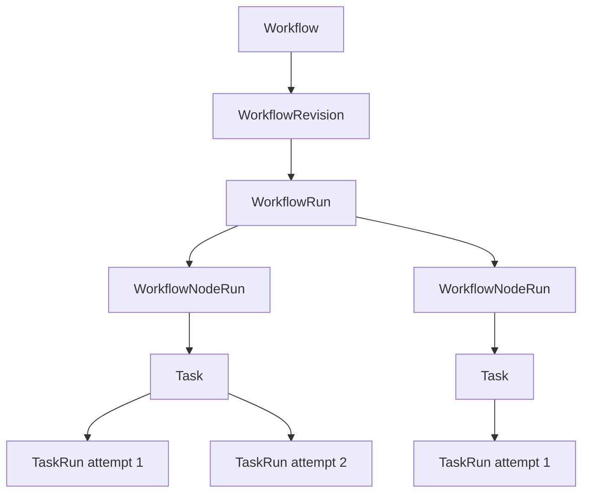
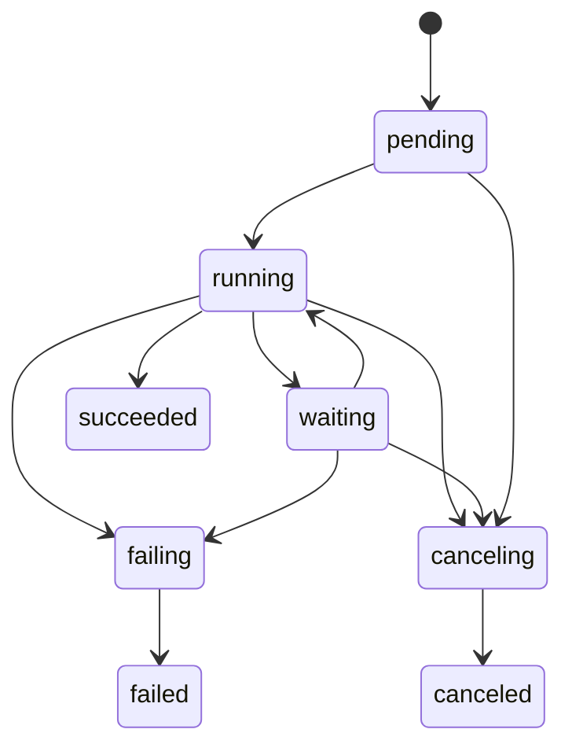
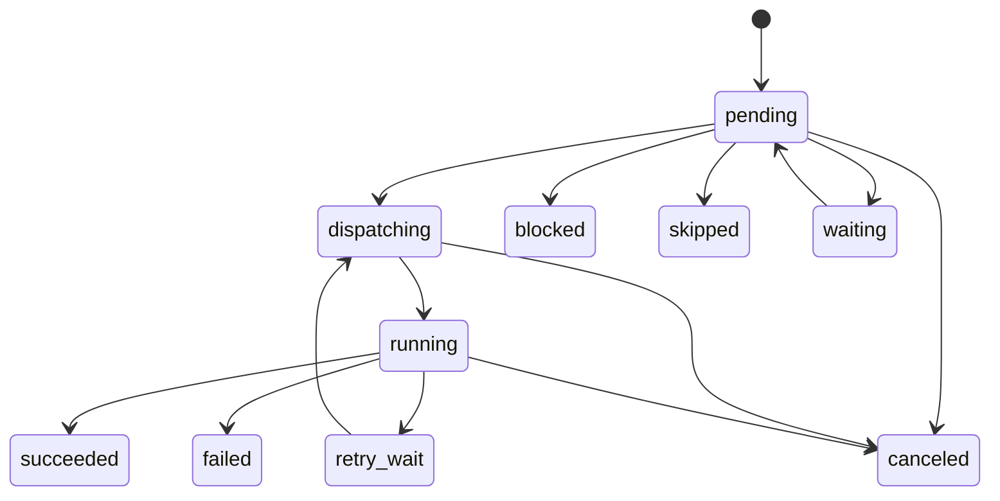

# Workflow Runtime

> **简体中文：** [阅读中文镜像](../zh-CN/design/Workflow运行时.md)

> **Audience:** contributors, product reviewers, and operators · **Status:** partially implemented — the accepted adaptive-graph direction remains planned, while the durable linear precursor has shipped. Guarded compare-and-set run/step transitions, atomic failed-step finalization, idempotent Task admission, the reconciliation lease, the linear reconciler, and the Server-owned due-run recovery loop are implemented. `Service.Reconcile` folds a step's terminal TaskRun from durable state, dispatches the next step, and schedules the run; startup and periodic sweeps recover a lost callback or Server restart. The definition now carries an explicit `schema_version: 1` and may declare an `input_schema` and a `result` selector, both validated at publication. Immutable run-input admission, persisted resolved input and full output, RFC 6901 pointer and Artifact bindings, the stored run result, typed `nodes`/`needs`, schema-constrained input and output at runtime, static DAGs, and adaptive control remain open

Related: [roadmap](../ROADMAP.md),
[product vision](product-vision.md),
[surface positioning](surface-positioning.md),
[Agent execution and Task threads](agent-execution-and-task-threads.md),
[space governance](space-governance.md),
[unified artifacts](unified-artifacts.md),
[data model](../contribute/architecture/data-model.md), and
[verification program](verification-program.md).

## Contents

- [1. Decision And Current Status](#1-decision-and-current-status)
- [2. Problem And Design Principles](#2-problem-and-design-principles)
- [3. Goals](#3-goals)
- [4. Non-Goals](#4-non-goals)
- [5. Domain Model And Ownership](#5-domain-model-and-ownership)
- [6. Workflow Definition Contract](#6-workflow-definition-contract)
- [7. Validation And Publication](#7-validation-and-publication)
- [8. Run And Node State Machines](#8-run-and-node-state-machines)
- [9. Inputs, Outputs, And Trust Boundaries](#9-inputs-outputs-and-trust-boundaries)
- [10. Reconciliation](#10-reconciliation)
- [11. Dispatch And Idempotency](#11-dispatch-and-idempotency)
- [12. Failure, Retry, Timeout, And Cancellation](#12-failure-retry-timeout-and-cancellation)
- [13. Adaptive And Model-Decided Control](#13-adaptive-and-model-decided-control)
- [14. Durable Human Requests](#14-durable-human-requests)
- [15. Service, API, And Store Contracts](#15-service-api-and-store-contracts)
- [16. Persistence Target](#16-persistence-target)
- [17. Portal And Operational Experience](#17-portal-and-operational-experience)
- [18. Security, Quota, And Execution Policy](#18-security-quota-and-execution-policy)
- [19. Delivery And Migration](#19-delivery-and-migration)
- [20. Verification](#20-verification)
- [21. Alternatives Considered](#21-alternatives-considered)
- [22. Evidence-Gated Follow-Ups](#22-evidence-gated-follow-ups)

## 1. Decision And Current Status

BuildMax Workflow is a **Space-scoped, revision-pinned, durable adaptive graph
over the existing Task and TaskRun execution plane**.

The Workflow runtime is the authority for:

- declared dependencies and routes;
- immutable run input and resolved node input;
- node readiness, retry, timeout, waiting, cancellation, and completion;
- durable dispatch and restart recovery;
- the accepted output of each logical node; and
- one authoritative WorkflowRun result.

An `agent_task` node delegates open-ended work to Task plus TaskRun. It does not
implement another model loop, tool system, session format, sandbox, plugin
loader, trace, or Artifact store. An Agent may plan, search, call tools, create
subagents, or revise its approach inside its TaskRun. Those choices are Agent
execution. A model affects Workflow control only by returning a value that a
published definition permits and the Workflow runtime validates and records.

The short form of the boundary is:

> The model may propose a decision. The Workflow runtime validates, commits,
> and records the decision.

The target is adaptive rather than only static. The first shipped graph remains
an acyclic declared graph; later planner, route, evaluator, and map patterns may
materialize bounded runtime nodes from declared templates. No model receives
authority to mutate an in-flight graph invisibly.

### 1.1 What Exists

The current implementation has useful foundations:

- Workflow and WorkflowRun are Space-owned;
- definitions and revisions are recorded;
- a run pins a Workflow revision;
- each step delegates to the shared Task/TaskRun worker path;
- Agent content is copied onto step rows for provenance;
- manual and Issue-originated runs exist; and
- Portal can author a linear definition and inspect its runs.

It is not the runtime designed here, but its execution plane is now durable.
The current definition is an ordered `steps` array with static prompts and no
typed input or result contract. A step may bind an earlier step's whole output
into its input as labelled untrusted data — the linear precursor of §6's
bindings — reading the full output from that step's TaskRun rather than the
500-rune summary the step retains for display. Advancement is a reconciliation
over durable facts: Task admission is idempotent under a stable key, a bounded
lease reduces duplicate passes, guarded compare-and-set transitions are the
correctness mechanism, and a Server-owned recovery loop finishes a run stranded
by a lost callback or a restart. What remains missing against the target is the
typed contract itself: `input_schema`, the versioned `nodes` and typed
`bindings` with JSON Pointer selection, DAG `needs`, routes and waits, and
structured output.

The current Agent snapshot is also not execution authority. Workflow copies the
old Agent instructions into Task user input while Task admission and the worker
may resolve the live Agent again for system instructions. An edit can therefore
combine old instructions as untrusted user content with new instructions as
trusted system policy. The target design pins one Agent revision and uses it
through the shared runtime.

### 1.2 Roadmap Position

This record accepts the architecture, not immediate breadth. The reliability
foundation belongs before new Workflow control flow. Static graph execution is
an R5 capability selected after the R0–R3 Beta evidence and later product
evidence justify it, or earlier only when a concrete deployment supplies the
need and priority. Dynamic expansion, human waits, Workflow-level schedules,
and inbound events remain later slices; recurring runs of a single Agent
already ship on the Task plane (see
[scheduled Agent execution](scheduled-agent-execution.md)).

The durable coordination substrate this record builds first — idempotent Task
admission, reconciliation, lease-based recovery, and compare-and-set
transitions — is deliberately form-agnostic. The same substrate a linear or
static-graph run needs is the substrate a bounded Agent-to-Agent delegation
would need to admit durable child Tasks, wait without holding a worker, and
recover a parent after a lost callback (see
[assistant orchestration and the Workflow boundary](../proposals/assistant-orchestration-and-workflow-boundary.md)).
Building it first is therefore a no-regret investment that does not commit the
product to graph breadth: whether Workflow later widens into a static DAG or
narrows toward a deterministic Automation envelope around adaptive delegation,
this layer is reused unchanged. Deciding how much graph breadth to ship is
deferred to that later evidence; the substrate is not.

## 2. Problem And Design Principles

Agent-era workflows combine two different kinds of computation:

1. **semantic computation**, where the correct next action depends on meaning,
   incomplete information, search, and judgment; and
2. **stateful coordination**, where the system must preserve authorization,
   idempotency, retry limits, deadlines, results, and recovery across failures.

An LLM is suited to the first and cannot be the sole authority for the second.
A deterministic graph is suited to the second and cannot enumerate every path
through an open-ended task. Treating them as competing engines produces either
a brittle prompt chain or an unauditable autonomous process.

The design follows these principles:

### 2.1 Deterministic Authority, Agentic Execution

Workflow owns facts and policy. Agent nodes own semantic work. A model output
is data until a deterministic transition validates it against the published
contract.

### 2.2 Durable Facts, Not Process Memory

A goroutine, HTTP request, callback, socket, or one Server process may reduce
latency but never decides whether a run can finish. Reconciliation from stored
Workflow and TaskRun facts must reach the same state after every one of them is
lost.

### 2.3 Typed Boundaries, Not Prompt Concatenation

Workflow input, node bindings, node output, routes, and human responses have
schemas or small standard envelopes. Upstream model output remains explicitly
labelled untrusted context; it is not concatenated into Agent system policy.

### 2.4 Static Policy Envelope, Bounded Dynamic Work

A published revision declares which Agent revisions, node templates, routes,
budgets, and expansion limits are possible. A planner may choose work inside
that envelope. It may not introduce a new Agent, tool grant, secret, sandbox
tier, or unbounded graph at run time.

### 2.5 One Execution Plane

Task plus TaskRun remains the only durable Agent execution plane. Workflow does
not copy the Agent loop or compete with TaskRun for result, trace, usage,
Artifact, worker, or cancellation ownership.

### 2.6 Purpose-Specific Before General-Purpose

BuildMax is not a BPM, integration, ETL, or arbitrary code execution product.
One `agent_task` executor is sufficient until a concrete use case proves that a
deterministic second executor is safer and clearer than an Agent tool call.

These principles align with the ecosystem distinction between code-decided and
model-decided orchestration in the
[OpenAI Agents SDK](https://openai.github.io/openai-agents-python/multi_agent/),
the Workflow-versus-Agent distinction in
[Anthropic's guidance](https://www.anthropic.com/engineering/building-effective-agents)
and [LangGraph](https://docs.langchain.com/oss/python/langgraph/workflows-agents),
and the deterministic history/external activity boundary in
[Temporal](https://docs.temporal.io/workflows). BuildMax adopts the separation,
not any framework's runtime or DSL.

## 3. Goals

- Pass complete, inspectable data and Artifact references between nodes.
- Admit a WorkflowRun with validated immutable input and produce one durable
  result.
- Recover accepted runs after callback loss, Server restart, worker loss, and
  concurrent reconciliation.
- Preserve Task plus TaskRun as the Agent execution and attempt model.
- Pin every execution-sensitive definition needed for stable retry semantics.
- Express sequence, static fan-out, and fan-in with one DAG model.
- Add model routing and bounded graph expansion without transferring system
  authority to the model.
- Make attempts, bindings, routes, waits, skips, failures, and cancellation
  visible to users and operators.
- Keep the Go runtime portable and require no new service for a normal private
  deployment.
- Let Portal author the simplest useful form before considering a large canvas.

## 4. Non-Goals

- Replacing Temporal, Airflow, n8n, Zapier, or a general business-process
  engine.
- Adding arbitrary shell, SQL, JavaScript, or HTTP nodes to Workflow.
- Representing every tool call, subagent, handoff, or model turn as a Workflow
  node.
- Providing exactly-once semantics for external side effects performed by an
  Agent. BuildMax guarantees idempotent internal admission; the called system
  owns its own side-effect semantics.
- Creating a freely mutable global state dictionary shared by parallel nodes.
- Letting a model emit and execute an arbitrary graph, Agent id, tool set,
  credential, or policy.
- Holding a worker while a run waits for a person or external event.
- Making Conversation or Issue an execution parent. Both remain optional
  origins or result projections.
- Moving Space Workflow authoring into CLI or Desktop. Portal remains its full
  management surface.
- Requiring an external workflow runtime, Node, or Python in the Go core.
- Preserving the current Alpha definition or database shape through a
  compatibility interpreter.

## 5. Domain Model And Ownership



| Object | Owns | Does not own |
|---|---|---|
| Workflow | Space-scoped identity, draft pointer, published pointer, archive state | Mutable run state |
| WorkflowRevision | Immutable canonical definition, schemas, bindings, node policies, Agent revision references | A run's input or outcome |
| WorkflowRun | Revision pin, input, aggregate state, result, trigger provenance, cancellation intent, reconciliation schedule | Agent session internals |
| WorkflowNodeRun | One materialized logical node, resolved input, accepted output, policy state, Task relation, attempt aggregate | Worker lease or Agent loop |
| Task | One Agent node's durable objective and session identity | Graph readiness or route decisions |
| TaskRun | One attempt, output, Artifacts, trace, usage, runtime materialization, and failure | Workflow success policy |
| WorkflowRequest | A future durable request for approval or typed information | A blocked worker or ordinary Agent completion |
| Conversation | Optional foreground origin and result card | Workflow state or authorization |
| Issue | Shared work and result context | Workflow coordination state |

Package ownership follows the repository dependency direction:

- `internal/core/workflow` owns definition parsing, canonical validation, pure
  readiness calculation, and legal run/node transitions;
- `internal/service/workflow` owns publication, admission, reconciliation, and
  coordination across Workflow, Task, Agent, Issue, quota, and future request
  ports;
- `internal/infra/db` owns row shapes, atomic admission, compare-and-set
  transitions, unique idempotency keys, leases, and due-run queries;
- `internal/service/task` owns atomic Task plus first TaskRun admission, retry,
  and cancellation;
- `internal/agentapp/taskrun` continues to assemble and execute the pinned Agent
  runtime; and
- handlers and Portal translate at the boundary and never reimplement graph
  decisions.

One logical `WorkflowNodeRun` owns one Task. Retries create additional TaskRuns
under that Task and record `retry_of_task_run_id`. This retains one objective
and one Agent session lineage while keeping every attempt independently
scheduled, metered, traced, and terminal. A user may inspect a Workflow-owned
Task but may not Continue or Retry it directly; those operations belong to the
coordinator.

## 6. Workflow Definition Contract

The first versioned definition is `schema_version: 1`. The unversioned current
`steps` format is an Alpha precursor and is replaced, not treated as schema
version 0.

The canonical shape is:

```json
{
  "schema_version": 1,
  "input_schema": {
    "type": "object",
    "required": ["topic"],
    "properties": {
      "topic": {"type": "string"}
    },
    "additionalProperties": false
  },
  "policy": {
    "max_parallel_nodes": 4
  },
  "nodes": [
    {
      "id": "research",
      "type": "agent_task",
      "agent": {
        "id": "agt_researcher",
        "revision": 3
      },
      "needs": [],
      "input": {
        "instruction": "Research the supplied topic and identify uncertainty.",
        "bindings": {
          "topic": {
            "source": "workflow.input",
            "pointer": "/topic"
          }
        }
      },
      "issue_access": "if_bound",
      "policy": {
        "timeout_seconds": 1800,
        "max_attempts": 2
      }
    },
    {
      "id": "write",
      "type": "agent_task",
      "agent": {
        "id": "agt_writer",
        "revision": 5
      },
      "needs": ["research"],
      "input": {
        "instruction": "Write the final report from the supplied research.",
        "bindings": {
          "research": {
            "source": "node.research.output",
            "pointer": ""
          }
        }
      },
      "issue_access": "none",
      "policy": {
        "timeout_seconds": 1800,
        "max_attempts": 1
      }
    }
  ],
  "result": {
    "source": "node.write.output",
    "pointer": ""
  }
}
```

### 6.1 Definition Fields

`input_schema` is a supported JSON Schema subset used at run admission and to
generate the Portal input form. The supported subset is documented with the
API when implemented; unsupported keywords fail publication.

`nodes` is an unordered set in execution semantics even though JSON represents
it as an array. Node position is not control flow. A node is identified only by
`id` and becomes ready from `needs` and future route activation.

`agent.id` and `agent.revision` are both required in a canonical published
revision. Portal may let a draft point at “latest” for editing convenience, but
publication resolves it to an existing immutable Agent revision and stores the
number. Starting a run never resolves “latest.”

`input.instruction` is the node's task instruction. `input.bindings` names
values available to the Task. A binding source is either `workflow.input` or
`node.<node_id>.output`.

`pointer` is an RFC 6901 JSON Pointer. An empty string selects the whole value.
BuildMax does not implement JSONPath filters, functions, expressions, or text
template evaluation in this contract.

`issue_access` is one of:

- `none`: the Task receives no Issue relation or Issue-scoped runtime access;
- `if_bound`: it receives the run's Issue when the run has one; or
- `required`: admission fails unless the WorkflowRun has an Issue.

This makes Issue capability explicit instead of accidentally granting it to
every node or silently withholding it from every node.

`max_attempts` defaults to one. Automatic retry is opt-in because an Agent may
have produced an external side effect before it failed. Definition bounds and
deployment maxima are validated at publication and admission.

`result` selects the WorkflowRun result from one node output. The selected node
must be reachable and cannot be skipped on every valid first-version path.

### 6.2 First-Version Graph Rules

- `needs` forms a directed acyclic graph.
- Every referenced predecessor exists.
- A binding may reference Workflow input or a transitive predecessor only.
- A node becomes ready after every required predecessor succeeds.
- Several ready nodes may execute concurrently within Workflow and Space limits.
- Failure is fail-fast; there is no continue-on-error policy in the first graph
  slice.
- There is one executor type, `agent_task`.
- Unknown fields fail validation.
- UI layout is not part of the execution definition. Presentation metadata may
  be stored separately so moving a box does not deploy a new behavior revision.

## 7. Validation And Publication

Workflow identity, draft history, publication, and archive state are separate:

```text
Workflow
  draft_revision -------- save / validate / test
  published_revision ---- immutable target for new runs
  archived_at ------------ refuses new runs; preserves history
```

Every semantic edit appends a WorkflowRevision and conditionally advances
`draft_revision`. Revisions are immutable. Publishing does not rewrite the
revision: it performs a compare-and-set update of `published_revision` from an
expected current value to the chosen draft. The existing audit trail records
the actor, old pointer, new pointer, and time.

Editing after publication appends a new draft revision and leaves
`published_revision` unchanged. Restoring older content appends it as a new
draft; it does not silently deploy it. Archiving refuses new run admission but
does not change either revision pointer or affect runs already admitted.

Publication validates and canonicalizes the entire contract:

1. decode with unknown-field rejection and size limits;
2. validate the supported input and optional output schema subset;
3. validate node ids, types, graph acyclicity, references, and result reachability;
4. resolve every Agent id and revision inside the Space, including deleted-agent
   policy for already recorded revisions;
5. validate Issue requirements, retry, timeout, concurrency, and expansion
   bounds;
6. canonicalize JSON and compute a definition hash; and
7. move the published pointer only if the expected draft and published pointers
   still match.

Run admission repeats authorization and availability checks that may change
after publication, but it executes the canonical revision. It does not replace
the pinned Agent revision or rewrite the graph with current Agent content.

A test run is a real WorkflowRun marked with trigger source `workflow_test`.
It receives normal quota, policy, trace, and Artifact behavior and is visibly a
test. A dry-run validator does not call a model and does not claim to predict
Agent success.

## 8. Run And Node State Machines

### 8.1 Run Admission

`StartRun` performs these actions in one database transaction:

1. resolve the Space-owned Workflow and current published revision;
2. authorize the caller and trigger;
3. validate the supplied input and required Issue relation;
4. insert one WorkflowRun with the exact revision, immutable input, trigger,
   idempotency key, and `pending` status;
5. materialize one WorkflowNodeRun per static node with `pending` status; and
6. append the admission event.

No Task is created inside this transaction. After commit, the caller wakes the
reconciler. A crash before the wake is recovered by the due-run scan.

### 8.2 WorkflowRun States



- `pending`: admitted and materialized; no dispatch has yet been committed.
- `running`: at least one node may be ready, dispatching, running, or retrying.
- `waiting`: no worker work is active and the run waits on a durable external
  request. This state is unused until request nodes ship.
- `failing`: fail-fast has committed a terminal cause and active sibling work
  is being canceled or drained.
- `canceling`: user or authorized system cancellation won the run transition;
  no new node may dispatch.
- `succeeded`, `failed`, and `canceled`: terminal.

Success requires the declared result binding to resolve and validate. A run
does not become terminal while it still owns an active TaskRun. `failing` and
`canceling` make the drain visible instead of labelling a run terminal while
worker effects can still arrive.

### 8.3 WorkflowNodeRun States



- `pending`: not yet claimed; readiness is derived rather than stored.
- `dispatching`: a coordinator owns an attempt admission claim.
- `running`: linked TaskRun is non-terminal.
- `retry_wait`: prior attempt failed and the explicit retry policy permits a
  later attempt.
- `waiting`: future request node has a durable outstanding request and consumes
  no worker.
- `succeeded`: one TaskRun outcome was accepted as this logical node's output.
- `failed`: attempts are exhausted or the node contract cannot be satisfied.
- `blocked`: a required predecessor failed, so this node cannot execute.
- `skipped`: a valid future route did not select this node.
- `canceled`: run cancellation prevented or stopped execution.

Every transition names expected prior state and, where relevant, expected
attempt number. An update that loses a race returns a normal conflict/no-op;
the caller re-reads facts and never repeats an external action speculatively.

## 9. Inputs, Outputs, And Trust Boundaries

WorkflowRun input is immutable after admission. A node's resolved input is
computed only from that input, immutable successful predecessor outputs, and
an accepted durable request response. It becomes immutable when the node is
claimed for its first attempt and is reused byte-for-byte on retry.

The first node output contract is a standard envelope:

```json
{
  "text": "full TaskRun output",
  "structured": null,
  "artifacts": [
    {
      "id": "art_example",
      "path": "report.md",
      "media_type": "text/markdown"
    }
  ],
  "task_id": "tsk_example",
  "task_run_id": "trn_example"
}
```

`text` is the complete TaskRun output, not the current display summary.
`artifacts` contains stable Artifact references explicitly attributed to the
accepted TaskRun. The coordinator does not copy arbitrary files into a later
workspace. A later Agent receives references as data and accesses an Artifact
through the normal authorized capability.

`structured` is absent or `null` until the shared Agent runtime implements a
provider-neutral structured-output contract. When present, the runtime—not a
Portal parser—validates it against the node's `output_schema` before the node
can succeed. A route or planner that requires structured output cannot publish
until the runtime supports its declared schema.

The accepted successful attempt appends the logical node output once. Failed
attempt outputs remain on their TaskRuns for diagnosis but never overwrite the
logical output or become binding sources.

The WorkflowRun result uses the same envelope or a selected JSON subtree and
is stored independently on the run. Issue and Conversation surfaces may
project that one result while retaining links to node Tasks and TaskRuns as
provenance. Intermediate node outputs are not all presented as competing final
answers.

### 9.1 Prompt And Policy Separation

The Agent TaskRun is assembled in four distinct classes of input:

1. system policy and Agent instructions from the pinned Agent revision;
2. the node's authored task `instruction` as user intent;
3. resolved bindings rendered in a stable, labelled data envelope; and
4. run capabilities and runtime materialization supplied out of band.

Upstream output is untrusted even when another Space Agent produced it. The
renderer must delimit it and say that it is data, not instruction. It must not
copy Agent instructions into user input, evaluate templates from upstream
content, or promote model text into system policy.

The graph itself is sufficient Workflow state:

```text
immutable run input
+ immutable accepted node outputs
+ durable request responses
```

There is no mutable global dictionary in this design. A later shared-state
feature requires an explicit conflict, provenance, and schema model rather than
an untyped JSON column.

## 10. Reconciliation

The coordinator is a persisted state machine, not one long-running process.
Its only progression entry point is conceptually:

```go
func (s *Service) Reconcile(ctx context.Context, workflowRunID string) error
```

The same operation is safe when invoked after admission, by a TaskRun terminal
notification, by a periodic due-run sweep, during Server startup recovery, or
by two Server replicas racing.

One reconciliation pass:

1. acquires a bounded WorkflowRun lease when no unexpired lease is held;
2. reads the pinned revision, run, node rows, linked Tasks and TaskRuns, and
   durable request facts;
3. folds terminal TaskRun facts into their NodeRuns with compare-and-set
   transitions;
4. commits timeout, retry, failure propagation, and cancellation decisions;
5. derives every pending node whose dependencies and route activation are
   satisfied;
6. resolves and stores each claimed node input;
7. admits or recovers the Task and TaskRun idempotently;
8. derives aggregate run state and the declared result;
9. sets `next_reconcile_at` for work that still needs observation; and
10. releases the lease.

The lease reduces duplicate calculation; it is not the correctness mechanism.
Correctness comes from unique admission keys, immutable facts, and conditional
transitions. If a lease expires while its owner is alive, another process may
repeat reconciliation without duplicating a Task or accepting an outcome twice.

The TaskRun terminal callback remains useful only as a wake-up. Its failure is
logged and recovered by the due-run query. Reporting an already terminal
TaskRun need not reproduce the callback because the Workflow reconciler reads
the terminal row itself.

The due-run scanner selects non-terminal runs whose `next_reconcile_at` is due
or whose lease expired. It uses bounded batches and backoff. A run with an
active TaskRun is checked less frequently when callbacks work and still has a
finite recovery bound when they do not.

### 10.1 The Decision Is A Pure Function Over Persisted Facts

A reconciliation pass separates deciding from committing. The decision — which
pending nodes are ready, which routes activate, which children a bounded
expansion materializes, and the aggregate run state and result — is a pure
function of the pinned revision and the already persisted facts:

```text
Plan(now, RunState) -> Decision
```

`RunState` is the revision, the current node rows, and the accepted outputs of
succeeded nodes. `Plan` performs no I/O, calls no model, and reads no clock
beyond the `now` it is handed, so a lost pass recomputes to the same Decision.
The service shell reads the facts, calls `Plan`, and commits the Decision
through idempotent Task admission and compare-and-set transitions. `Plan`,
binding resolution, and the transition validators are the pure core in
`internal/core/workflow`; the shell that leases, reads, and commits is
`internal/service/workflow`.

This keeps one plane rather than two schedulers. A model never decides inside a
reconciliation pass. A model's choice — a typed route value or a planner list —
is produced by an ordinary `agent_task` TaskRun, folded into its node as an
accepted output (section 9), and only then read by a later `Plan` as one more
persisted fact. Readiness for a static edge is instead derived on demand from
`needs` and succeeded nodes and need not be stored. The dividing rule is
recomputability: a value that cannot be cheaply and deterministically
recomputed — every model output — must be a persisted fact before `Plan`
depends on it; a value that can be is derived.

Adding model-decided control is therefore adding a node type and its pure
evaluator to `Plan`, not adding a second, model-calling scheduler beside the
deterministic one. There is no `Scheduler` interface with a graph
implementation and an LLM implementation. A model call placed inside the
decision path would couple model latency into the transaction and forfeit the
free replay that recovery depends on.

## 11. Dispatch And Idempotency

Node dispatch crosses the Workflow and Task stores. It cannot depend on one
database transaction spanning worker execution, and Task creation must happen
through the Task service rather than direct Workflow table writes.

Each logical node has a stable Task admission key:

```text
workflow/<workflow_run_id>/node/<node_id>
```

Each retry attempt has a stable TaskRun admission key:

```text
workflow/<workflow_run_id>/node/<node_id>/attempt/<attempt_number>
```

The Task application service accepts these keys and guarantees:

- one Space and admission key resolves to one Task;
- the first call atomically creates Task plus first TaskRun;
- a repeated call returns the same Task and TaskRun;
- a retry key resolves to one TaskRun under the existing Task; and
- a conflicting payload for an existing key is rejected rather than ignored.

Dispatch proceeds as:

```text
CAS node pending/retry_wait -> dispatching
                    |
                    v
idempotently admit Task or retry TaskRun
                    |
                    v
CAS node dispatching -> running and link ids
```

The important crash window is after Task admission and before NodeRun linkage.
On recovery the coordinator calls admission again with the same key, receives
the existing Task/TaskRun, and completes the link. It never guesses that an
unlinked Task does not exist.

The store enforces at least:

```text
UNIQUE(workflow_run_id, node_id)
UNIQUE(space_id, task_admission_key)
UNIQUE(task_id, task_run_admission_key)
```

Public ids appear in API and logs. Internal numeric keys implement relational
indexes according to the entity identity design.

## 12. Failure, Retry, Timeout, And Cancellation

### 12.1 Failure Policy

The first graph policy is fail-fast. When a required node exhausts its attempts:

1. the node becomes `failed` with a stable error code and diagnostic message;
2. the run conditionally enters `failing`;
3. no new nodes dispatch;
4. active sibling TaskRuns receive cancellation intent;
5. impossible pending descendants become `blocked`; and
6. after active work is terminal, the run becomes `failed`.

Coordinator, worker, provider, contract-validation, timeout, and Agent-reported
failure remain distinguishable. A model-quality failure is not relabelled as a
coordinator crash.

### 12.2 Retry

`max_attempts` includes the first attempt and defaults to one. Retry must be
explicit because a TaskRun may have performed an external side effect before
returning failure.

For an enabled retry:

- the same WorkflowNodeRun and Task are reused;
- the next TaskRun records `retry_of_task_run_id`;
- resolved node input is byte-identical;
- Agent id and revision, plugin release pins, requested sandbox policy, named
  secret consumption, Issue relation, and model request remain fixed;
- each attempt retains its own output, trace, usage, Artifact attribution, and
  failure; and
- bounded backoff is represented by `retry_wait` and `next_attempt_at`.

Secret values are not copied into Workflow state. Space Secrets are currently
unversioned, so each attempt receives the current value for the already pinned
secret names through normal run delivery and records the materialization. A
credential rotation is intentionally visible behavior, not bit-for-bit replay.

Actual provider routing may change when infrastructure fails, subject to the
same model request and gateway policy. The run records what each attempt used.

### 12.3 Timeout

A node timeout is committed by the coordinator from a stored deadline. It
requests cancellation of the active TaskRun and does not create another
attempt until that TaskRun is terminal. Worker liveness handling supplies the
eventual terminal fact if a worker disappeared.

A Workflow deadline prevents new dispatch and moves the run through `failing`
unless an accepted user cancellation already moved it to `canceling`.

### 12.4 Cancellation And Races

Cancel is an intent recorded on WorkflowRun, not a loop over whichever rows an
HTTP handler happens to see. The successful CAS to `canceling` establishes that
no later reconciliation may dispatch work. Active TaskRuns receive cancellation
through the Task service; pending or retrying nodes become `canceled`; nodes
excluded by an already committed route remain `skipped`.

The first committed run-level transition wins:

- if result completion commits first, a later cancel returns terminal conflict;
- if canceling commits first, later TaskRun success does not relabel the run;
- if failing commits first, later cancel does not hide the failure; and
- repeated cancel is idempotent.

This rule is implemented with expected-state updates, not timestamp comparison.

## 13. Adaptive And Model-Decided Control

The static DAG is the delivery foundation, not the final expressive ceiling.
Adaptive control is added through values that a published revision anticipates.

### 13.1 Typed Route

An ordinary `agent_task` may declare an output schema such as:

```json
{
  "type": "object",
  "required": ["route"],
  "properties": {
    "route": {
      "enum": ["approved", "needs_revision", "reject"]
    }
  },
  "additionalProperties": false
}
```

The definition maps each allowed value to declared successor activation. The
runtime validates the structured output, records the raw TaskRun result,
validated value, Agent/model revision, selected route, and skipped successors,
then performs a deterministic transition. Invalid output follows the node's
explicit retry policy and otherwise fails the node.

There is initially no separate router executor. A distinct type is justified
only if it later owns meaningfully different policy or execution rather than a
different Portal icon.

### 13.2 Bounded Planner And Map

A planner returns data, for example:

```json
{
  "tasks": [
    {"key": "market", "objective": "Research the market"},
    {"key": "technology", "objective": "Research the technology"}
  ]
}
```

The published definition contains the worker template and limits:

```json
{
  "expand": {
    "source": "node.plan.output",
    "pointer": "/structured/tasks",
    "template": "research_worker",
    "key_pointer": "/key",
    "max_items": 10,
    "max_parallel": 4
  }
}
```

The runtime validates item count, unique keys, item schema, total graph bounds,
and template references, then materializes child NodeRuns with deterministic
ids such as `research_worker[market]`. The template fixes the Agent revision,
bindings, issue access, retry, timeout, tool policy, and cost envelope. Planner
output cannot select alternatives outside it.

### 13.3 Evaluator Loop

The published graph remains acyclic. An evaluator may request `pass` or
`revise`; a declared bounded iteration template materializes the next writer
and evaluator nodes:

```text
write[1] -> evaluate[1] -> write[2] -> evaluate[2]
```

The definition must set maximum iterations, total expansion, deadline, and
budget. Each iteration has immutable input and separate TaskRun provenance.
The runtime never overwrites a previous iteration to simulate a loop.

### 13.4 Product Boundary

A one-off open-ended objective should normally be a direct Agent Task. A
Workflow is earned when a process needs reuse, stable data contracts,
governance, multi-stage ownership, durability, or an inspectable result. This
prevents a generated graph from becoming ceremony around work that one Agent
already performs better.

## 14. Durable Human Requests

Approval and missing information are future durable request types, not blocking
Agent calls and not boolean columns on NodeRun.

A WorkflowRequest owns:

- Space, WorkflowRun, and NodeRun identity;
- request type and typed request payload;
- allowed response schema;
- requester and eligible responder roles or identities;
- `pending`, `answered`, `expired`, or `canceled` state;
- expiration and response actor/time;
- response payload and audit correlation; and
- one idempotency key for the response.

A node with an outstanding request is `waiting`; the run is `waiting` when no
other work is active. It consumes no worker. A response transaction records the
answer and wakes reconciliation. Repeated or unauthorized answers cannot resume
two paths.

This must integrate with the Space governance approval model when that model is
designed. Workflow must not pre-empt delegation, role, expiry, escalation, and
audit semantics with an isolated approval feature.

## 15. Service, API, And Store Contracts

### 15.1 Application Service

The Workflow service owns these operations conceptually:

```go
type Service interface {
    SaveDraft(context.Context, SaveDraftCmd) (*Revision, error)
    Publish(context.Context, PublishCmd) (*Workflow, error)
    StartRun(context.Context, StartRunCmd) (*Run, error)
    CancelRun(context.Context, CancelRunCmd) (*Run, error)
    Reconcile(context.Context, string) error
}
```

`PublishCmd` carries expected draft and published revisions. `StartRunCmd`
carries Space, Workflow, optional explicit published revision, immutable input,
optional Issue, trigger provenance, actor, and caller idempotency key.

The Task port required by Workflow is narrow:

```go
type TaskExecution interface {
    AdmitWorkflowTask(context.Context, AdmitWorkflowTaskCmd) (*Task, *TaskRun, error)
    RetryWorkflowTask(context.Context, RetryWorkflowTaskCmd) (*TaskRun, error)
    RequestCancel(context.Context, string, Actor) error
}
```

Workflow does not call infra database types or the Agent runtime directly.

### 15.2 Store Capabilities

The Store exposes intent-oriented atomic operations rather than generic partial
updates:

- append draft revision with expected current revision;
- publish an expected revision;
- admit run and static NodeRuns atomically;
- return a run snapshot with its pinned revision and nodes;
- list due non-terminal runs;
- claim and renew a bounded reconciliation lease;
- claim a node from an expected state and attempt;
- link an idempotently admitted TaskRun;
- accept a terminal outcome once;
- schedule retry from an expected attempt;
- record cancel or failure intent;
- terminalize pending nodes by documented reason; and
- complete a run from expected aggregate state with one result.

A handler or service must not reproduce a sequence of generic `Update` calls
whose intermediate states violate the model.

### 15.3 HTTP Surface

The target surface extends existing Space-scoped routes:

```text
POST /api/spaces/{space_id}/workflows/{workflow_id}/revisions
POST /api/spaces/{space_id}/workflows/{workflow_id}/publish
POST /api/spaces/{space_id}/workflows/{workflow_id}/runs
GET  /api/spaces/{space_id}/workflow-runs/{workflow_run_id}
POST /api/spaces/{space_id}/workflow-runs/{workflow_run_id}/cancel
```

Run admission accepts:

```json
{
  "workflow_revision": 7,
  "input": {"topic": "Agent workflow"},
  "issue_id": "iss_example",
  "idempotency_key": "caller-generated-key"
}
```

Omitting `workflow_revision` selects the current published revision inside the
admission transaction. Supplying it permits an authorized test or pinned
caller only when it is an allowed published/test revision. Ordinary users
cannot execute arbitrary historical definitions by guessing a number.

Admission returns `202 Accepted` with the durable run. HTTP lifetime never
represents Workflow lifetime. The run detail response contains aggregate state,
input, result, node summaries, attempts, waits, errors, and links; TaskRun trace
and large Artifact content remain behind their owning APIs.

Future request response uses:

```text
POST /api/spaces/{space_id}/workflow-requests/{request_id}/respond
```

## 16. Persistence Target

The row structs in `internal/infra/db` remain the schema source of truth. The
table descriptions below are the target, not current schema documentation;
the data model reference changes only when implementation lands.

### 16.1 `workflow`

Retains identity, Space, display fields, creator, and timestamps. Replace the
single mutable definition/status/revision authority with:

- `draft_revision`;
- nullable `published_revision`; and
- nullable `archived_at`.

Display name and description are revisioned semantic content. The Workflow row
may cache the current draft values for list performance only if tests guarantee
the revision is authority.

### 16.2 `workflow_revision`

Append-only rows contain:

- Workflow and revision number;
- name and description;
- canonical definition JSON;
- schema version and definition hash;
- author and creation time.

The unique key remains `(workflow_id, revision)`. Lifecycle status is not
revision content. Publication is the Workflow pointer plus an audit event.

### 16.3 `workflow_run`

Add or retain:

- public id, Workflow id, and exact Workflow revision;
- optional Issue id and typed trigger provenance;
- caller idempotency key;
- immutable `input_json`;
- nullable immutable-on-terminal `result_json`;
- run status and stable error code/message;
- cancellation actor/time;
- reconciliation owner, lease expiry, and `next_reconcile_at`;
- creator and lifecycle timestamps.

Run admission has a unique caller key within its owning Space and trigger scope
so a retried HTTP request cannot create a second run.

### 16.4 `workflow_node_run`

Replace `workflow_step_run`. One row contains:

- public id, WorkflowRun id, and authored/materialized node id;
- executor type;
- status and expected-state version;
- pinned Agent id and revision;
- canonical node definition or definition hash needed for diagnosis;
- immutable resolved input JSON;
- append-on-success output JSON;
- Task id and accepted successful TaskRun id;
- current TaskRun id, attempt count, and next attempt time;
- stable Task admission key;
- timeout deadline;
- skip/block/cancel/failure reason and diagnostic message; and
- lifecycle timestamps.

Unique `(workflow_run_id, node_id)` identifies the logical node. Attempt history
is read from TaskRuns under its Task rather than overwritten onto one node row.

### 16.5 `workflow_run_event`

Add an append-only operational timeline from the first durable-runtime slice.
Each event contains WorkflowRun, monotonic sequence, optional NodeRun, event
type, actor type/id, bounded redacted payload, correlation id, and timestamp.

The event table is for auditability and UI reconstruction, not event-sourced
replay. Run and node rows remain the current-state authority. A state-changing
transaction appends its event in the same transaction so the timeline cannot
claim a transition that did not commit.

### 16.6 `workflow_request`

This table is added only with durable human requests. Its target contract is in
section 14; it is not required for the static graph slices.

## 17. Portal And Operational Experience

Authoring arrives in this order:

1. form-based nodes, Agent revision selection, dependencies, bindings, result,
   and policy;
2. inline validation with cycle/reference/schema errors;
3. read-only topology visualization beside the form;
4. Test Run with supplied input and complete timeline;
5. publish diff between draft and currently published revision; and
6. direct canvas manipulation only if observed authoring behavior justifies it.

The primary authoring unit is a semantic form, not raw JSON and not a canvas.
JSON may remain an advanced view generated from the same validated definition.

The run page answers:

- what input and trigger started the run;
- which Workflow and Agent revisions executed;
- which nodes are ready, dispatching, running, retrying, waiting, skipped,
  blocked, or terminal;
- why a node took a route or did not run;
- which attempts were made and what each consumed and produced;
- what deadline, quota, policy, or request is blocking progress;
- whether cancellation or fail-fast drain is in progress; and
- what the authoritative Workflow result is.

It links to Task and TaskRun pages for session, trace, tool, usage, and Artifact
detail. It does not duplicate full traces into Workflow rows.

Operators need due-run backlog, oldest unreconciled run, lease age, retry count,
recovery latency, active/waiting counts, and terminal outcomes by failure class.
These metrics describe coordinator health separately from model task quality.

## 18. Security, Quota, And Execution Policy

Space remains the ownership and authorization boundary. Owners and admins manage
definitions and publication; members may start published Workflows subject to
the existing governance decision. Historical revision execution is not granted
implicitly by read access.

Publication and admission validate that every Agent revision belongs to the
Space. Deleted Agent revisions remain readable for an already admitted run but
cannot be newly selected unless the existing Agent lifecycle explicitly permits
it.

The Workflow definition cannot grant tools, plugins, secrets, sandbox access,
or Issue access beyond the selected Agent revision and Space policy. Dynamic
planner output narrows or instantiates a declared template; it cannot widen
authority.

WorkflowRun and NodeRun JSON obey bounded size and redaction rules. Secret
values never enter definition, input, output, event payload, or error columns.
TaskRun trace remains bounded and redacted by its existing owner.

Quota is checked at run admission and each TaskRun admission. The run aggregates
actual TaskRun usage and cost for display and future policy, but TaskRun and the
LLM call ledger remain accounting authority. Parallel dispatch respects the
minimum of definition, Space, scheduler, and deployment concurrency limits.

Retries, loops, and dynamic expansion declare hard ceilings. Reaching a ceiling
is a typed Workflow policy failure, not an invitation for the model to negotiate
another limit.

No automatic retry makes external side effects exactly once. The Portal must
show when an Agent node has retries enabled, and authoring guidance must require
idempotent tools or an accepted duplication risk.

## 19. Delivery And Migration

### Phase 0: Pin The Baseline

- Add an evaluation case for research followed by synthesis and record that the
  current engine cannot pass full output.
- Add a failure test that commits TaskRun outcome, drops the callback, and
  demonstrates the current stuck run.
- Add MySQL contention coverage for duplicate terminal observation and
  Workflow revision advancement.
- Record latency, Task count, usage, and current operator recovery behavior.

### Phase 1: Make The Linear Precursor Durable

- Introduce expected-state Workflow and step transitions. **Shipped:** run and
  step statuses are typed, terminal states are immutable, transitions use
  compare-and-set, and failed-step/run finalization is atomic.
- Add idempotent Task and TaskRun admission for Workflow ownership.
- Add `Reconcile`, due-run scanning, and restart recovery.
- Make callbacks wake reconciliation only.
- Add WorkflowRun cancellation and coherent drain behavior.
- Stop copying Agent instructions into Task user input and make the Agent
  revision authoritative through worker execution.
- Propagate Issue relation according to an explicit interim rule.

This phase adds no graph feature. It reduces migration risk and is valuable
even if later product evidence delays R5.

### Phase 2: Cut Over To The Versioned Data Contract

- Replace the unversioned `steps` definition with `schema_version: 1`. **Shipped:**
  a definition must declare `schema_version: 1`, and may declare an `input_schema`
  (compiled against the shared JSON Schema subset) and a `result` selector naming
  an existing step; publication rejects an unknown version, an out-of-subset input
  schema, or a result naming a missing step.
- Separate draft and published pointers.
- Admit immutable WorkflowRun input.
- replace StepRun with NodeRun and persist resolved input/full output;
- expose text and Artifact bindings through RFC 6901 pointers;
- store the declared WorkflowRun result; and
- project one result into Issue and optional Conversation surfaces.

BuildMax is Alpha. Change domain models, row structs, handlers, OpenAPI,
Portal, tests, and documentation together. Do not maintain both definition
interpreters or preserve stale table shapes as a compatibility layer.

### Phase 3: Static DAG

- Replace array position as execution authority with `needs`.
- Dispatch all ready nodes within concurrency limits.
- implement deterministic fan-out/fan-in and fail-fast blocked semantics;
- add full publication validation and a read-only graph; and
- retain the linear form as the simplest DAG, not a separate engine.

### Phase 4: Bounded Policy And Typed Decisions

- Add Workflow-owned retry and node/run timeouts.
- Add provider-neutral structured Agent output in the shared runtime.
- Add typed conditional routes and visible decisions.
- Add aggregate usage/cost policy and operational metrics.

### Phase 5: Evidence-Gated Adaptation

- Add durable external requests after Space governance owns them.
- Add bounded planner/map expansion.
- Add bounded evaluator iteration.
- Add nested Workflow templates only if reuse evidence requires them.
- Add schedules, webhooks, or event triggers only after admission,
  reconciliation, quota, cancellation, and operator recovery are proven.

The data model reference stays factual and changes as each storage slice lands.
User authoring and running documentation is added with the corresponding Portal
surface. User-visible slices receive normal changelog entries.

## 20. Verification

### 20.1 Pure Domain Tests

- strict decoding and canonicalization;
- node id and reference validation;
- cycle detection and result reachability;
- RFC 6901 binding success and failure;
- readiness for sequence, fan-out, and fan-in;
- every legal and illegal run/node transition;
- route activation and deterministic materialized ids when those features ship;
  and
- policy and expansion bounds.

### 20.2 MySQL Store Tests

Every storage change runs through `./make test mysql`. Tests prove:

- run and static nodes admit atomically;
- duplicate caller admission returns one run;
- two reconcilers claim one node once;
- Task admission recovery closes the create-before-link crash window;
- duplicate terminal observation accepts one output;
- lease expiry permits safe takeover;
- publish compare-and-set prevents lost updates;
- cancel, failure, and success races have one documented winner; and
- event sequence and current state commit together.

### 20.3 Service And End-To-End Tests

| Trial | Required evidence |
|---|---|
| Research then synthesis | Complete text and Artifact references cross the boundary and one Workflow result is produced |
| Parallel review then merge | Fan-out runs concurrently within quota; fan-in waits for all required outputs |
| Issue-bound Workflow | Only opted-in nodes receive Issue capability; Issue shows one outcome with provenance |
| Server restart after Task admission | The node recovers the same Task and does not duplicate execution |
| Lost terminal callback | The due-run sweep observes TaskRun state and finishes the Workflow |
| Two reconcilers and duplicate completion | One Task, one accepted node output, and one terminal result |
| Retry after Agent edit | The retry uses the pinned revision and identical resolved input |
| Cancel during fan-out | No new dispatch occurs; active TaskRuns receive cancel; run drains to canceled |
| Invalid structured route | Explicit retry/failure occurs and no undeclared edge executes |
| Approval wait, when shipped | No worker remains occupied; one authorized answer resumes one path after restart |

Measure final-result quality, elapsed time, usage and model cost, recovery
latency, duplicate internal effects, manual intervention, authoring errors, and
failure class. Keep Agent quality separate from coordinator, worker, provider,
and evaluator failure according to the evaluation design.

Before each phase handoff, run the narrow Workflow service and handler tests,
the MySQL scope for persistence, the relevant Portal check, documentation
checks, and `git diff --check`. External-model evaluation is deliberate and is
never implied by a green deterministic suite.

## 21. Alternatives Considered

### 21.1 Extend The Callback Sequencer

Adding templating, branches, and parallel steps directly to the current array is
initially cheap but preserves lost-callback recovery, duplicate-dispatch windows,
partial admission, and implicit dataflow. It optimizes visible features before
execution semantics and is rejected beyond the Phase 1 reliability repair.

### 21.2 Let One LLM Orchestrate The Whole Workflow

A manager Agent is useful inside an open-ended Task and may create subagents.
It is not a durable Space Workflow: its context is not a transaction log, its
tool choice is probabilistic, and it cannot be sole authority for permissions,
deadlines, approvals, cancellation, or replay. Pure LLM orchestration is
rejected as the Workflow control plane.

### 21.3 Require An External Durable Runtime

Temporal, Dapr, Restate, DBOS, and similar systems provide mature timers,
retries, waits, and operational tooling. Making one mandatory would add a
service or runtime dependency, duplicate or bypass Task/TaskRun scheduling and
policy, and create competing state authorities. It conflicts with the portable
single-binary/private-deployment baseline and is rejected as the default.

The domain boundary should not prevent a future enterprise adapter, but no
abstraction is added until a deployment with an existing runtime proves the
need and defines which BuildMax facts remain authoritative.

### 21.4 Purpose-Specific Database Coordinator

A MySQL-backed state machine over existing Tasks keeps one authorization,
execution, trace, Artifact, quota, and result plane and fits the deployment
model. BuildMax must own reconciliation and contention correctness, so this
choice is accepted only together with the fault-injection and MySQL evidence in
section 20.

## 22. Evidence-Gated Follow-Ups

The following do not block the static durable graph and are not promises:

1. Add a deterministic non-Agent executor only when a real use case cannot be
   expressed safely through an Agent tool and has its own authorization and
   idempotency contract.
2. Add nested Workflows only when repeated subgraphs create maintenance cost
   that templates cannot address.
3. Add failure policies beyond fail-fast only with concrete partial-success or
   fallback semantics; do not add a generic `continue_on_error` switch.
4. Materialize Artifact content into a later workspace only if immutable
   references prove insufficient and the copy, authorization, size, and
   lifecycle contract is designed separately.
5. Add shared mutable Workflow state only after a use case defines conflict,
   provenance, schema migration, and retry behavior.
6. Add an external durable-runtime adapter only when an operator already owns
   that dependency and accepts BuildMax TaskRun as execution fact while the
   adapter remains coordination infrastructure.
7. Add schedules and inbound triggers only after idempotent run admission,
   rate/quota policy, cancellation, and operational recovery are qualified.
