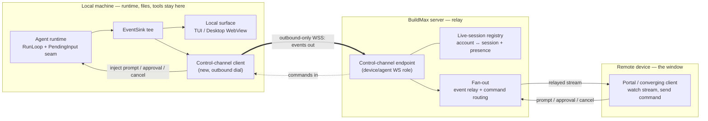

# Remote Control: Drive a Local Agent Session from Another Device

> **简体中文：** [阅读中文镜像](../zh-CN/proposals/remote-control.md)
>
> **Audience:** contributors, product designers, and early adopters · **Status:** proposal — under discussion
>
> **Opened:** 2026-09-20

Related: [roadmap](../ROADMAP.md),
[client surface convergence](client-surface-convergence.md),
[surface positioning](../design/surface-positioning.md),
[client modes](../design/client-modes.md),
[agent execution and task threads](../design/agent-execution-and-task-threads.md),
[agent bridge CLI](../design/agent-bridge-cli.md),
[queued messages](../design/queued-messages.md),
[worker run token](../design/worker-run-token.md), and
[agent sandbox policy](../design/agent-sandbox-policy.md).

## Contents

- [1. Summary](#1-summary)
- [2. The Prompting Question](#2-the-prompting-question)
- [3. What Remote Control Is](#3-what-remote-control-is)
- [4. Problem and Current Context](#4-problem-and-current-context)
- [5. Decomposition: Two Axes and Two Shared Substrates](#5-decomposition-two-axes-and-two-shared-substrates)
- [6. First Principles: What Remote Control Requires](#6-first-principles-what-remote-control-requires)
- [7. Goals](#7-goals)
- [8. Non-Goals](#8-non-goals)
- [9. The Control Plane](#9-the-control-plane)
- [10. What We Reuse and What We Build](#10-what-we-reuse-and-what-we-build)
- [11. Security and Trust](#11-security-and-trust)
- [12. Phased Plan](#12-phased-plan)
- [13. Options and Trade-Offs](#13-options-and-trade-offs)
- [14. Open Questions and Evidence Needed](#14-open-questions-and-evidence-needed)
- [15. Likely Destination if Accepted](#15-likely-destination-if-accepted)

## 1. Summary

A developer starts an Agent session in the local CLI/TUI or Desktop, then walks
away from the machine and wants to keep going from a phone or another computer:
watch the run stream, send a follow-up instruction, approve a tool call. This is
the capability Claude Code ships as **Remote Control** — the local process keeps
running and owns execution and the filesystem, while a remote surface becomes an
additional window onto it, brokered by a server.

BuildMax already covers the *cloud-execution* half of "work away from the
terminal": the Task/TaskRun plane runs an Agent on a worker, and any device can
observe it over the existing server API. What BuildMax has no answer for is the
*local-execution* half: a running CLI/TUI or Desktop session is entirely
in-process and never registers with the server, so nothing outside the machine
can see or steer it.

This paper argues that Remote Control is a genuinely distinct capability — the
one thing a cloud environment can never offer is remote access to *this laptop's*
live session, its uncommitted work, and its local tools and MCP servers — and
that BuildMax's existing pieces (the run-bridge outbound-proxy pattern, the
WebSocket and streaming hubs, the per-device `AuthSession` model, and, crucially,
a mid-run input seam the local runtime *already* wires) make it low-risk to
build. It also shows (§5) that Remote Control and the
[client surface convergence](client-surface-convergence.md) proposal's Environment
plane are not competing products but two points on a host-by-surface grid, resting
on two orthogonal substrates — a control plane and a cloud-environment substrate —
of which the control plane can ship first, on its own, as local Remote Control.
§9–§12 give that control plane's design and phased plan.

## 2. The Prompting Question

The question was direct: implement Claude Code's Remote Control feature in
BuildMax. Remote Control lets a user drive a local Claude Code session from
claude.ai/code or the Claude mobile app; the session keeps running on the user's
machine and the browser or phone is a window onto it.

Taken literally, "port that feature" is a large undertaking, and part of it —
serving a rich remote surface across web and mobile — overlaps work already
scoped by [client surface convergence](client-surface-convergence.md). This paper
separates the part that is *new and specific to Remote Control* (making a local
session reachable and steerable through the server) from the part that is
*shared client work* (the remote surface itself), and reasons about the former
from first principles.

## 3. What Remote Control Is

Remote Control has one defining property: **execution and filesystem access stay
on the local machine, and the remote device is only a window.** It is not "run in
the cloud." Claude Code positions three separate answers to "work away from the
terminal," and the distinction matters for BuildMax:

- **Cloud session** — the agent runs on cloud infrastructure. BuildMax's
  equivalent is the Task/TaskRun worker plane.
- **Remote Control** — the agent runs on your machine; a server brokers a remote
  window. BuildMax has no equivalent.
- **Dispatch / channels** — an external trigger reaches a local or cloud session.
  BuildMax has partial equivalents (schedules, inbound webhook).

Three mechanics define Remote Control's shape, and each becomes a design
constraint below:

1. **Outbound-only connectivity.** The local process opens no inbound port. It
   makes outbound HTTPS to the broker, registers a session, and polls or holds a
   streaming connection for work. This is the security and NAT story in one
   stroke: nothing on the machine is externally reachable.
2. **A server-held transcript for sync and reconnect.** While connected, the
   conversation is mirrored on the server so multiple devices stay in sync and a
   dropped connection can replay. Execution and files never leave the machine.
3. **Presence and notification.** The session reports liveness (an online
   indicator) and can push a notification when a long turn finishes or a decision
   is needed.

## 4. Problem and Current Context

Below the shared runtime, a local Agent session is isolated from the server by
construction. The three findings that matter:

- **Local sessions never register with the server.** The CLI/TUI builds an
  in-process runtime and streams events over an in-memory Go channel to the
  terminal (`internal/interface/cli/tui_model.go`); Desktop runs the same
  in-process runtime and delivers events to its WebView over Wails IPC
  (`internal/interface/desktop/app.go`). The only server traffic on the local
  path is model inference and login. The agent "session" itself
  (`internal/core/session/meta.go`) is a set of local files under
  `internal/config/config.go`'s sessions directory, keyed by local project and
  carrying no user identity — the server has no model of a user's live sessions.

- **The server already brokers *worker* runs, in the opposite direction.** The
  run bridge (`internal/infra/runbridge/bridge.go`) is a per-run,
  outbound-dialed Unix-domain-socket reverse proxy that injects a scoped run
  token and forwards only the `/api/worker/` route space — precisely the
  "outbound tunnel that carries a scoped credential" pattern Remote Control
  needs, but pointed subprocess-to-server during a server-owned run, not
  server-to-local-session. See [agent bridge CLI](../design/agent-bridge-cli.md).

- **The runtime already has a mid-run input seam — wired only locally.** The
  shared loop drains `RunLoopOpts.PendingInput` at the top of every iteration
  (`internal/core/agent/agent.go`), backed by a message queue
  (`internal/core/agent/queue.go`). The **local** app path wires it
  (`internal/agentapp/app.go`), so CLI/TUI and Desktop can already inject a
  message into a running turn. The **durable worker** path deliberately does not
  (`internal/agentapp/taskrun/runtime.go`; see
  [queued messages](../design/queued-messages.md)). This is the decisive
  asymmetry: steering a *local* run — Remote Control's exact target — is the case
  the runtime already supports.

The transport and identity primitives a broker needs also exist. The server has
a per-space WebSocket with a coordination-bus fan-out
(`internal/server/websocket/registry.go`, `internal/server/websocket/protocol.go`)
whose protocol even declares `subscribe.task`/`unsubscribe.task` events that have
no handler yet — a natural hook point. It has a run-scoped, buffered streaming
hub for live output (`internal/server/websocket/hub.go`,
`internal/server/handlers/work/stream.go`). And `AuthSession`
(`internal/core/identity/auth_session.go`) already models a user's logins per
device — platform (`cli`/`desktop`/`portal`), last-seen, and per-device revoke —
which is the natural spine for session presence and trust.

What is absent is equally clear: no server-side registry that links a user
account to their live local sessions; no outbound event relay from a local
session; no inbound command channel into one; and no push/notification mechanism
of any kind (no SMTP, no outbound webhook, no browser push).

## 5. Decomposition: Two Axes and Two Shared Substrates

Remote Control and the [client surface convergence](client-surface-convergence.md)
proposal's Environment plane are easy to read as two competing answers to one
question. They are better understood as points in a two-axis space, and
separating the axes turns an either/or product choice into a build-ordering
decision.

Two orthogonal axes:

- **Runtime host** — where the agent session actually runs: the user's own
  machine, or a cloud-allocated machine.
- **Interaction surface** — how wide the remote window is. *Narrow*: the agent
  session (its conversation, subagent/workflow progress, approvals, and a
  workspace diff) is the whole interaction. *Broad*: a codespace where a terminal,
  file browsing, and launching arbitrary applications are also on offer.

The four quadrants:

| | Narrow surface (agent session) | Broad surface (codespace: terminal / files / apps) |
| :--- | :--- | :--- |
| **Local host (laptop)** | **Remote Control (this proposal)** | Local Desktop app (exists); remotely exposing it is a non-goal (§8) |
| **Cloud host** | Cloud agent session (Remote Control extended to the cloud) | **Environment plane** (convergence §10) |

Reading the two proposals onto the grid: Remote Control is the left column
narrowed to the agent session; the Environment plane is the bottom-right; and
"Remote Control extended to the cloud" is the top-right, which shares a foundation
with the Environment plane.

**Two reusable substrates fall out, one per axis:**

1. **The environment substrate** — allocation, lease, idle hibernation, quota, and
   reclamation. *Every cloud-host quadrant needs it*, narrow or broad. This is
   exactly the new design work convergence §10 scopes for the Environment plane,
   and it is the common foundation the two cloud quadrants share.
2. **The control plane** — the live-session registry, outbound event relay,
   inbound command delivery, and presence of §9. *Every narrow-surface quadrant
   can use it*, local or cloud. It is Remote Control's signature contribution.

**One asymmetry decides the ordering.** The control plane is *required* for the
local host and only *unifying* for the cloud host:

- **Local host:** the server cannot reach the laptop, so the session must dial
  out, register, and be brokered. This outbound control plane is the entire reason
  Remote Control needs new plumbing. Because it is outbound-only — the local
  process opens no inbound port — it does not turn any client into a network
  server, so it does not violate convergence's non-goal of exposing the Desktop
  process to remote browsers.
- **Cloud host:** the machine is the server's own allocation at a known address,
  so a browser reaches it directly through `buildmax-server` — the thin-client
  model convergence already assumes. The control plane is not required there; it
  only adds a unified "all my live sessions, wherever they run" view and one way
  to steer them.

This matches Claude Code's own shape: its cloud sessions and Remote Control
**share one agent-centric window** (the narrow surface), but a cloud session is
reached directly while Remote Control alone goes through a relay from the laptop.
Surface shared, host differs, cloud host separately needs environment management.

**The positioning conclusion.** Because the two substrates are orthogonal and
BuildMax will plausibly want both eventually, the question is not "Remote Control
*or* the Environment plane" but the order in which the substrates are built:

- Build the **control plane** first and local Remote Control (top-left) arrives
  immediately, reusing the existing runtime, WebSocket, and the already-wired
  `PendingInput` seam — a small, low-risk increment that depends on no
  cloud-environment work.
- Build the **environment substrate** next and the Environment plane (broad,
  bottom-right) converges with the convergence proposal, while the cloud agent
  session (narrow, top-right) falls out almost for free as "control plane plus
  environment substrate."

So Remote Control need not wait on, or compete with, the Environment plane. It can
ship first as the control-plane slice, and the two meet later in the cloud
quadrants. The remaining sections describe the control plane and its phased
delivery on that basis.

## 6. First Principles: What Remote Control Requires

Starting from the outcome — "observe and steer *this machine's* live session from
another device, safely" — and not from any existing schema, the essential
requirements are:

- **A server-visible identity for a live local session**, tied to the user
  account, so a remote surface can find it and address messages to it. This is
  new: today the local session has no server identity.
- **An outbound event relay** so the events that today reach only the local
  terminal or WebView also reach the server, which fans them to connected remote
  surfaces.
- **An inbound command channel** so a remote prompt, approval, or cancel reaches
  the local runtime. For prompts and approvals the runtime seam already exists
  locally (§4); the missing part is *delivery from the server to the local
  process*.
- **Presence** at the session level — is this session online right now — beyond
  the run-level and login-level liveness that exist today.
- **A safety boundary**: explicit consent to expose a machine, a kill switch, and
  per-device trust, because remote control of a local session is remote code
  execution on that machine under the user's account.

Everything else Remote Control appears to need — a rich mobile surface, a
diff pane, a session list UI — is either shared client work owned by
[client surface convergence](client-surface-convergence.md) or a thin
presentation over the five primitives above. Occam's razor applied here means:
add exactly the control plane, and let the remote *window* be the existing and
converging client surface, not a second one built for Remote Control.

## 7. Goals

- Let a user opt a local CLI/TUI or Desktop session into being reachable through
  the server, register it against their account, and see it online from another
  device.
- Relay that session's live event stream outbound to the server so a remote
  surface can watch the run as it happens.
- Deliver a remote follow-up prompt and a remote tool-approval decision back into
  the running local session, reusing the runtime's existing local input seam.
- Deliver a remote cancel into the local session.
- Keep execution, the filesystem, local tools, and local MCP servers entirely on
  the user's machine; the server relays messages and holds only what sync and
  reconnect require.
- Use outbound-only connectivity: the local process opens no inbound port.
- Reuse the existing user credential and per-device `AuthSession` model, and add
  the minimum trust controls that remote code execution demands (§11).
- Present the remote window through the existing/converging client surface, not a
  new one.

## 8. Non-Goals

- Running the agent runtime — tool loop, sandbox, subprocess execution — anywhere
  but the user's machine. That is the Environment plane's job, not this one.
- Opening any inbound network port on the user's machine, or turning the CLI or
  Desktop into a network server.
- Mirroring the full conversation transcript server-side beyond what live sync and
  short-window reconnect require; this paper does not propose durable server
  storage of local session history.
- Building a bespoke mobile application for Remote Control; mobile is the thin
  client of [client surface convergence](client-surface-convergence.md).
- Changing the Task/TaskRun execution model. Remote Control is a separate control
  plane over an already-running local session, not a new kind of TaskRun (§9).
- Cross-session messaging between a user's sessions on different machines; it is a
  plausible later extension of the same channel but is out of scope here.

## 9. The Control Plane

Remote Control is a new **control plane** over a live local session — distinct
from the Task plane the same way convergence's Environment plane is. The Task
plane is a bounded-turn, server-executed model; a Remote Control session is a
persistent, device-resident, interactively driven session that the server only
brokers. Forcing it into TaskRun would invert its ownership (the run originates on
the laptop, not from a server dispatch) and distort both models.

At a glance, the plane relays a local session's events outbound and delivers
remote commands back, all over one outbound-dialed connection:

The single WebSocket is dialed outbound by the local process, so the machine
opens no inbound port; that one connection then carries events out and commands
in. The plane has five parts, each mapped to what it reuses:

1. **Live-session registry (new, server-side).** A record linking a user account
   to a currently-connected local session: an id, the owning user, a display
   name, the originating platform and host, and a last-seen heartbeat. It is the
   server's model of "my sessions right now." Its natural sibling is
   `AuthSession` (`internal/core/identity/auth_session.go`), which already tracks
   per-device logins and revoke; the registry adds the *live agent session* that
   `AuthSession` does not model. Its authorization scope is an open question
   (§14): it is more naturally account-scoped than Space-scoped, which is a
   departure from the Portal norm that Space owns resources.

2. **Outbound control channel (new local role on an existing transport).** The
   local process dials the server over WebSocket — a new device/agent connection
   role, not the browser's per-space socket — authenticating as the user with the
   existing access token and `AuthSession`. It registers the session and then
   carries events outbound and commands inbound. This is the run-bridge idea
   (`internal/infra/runbridge/bridge.go`) inverted in direction: outbound dial,
   scoped credential, a narrow message set.

3. **Event relay (extend an existing sink).** Today the local runtime tees events
   to a trace recorder and the caller's sink (`internal/agentapp/app.go`). Remote
   Control adds one more tee: onto the control channel. The server fans relayed
   events to connected remote surfaces using the same buffer-and-replay shape as
   the streaming hub (`internal/server/websocket/hub.go`), so a device that
   connects mid-run gets a backlog then live deltas.

4. **Inbound command delivery (fill the gap the seam leaves).** A remote prompt,
   approval, or cancel arrives at the server, is routed to the owning session's
   control channel, and is handed to the local runtime. Prompts and approvals
   feed the input seam the local path already wires — `RunLoopOpts.PendingInput`
   and the message queue (`internal/core/agent/agent.go`,
   `internal/core/agent/queue.go`) — and cancel maps onto the existing
   cancellation path. No new runtime behavior is required beyond *delivering* the
   message to the local process; this is the smallest possible addition given the
   existing seam.

5. **Presence and notification.** The control channel's heartbeat drives an
   online indicator, reusing the last-seen pattern `AuthSession` already has.
   Notification (push) is entirely new and is deferred to a late phase (§12);
   nothing outbound exists today.

The remote **window** is not part of this plane. It is the existing Portal
surface (and, as convergence proceeds, the shared client surface), reading the
relayed stream and posting commands through the server.

## 10. What We Reuse and What We Build

| Capability | Reuse | Build |
| :--- | :--- | :--- |
| Outbound scoped tunnel | Run-bridge pattern (`internal/infra/runbridge/bridge.go`) | Reverse it to server-to-local, over WebSocket |
| Transport / fan-out | Per-space WS + coordination bus (`internal/server/websocket/registry.go`); the stubbed `subscribe.*` events (`internal/server/websocket/protocol.go`) | A device/agent connection role; the control message set |
| Live output relay | Buffered streaming hub (`internal/server/websocket/hub.go`, `internal/server/handlers/work/stream.go`) | An outbound event tee from `internal/agentapp/app.go` |
| Mid-run steering | `RunLoopOpts.PendingInput` + queue, already wired locally (`internal/core/agent/agent.go`, `internal/core/agent/queue.go`) | Server-to-local delivery of the queued message |
| Cancel | Existing cancellation path | Route a remote cancel to the local session |
| Identity / per-device trust | `AuthSession` platform + last-seen + revoke (`internal/core/identity/auth_session.go`) | A live-session registry alongside it |
| Remote window | Portal / converging client surface | No new surface for Remote Control itself |
| Notification | — | Entirely new; deferred |

The pattern is that the *hard* pieces — a token-carrying outbound tunnel, a
buffered replayable stream, per-device identity, and a mid-run input seam — all
exist. The build is mostly *wiring in a new direction* plus one genuinely new
concept, the live-session registry.

## 11. Security and Trust

Remote control of a local session is remote code execution on the user's machine
under their account, so trust is load-bearing, not an afterthought. This paper
adopts Claude Code's posture, adapted to BuildMax's self-hosted advantage:

- **Explicit opt-in per session or per machine**, never implicit. A session is
  reachable only after the user turns it on.
- **A kill switch**: a setting that disables Remote Control on a machine
  regardless of account state, and the ability to end a session's reachability
  from any device.
- **Per-device trust and revoke**, building on `AuthSession`'s existing
  per-device revoke, so a lost device can be cut off without rotating everything.
- **Outbound-only** connectivity (§7) keeps the machine unreachable from the
  network directly.
- **Self-hosted relay is a privacy gain over the reference feature.** Because the
  broker is the user's own `buildmax-server`, the relayed transcript and control
  traffic never leave infrastructure the user controls — a materially better data
  story than a third-party relay.
- **Sandbox posture is inherited, not changed.** Remote Control does not alter
  where code runs or the local sandbox default; it is the same local session,
  now also reachable. This is distinct from the Environment plane, where network
  exposure argues for a fail-closed sandbox default (see
  [agent sandbox policy](../design/agent-sandbox-policy.md)).

Assess the full design against [`SECURITY.md`](../../SECURITY.md) and the sandbox
and hook trust boundaries before implementation, per repository rules.

## 12. Phased Plan

Each phase delivers standalone value and is independently verifiable.

1. **Read-only remote observation.** Live-session registry, outbound control
   channel with registration and heartbeat, event relay outbound, presence
   indicator, and a Portal read-only view of a local session's stream. Proves the
   channel and the registry end to end without any inbound authority.
2. **Remote follow-up prompt.** Inbound delivery of a prompt into the local
   session's existing `PendingInput` seam. The first steering capability.
3. **Remote tool approval.** Forward permission prompts to the remote surface and
   return the decision, so a user can unblock a run from another device.
4. **Remote cancel and reconnect hardening.** Route cancel to the local session;
   queue and replay events/commands across brief disconnects.
5. **Notification and per-device trust.** Add outbound push (the first such
   mechanism in the codebase) and a trusted-devices step-up for reachability.

Phases 1–3 are the core of the feature; 4 hardens it; 5 is polish and defense in
depth. A useful pre-phase is a proof-of-concept spanning only phase 1's channel
and relay, to validate the outbound-WebSocket-plus-registry assumption against
real Portal before committing to the full design.

All five phases are the control plane and depend on no cloud-environment work.
Extending Remote Control to a cloud host — the top-right quadrant of §5 — is a
separate track that builds on the environment substrate, not on this plan.

## 13. Options and Trade-Offs

Framed by the decomposition of §5, the options are orderings of two substrates
rather than a choice between two products.

- **C — Both substrates, control plane first (recommended).** Build the control
  plane now for local Remote Control (§5 top-left), reusing run-bridge, the hubs,
  the input seam, and `AuthSession`; then build the environment substrate to reach
  the cloud quadrants, converging with the Environment plane and getting the cloud
  agent session almost for free. Highest capability coverage; matches Claude Code.
  Per §5 the control plane ships independently of any cloud-environment work, so
  this is an ordering, not a doubling of effort. Cost: two substrates to maintain
  over time and a product story clear enough to keep the surfaces from confusing
  users.
- **A — Control plane only, local host.** Build Remote Control as the control
  plane and stop there; no cloud host. Smallest scope that delivers the
  device-resident capability the Environment plane cannot. Cost: a new
  account-scoped server concept and the laptop-must-stay-awake constraint, with no
  path to cloud-hosted sessions.
- **B — Environment substrate only.** Do not build the control plane; answer
  "work from another device" with the Environment plane's Desktop-in-Cloud alone.
  Fully aligned with convergence. Cost: never serves *your local machine's* live
  session and files — a different capability, not a substitute.
- **D — Do nothing now.** Local sessions stay terminal-bound; away-from-terminal
  work goes through the Task plane only. Lowest cost; leaves the device-resident
  gap open.

## 14. Open Questions and Evidence Needed

- **Authorization scope.** A live local session is more naturally an account
  resource than a Space resource, which departs from the Portal norm that Space
  owns and authorizes resources. Is an account-scoped control plane acceptable,
  or must a Remote Control session be bound to a Space?
- **Priority against the roadmap.** Remote Control is net-new and off the current
  R2–R5 critical path (see [ROADMAP.md](../ROADMAP.md)). What real user need
  justifies it now versus after the durability and recovery work?
- **Relationship to convergence.** Under the recommended control-plane-first
  ordering (§13 option C), what is the crisp division of labor between the
  narrow agent surface and the broad codespace surface, so the two do not confuse
  users?
- **Transcript on the server.** How much conversation state must the server hold
  for sync and reconnect, and for how long, without becoming durable storage of
  local session history (a stated non-goal)?
- **Multi-replica delivery.** The streaming hub is per-instance in memory; the
  control channel's fan-out must ride the coordination bus. What is the smallest
  correct design for routing a command to the one replica holding a session's
  channel?
- **Smallest proof.** Does an outbound WebSocket carrying registration, a
  heartbeat, and a relayed stream, observed read-only in Portal, validate the
  approach cheaply before the inbound authority of phases 2–3 is built?

## 15. Likely Destination if Accepted

If accepted, the control-plane design becomes a [design record](../design/README.md)
— most naturally a new record cross-linked from
[client modes](../design/client-modes.md) and
[surface positioning](../design/surface-positioning.md), and paired with the
[agent execution and task threads](../design/agent-execution-and-task-threads.md)
record so the control plane's relationship to the Task plane is explicit. The
phased plan (§12) then enters [ROADMAP.md](../ROADMAP.md) as decomposed
[backlog](../backlog/README.md) items, and the positioning decision of §5 is
recorded so it is not relitigated without new evidence. This proposal is then
deleted.
