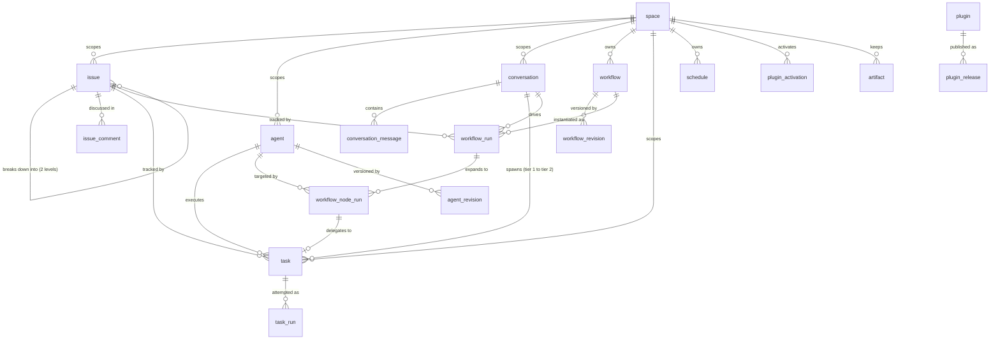
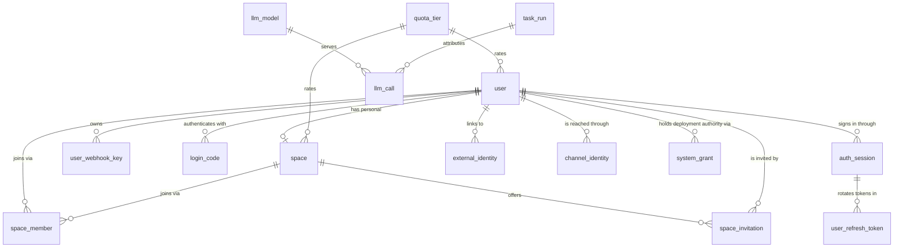

# 数据模型

> **翻译说明：** 本文是[英文原文](../../../contribute/architecture/data-model.md)的简体中文派生翻译。若中英文存在语义冲突，以英文原文为准。
> **受众：** 贡献者 · **状态：** 当前有效

BuildMax Server 数据库的关系模型、主要表及其修改规则。完整模式以 `internal/infra/db` 中的 `xxxRow` 结构体为准；修改表之前请先阅读对应结构体。

关于持久化各层的划分——哪个包拥有契约、哪个包拥有实现——参见 [store.md](store.md)。关于这些实体为何是这样的形状，参见 [../../design/product-vision.md](../../design/产品愿景.md) 和 [../../design/space-governance.md](../../design/Space治理.md)。

## 模式存放在哪里

并不存在描述当前模式的 `.sql` 文件。事实来源是 `internal/infra/db` 中那组未导出的 `xxxRow` 结构体及其 GORM 标签。`internal/infra/db/store.go` 中的 `New` 会在 Server 启动时对这些结构体调用 `AutoMigrate`，因此运行中的数据库就是这些结构体所描述的样子。

CLI 和 Desktop 界面完全不使用这个数据库。Session、trace 和设置都是 `<BUILDMAX_HOME>` 下的文件；参见 [session.md](session.md)。下文的一切都只存在于 Server 部署中。

## 约定

以下规则适用于每一张表，在各表小节中不再重复说明。

**两个标识符，各司其职。** `id` 是自增的 `bigint unsigned` 主键，是关系型键：本文档中的每一处引用都基于它连接，且它从不离开 `internal/infra/db`。`public_id` 是每个边界都能看到的句柄——API 路径、JWT 声明、日志行、对象键——它以 96 位加密随机数据的规范文本形式存储：20 个小写 base32 字符（`ivyoh5qcfu6ypfkhyedq`），存放在 `char(20) CHARACTER SET ascii COLLATE ascii_bin` 列中，下文的表格中记作 `char(20) ascii_bin`。以文本形式存储可让直接 `SELECT` 保持可读；`ascii_bin` 让比较采用 memcmp，且 store 只写入规范的小写形式。以句柄为起点的读取只需通过唯一索引解析一次，之后就是数字化的。为什么会这样、哪些表才有句柄，见 [../../design/entity-identity.md](../../design/实体身份.md)——存储形式是其 §17 修订内容。

**并非每一行都有句柄。** 关联行、修订版本、目录记录各自用别的方式寻址：`space_member` 用其二元组寻址，`agent_revision` 和 `workflow_revision` 用父项加修订号寻址，`plugin` 用名称寻址，`plugin_release` 用名称加版本寻址。这些表没有 `public_id`。

**部分引用仍是文本。** 以 `_id` 结尾的列是 `bigint unsigned` 引用，除非它是多态的、由外部拥有，或者本身是一个值而非引用——例如类型列可接受操作员身份的审计参与者、可能是 Agent 或 Workflow 的 executor、提供商的工具调用 ID、指向文件的 Agent Session。下文各表中会逐一说明，完整清单及原因在 `internal/architecture` 中，若新增引用以文本形式添加却没有对应说明，测试会失败。

**Agent Session ID 不是句柄。** `task.session_id` 和 `task_run.session_id` 是 `varchar(36)` 的 UUID，指向该运行 `BUILDMAX_HOME` 下的 Session 文件，而不是任何表。相对地，`user_refresh_token.session_id` 指向 `auth_session.public_id`，也是该次登录签发的访问令牌中的会话声明。

**没有数据库级外键。** 没有任何行结构体声明 GORM 关系，因此 `AutoMigrate` 不会生成 `FOREIGN KEY` 约束，若有则 `internal/architecture` 中的测试会失败。本文档描述的每一处引用都只是一个普通的带索引列，由应用代码负责维持一致性。删除父行不会级联，数字引用不应被理解为暗示会级联。这是经过权衡后的决定，而非被搁置：[实体身份](../../design/实体身份.md) §8 审阅了 store 的删除语义——没有任何硬删除会移除被引用的父行——并将约束留给首个实现真正删除功能的改动去处理，届时顺序本来就需要写清楚。

**时间戳是 `DATETIME(6)` 列**，绝不是 `TIMESTAMP`，绝不是整数，除非值确实没有时刻部分，也绝不是 `DATE`。在 Go 中它们是 `time.Time`，在网络传输中是 RFC 3339。标记了 `autoCreateTime` / `autoUpdateTime` 的列由 GORM 填充；其余列显式用 `time.Now().UTC()` 设置。可空时间戳是 `*time.Time`，其缺失是有意义的——`ended_at IS NULL` 表示仍在运行，而非未知，也没有哨兵零值。每个连接都使用 UTC：`db.New` 会在任何给定 DSN 上强制 `loc=UTC` 和 `time_zone` 为 `+00:00`，因此 Server 写入的 `DATETIME` 与操作员 shell 读到的是同一时刻。持续时间、配额和计数不是时刻，仍保持 `bigint`，单位写在名称中。原因见 [时间戳表示](../../design/时间戳表示.md)。

**可空性比 Go 类型看起来的更窄。** `AutoMigrate` 只在标签明确要求时才生成 `NOT NULL`。没有 `not null` 标签的非指针 Go 字段会映射为可空列，但应用代码从不真正向其中写 `NULL`——它写零值。下表中的 `可空` 列报告的是**数据库**约束；对非指针字段的“是”应理解为“DDL 中可空，实践中是空字符串或 0”。

**命名。** 表名为单数。列和 JSON 字段使用 `snake_case`。枚举值以字符串而非整数存储，常量定义在对应领域的 `internal/core/*` 包中——各表的拼写风格并不统一，会在各小节中说明（`task_run.status` 全大写，`issue.status` 不是）。

## 实体关系

工作图——用户实际创建和运行的内容：

身份、授权和平台相关的表：

Space 是授权边界：一个请求被允许，是因为调用者对该资源的 `space_id` 持有一条 `space_member` 行。Issue 是面向用户的主要工作对象。Conversation 拥有前台聊天，并可以创建或投影一个 Task。Task 加 task_run 是持久的 Agent 执行平面，其结果无需 Conversation 即具有权威性。所有权设计的依据见 [Agent 执行与 Task 线程](../../design/Agent执行与Task线程.md)。

## 身份与授权

### `user`

每人一行。由操作员或获准的 OIDC 首次登录创建；默认关闭本地自助注册（见 [../../deploy/authentication.md](../../deploy/authentication.md)）。

| 列 | 类型 | 可空 | 说明 |
|---|---|---|---|
| `id` | `bigint unsigned` | 否 | 自增主键，内部使用 |
| `public_id` | `char(20) ascii_bin` | 否 | 公开句柄，唯一 |
| `email` | `varchar(255)` | 否 | 唯一；登录标识符 |
| `name` | `varchar(255)` | 是 | 显示名称 |
| `password_hash` | `varchar(255)` | 是 | argon2id，PHC 编码。设置密码前为 `NULL` |
| `password_set_at` | `datetime(6)` | 是 | |
| `quota_tier` | `varchar(64)` | 是 | 引用 `quota_tier.tier_name` |
| `last_login_at` | `datetime(6)` | 是 | |
| `last_login_platform` | `varchar(32)` | 是 | 上次登录的来源 |
| `disabled_at` | `datetime(6)` | 是 | 非 `NULL` 表示该账号持有的每个凭证都被拒绝 |
| `created_at` | `datetime(6)` | 是 | `autoCreateTime` |

索引：主键 `id`；唯一索引 `email`；唯一索引 `public_id`。

`disabled_at` 在每个已认证请求上都会被读取，这就是它是这一行上的列而非侧表的原因：这项检查必须是一次主键读取。禁用不是删除——不移除任何内容，启用只需清空该列，别无其他。各类凭证对此的处理方式见 [../../design/system-administration.md](../../design/系统管理.md) 第 8 节。

`last_login_at` 和 `last_login_platform` 由登录处理器写入，在签发令牌对后调用 `UpdateLoginMeta`。此处失败只记录日志，不会使登录失败：无论如何都会让这个人登录成功，丢失一个时间戳不值得因此拒绝登录。它们只记录最近一次登录——登录审计轨迹是 `audit_event`，会保留每一次登录记录。

`password_hash` 可空，只由验证登录的代码通过 `identity.PasswordStore` 读取，而不是作为 `identity.User` 上的字段。它从不随 user 对象一起传递，因此任何处理器都不可能无意中将其序列化出去。可空也允许通过 OIDC 关联的账号没有本地密码；提供方身份记录在 `external_identity` 中。

### `external_identity`

一组关联到本地用户的 OIDC issuer 与 subject。两个协议值区分大小写；邮箱和姓名是最近一次登录的属性快照，不是身份键。

| 列 | 类型 | 可空 | 说明 |
|---|---|---|---|
| `id` | `bigint unsigned` | 否 | 内部主键 |
| `public_id` | `char(20) ascii_bin` | 否 | 公开句柄，唯一 |
| `user_id` | `bigint unsigned` | 否 | 关联的 `user.id` |
| `issuer` | `varchar(255) utf8mb4_bin` | 否 | OIDC issuer URL |
| `subject` | `varchar(255) utf8mb4_bin` | 否 | 该 issuer 下的 OIDC subject |
| `last_seen_email` | `varchar(320)` | 是 | 属性快照，不是身份键 |
| `last_seen_name` | `varchar(255)` | 是 | 属性快照 |
| `last_login_at` | `datetime(6)` | 是 | 最近一次通过此关联登录的时间 |
| `created_at` | `datetime(6)` | 是 | `autoCreateTime` |

索引：主键 `id`；唯一索引 `public_id`；(`issuer`, `subject`) 上的唯一索引；
(`issuer`, `user_id`) 上的唯一索引。

### `space`

每个 Portal 资源的所有权和授权边界。

| 列 | 类型 | 可空 | 说明 |
|---|---|---|---|
| `id` | `bigint unsigned` | 否 | 内部主键 |
| `public_id` | `char(20) ascii_bin` | 否 | 公开句柄，唯一 |
| `name` | `varchar(255)` | 否 | 显示名称 |
| `personal_for_user_id` | `bigint unsigned` | 是 | 在用户的个人 Space 上设置；唯一，因此一个用户最多拥有一个 |
| `quota_tier` | `varchar(64)` | 是 | 引用 `quota_tier.tier_name` |
| `plugin_curation` | `varchar(16)` | 否 | 默认 `'open'`；`open` 或 `curated`，见 `plugin_activation` |
| `agent_instructions` | `text` | 是 | 追加到每次后台 Agent 运行的 Space 级指令；为空表示没有这一层 |
| `agent_instructions_revision` | `bigint` | 否 | 每当 `agent_instructions` 变化时递增；从 0 开始 |
| `default_sandbox_network_tier` | `varchar(64)` | 是 | 未声明网络级别的 Agent 所继承的级别；为空表示无，见 `agent` |
| `default_sandbox_filesystem_tier` | `varchar(64)` | 是 | `default_sandbox_network_tier` 的文件系统对应项 |
| `created_by` | `bigint unsigned` | 否 | `user.id` |
| `created_at` | `datetime(6)` | 是 | `autoCreateTime` |
| `updated_at` | `datetime(6)` | 是 | `autoUpdateTime` |

索引：主键 `id`；唯一索引 `personal_for_user_id`；唯一索引 `public_id`。

每个用户都会得到一个名为 `My Space` 的个人 Space（`space.DefaultPersonalName`）。它是一条真实的 space 行，而不是授权代码中的特殊情况，这正是配额和成员机制对单人和共享使用完全一致的原因。

这种安排是刻意为之，且是承重结构。在 Space 存在之前，issue、agent 和 conversation 都挂在 `user_id` 下，Portal 请求按 `JWT -> user_id -> store 查询 -> 所有权检查` 解析。Space 在 2026 年 4 月取代了这一模型——发生在公开历史被压缩之前，因此 `git log` 中看不到这次变迁——规则只有一条：每个工作资源都属于一个 Space，单人用户只是拥有一个只有自己的 Space。这样做的目的是让共享变成一次成员变更，而不是一次数据迁移。

有两个后果约束着新代码：

- **不要在 Space 范围的资源周围添加用户范围的路径。** 单纯从 `user_id` 解析所有权的处理器，会重新引入 Space 所取代的模型，并与配额、成员机制以及所有读取 `space_member` 的授权检查产生分歧。
- **单人用户绝不应该需要了解这个概念。** 个人 Space 会自动为其创建并命名；在单人用户必须经过的路径上暴露 Space 选择、邀请或角色，是一种退步，而不是一项功能。

### `space_member`

成员关联表，也是每次授权检查都会查找的行。

| 列 | 类型 | 可空 | 说明 |
|---|---|---|---|
| `id` | `bigint unsigned` | 否 | 内部主键 |
| `space_id` | `bigint unsigned` | 否 | `space.id` |
| `user_id` | `bigint unsigned` | 否 | `user.id` |
| `role` | `varchar(32)` | 否 | `owner`、`admin` 或 `member` |
| `created_at` | `datetime(6)` | 是 | `autoCreateTime` |

索引：主键 `id`；(`space_id`, `user_id`) 上的唯一索引 `uq_space_member_space_user`。

角色为 `space.RoleOwner` / `RoleAdmin` / `RoleMember`。该列为 `NOT NULL`，但接受空字符串，`core/space.EffectiveRole` 会将这样的行读作 member：这一行本身表明某人属于该 Space，而 member 是三种角色中含义最弱的一种。没有代码会写入空角色——Space 服务会在存储前为未设置的角色赋予默认值——之所以保留这种读取方式，是为了兼容默认值引入之前遗留下来的行。Space 审批已规划但尚未实现。审计轨迹已在 `audit_event` 中实现；审批状态和审计状态都不属于这条成员行。

### `space_invitation`

针对已存在账号的一次待处理 Space 成员邀请。见 [Space 成员生命周期](../../design/Space成员生命周期.md)。

| 列 | 类型 | 可空 | 说明 |
|---|---|---|---|
| `id` | `bigint unsigned` | 否 | 内部主键 |
| `public_id` | `char(20) ascii_bin` | 否 | 公开句柄，唯一 |
| `space_id` | `bigint unsigned` | 否 | `space.id` |
| `user_id` | `bigint unsigned` | 否 | 被邀请账号的 `user.id` |
| `role` | `varchar(32)` | 否 | `member` 或 `admin`；绝不是 `owner`——见 `SetMemberRole` |
| `invited_by` | `bigint unsigned` | 否 | 发起者的 `user.id` |
| `expires_at` | `datetime(6)` | 否 | 默认创建后三天过期（`space.InvitationTTLDefault`） |
| `accepted_at` | `datetime(6)` | 是 | 非 `NULL` 表示已被接受；与 `revoked_at` 互斥 |
| `revoked_at` | `datetime(6)` | 是 | 非 `NULL` 表示在被接受前已撤回 |
| `created_at` | `datetime(6)` | 是 | `autoCreateTime` |

索引：主键 `id`；唯一索引 `public_id`；索引 `space_id`；索引 `user_id`。

没有 `status` 列。`accepted_at`、`revoked_at` 和 `expires_at` 就是全部状态，与 `user.disabled_at` 和 `system_grant.revoked_at` 已经使用的“默认关闭，直到被证明并非如此”的形状相同。`corespace.Invitation.Pending` 会一并读取这三者。

该行从不携带验证码或验证码哈希：与 `login_code` 不同，Space 邀请面向的是已经能够自行认证的账号，因此没有什么需要签发或投递。接受邀请（`AcceptInvitation`）与创建随之产生的 `space_member` 行是原子操作——一条标记为已接受、却没有对应成员关系的邀请，将是一个任何调用者都无法处理的 bug 证据。

### `system_grant`

一个用户持有的、不挂靠任何 Space 的部署范围授权。这是模式中唯一一张在 Space 之外授予权限的表，它授予的是部署的运维权限，而不是对其内容的访问权限——见 [../../design/system-administration.md](../../design/系统管理.md)。

| 列 | 类型 | 可空 | 说明 |
|---|---|---|---|
| `id` | `bigint unsigned` | 否 | 内部主键 |
| `public_id` | `char(20) ascii_bin` | 否 | 公开句柄，唯一 |
| `user_id` | `bigint unsigned` | 否 | `user.id` |
| `role` | `varchar(32)` | 否 | 本构建唯一接受的值是 `system_admin` |
| `granted_by` | `varchar(64)` | 否 | 不透明值：用户句柄，或者当操作员命令做出授权时为 `buildmax-server`——与对应审计事件所携带的字符串相同 |
| `granted_at` | `datetime(6)` | 否 | |
| `revoked_at` | `datetime(6)` | 是 | 授权生效期间为 `NULL` |
| `live_marker` | `tinyint unsigned` | 是 | 生效期间为固定的非 `NULL` 值；撤销时清空 |

索引：主键 `id`；索引 `granted_at`；(`user_id`, `role`, `live_marker`) 上的唯一索引 `idx_system_grant_live`；索引 `user_id`；唯一索引 `public_id`。

没有任何操作会从这张表中删除数据。撤销设置 `revoked_at` 并清空 `live_marker`，
因此该行会保留授权曾经存在及终止时间的记录。唯一索引用固定的 `live_marker`
值限制每个 (user, role) 只有一条生效授权；MySQL 将已撤销行的 `NULL` 视为不同值，
即使两次撤销时间相同，也允许保留任意数量的历史授权。

`role` 是一个列而不是布尔值，这样就能在不做迁移的情况下增加第二种部署角色。只有 `identity.ValidSystemRole` 接受的角色才会被存储，因此这一列不可能被用来凭空捏造权限。

### `login_code`

一次性邮件登录码。行在使用后被消费，而不是删除。

| 列 | 类型 | 可空 | 说明 |
|---|---|---|---|
| `id` | `bigint unsigned` | 否 | 内部主键 |
| `code_hash` | `varchar(128)` | 否 | 邮件发送验证码的哈希，唯一——明文从不存储 |
| `user_id` | `bigint unsigned` | 否 | `user.id` |
| `expires_at` | `datetime(6)` | 否 | 默认 TTL 为一小时（`identity.LoginCodeTTLDefault`） |
| `used_at` | `datetime(6)` | 是 | 非 `NULL` 表示已被兑换；第二次尝试会失败 |
| `created_at` | `datetime(6)` | 是 | `autoCreateTime` |

索引：主键 `id`；唯一索引 `code_hash`；索引 `expires_at`；索引 `user_id`。

### `auth_session`

一次登录对应一条持久会话。其公开 ID 是访问令牌中的 `sid` 声明，也是刷新令牌行的 `session_id`。每个已认证请求都会检查会话是否有效，因此撤销会话也会拒绝此前签发的访问令牌。

| 列 | 类型 | 可空 | 说明 |
|---|---|---|---|
| `id` | `bigint unsigned` | 否 | 内部主键 |
| `public_id` | `char(20) ascii_bin` | 否 | 公开会话句柄，唯一 |
| `user_id` | `bigint unsigned` | 否 | `user.id` |
| `platform` | `varchar(32)` | 是 | 发起登录的界面 |
| `auth_method` | `varchar(32)` | 是 | 登录时使用的凭据方式 |
| `absolute_expires_at` | `datetime(6)` | 否 | 会话生命周期上限 |
| `last_seen_at` | `datetime(6)` | 是 | 尽力记录的最近活动时间 |
| `revoked_at` | `datetime(6)` | 是 | 撤销后非 `NULL` |
| `created_at` | `datetime(6)` | 是 | `autoCreateTime` |

索引：主键 `id`；唯一索引 `public_id`；索引 `user_id`；索引 `absolute_expires_at`。

### `user_refresh_token`

登录会返回一个没有独立数据库行的已签名访问令牌，以及一个由此表中哈希行代表的刷新令牌。两者都属于持久的 `auth_session`；撤销该会话会拒绝访问与刷新请求。

每次交换都会消费提交的刷新令牌，并在同一个会话中签发新令牌。会话公开 ID 在每次轮换后保持不变。

| 列 | 类型 | 可空 | 说明 |
|---|---|---|---|
| `id` | `bigint unsigned` | 否 | 内部主键 |
| `token_hash` | `varchar(128)` | 否 | 令牌的哈希，唯一——明文只返回一次，从不存储 |
| `user_id` | `bigint unsigned` | 否 | `user.id` |
| `session_id` | `varchar(64)` | 否 | `auth_session.public_id`，跨每次轮换保持不变 |
| `platform` | `varchar(32)` | 是 | 哪个界面完成了登录——供阅读者参考的标签，不做强制校验 |
| `expires_at` | `datetime(6)` | 否 | 默认 TTL 为 30 天（`identity.RefreshTokenTTLDefault`） |
| `used_at` | `datetime(6)` | 是 | 非 `NULL` 表示已被交换 |
| `revoked_at` | `datetime(6)` | 是 | 非 `NULL` 表示因登出或重用报告而被撤销 |
| `replaced_by` | `varchar(128)` | 是 | 交换所签发令牌的哈希；供操作员沿链回溯到其登录 |
| `created_at` | `datetime(6)` | 是 | `autoCreateTime` |

索引：主键 `id`；索引 `expires_at`；索引 `session_id`；唯一索引 `token_hash`；索引 `user_id`。

一个已经被交换过的令牌再次出现，意味着存在两个持有者，因此 store 会撤销整个 session，而不是猜测哪一个才是合法的。例外情况是交换后的一小段宽限窗口，之所以存在，是因为 CLI 和 Desktop 在多个进程间共享同一份凭证文件，同时刷新两次在那里是正常现象。行在过期后会被清理；已撤销的行会保留到那时，因此重用报告仍有链条可供检查。

### `user_webhook_key`

[../../reference/webhook.md](../../reference/webhook.md) 中记录的入站 webhook 接口所使用的 API key。

| 列 | 类型 | 可空 | 说明 |
|---|---|---|---|
| `id` | `bigint unsigned` | 否 | 内部主键 |
| `public_id` | `char(20) ascii_bin` | 否 | 公开句柄，唯一 |
| `user_id` | `bigint unsigned` | 否 | `user.id`——key 按用户划分范围，而非按 Space |
| `key_hash` | `varchar(128)` | 否 | 唯一；密钥只在创建时展示一次，此后不再展示 |
| `name` | `varchar(255)` | 是 | 人类可读标签 |
| `created_at` | `datetime(6)` | 是 | `autoCreateTime` |

索引：主键 `id`；唯一索引 `key_hash`；索引 `user_id`；唯一索引 `public_id`。

### `channel_identity`

把一个聊天平台账号链接到一个用户，使来自该账号的消息以该用户身份执行。它不是登录凭证。见 [即时通讯渠道](../../design/即时通讯渠道.md)。

| 列 | 类型 | 可空 | 说明 |
|---|---|---|---|
| `id` | `bigint unsigned` | 否 | 内部主键 |
| `public_id` | `char(20) ascii_bin` | 否 | 公开句柄，唯一 |
| `user_id` | `bigint unsigned` | 否 | `user.id`；一个用户可以链接多个聊天账号 |
| `platform` | `varchar(32) ascii_bin` | 否 | `telegram` |
| `tenant` | `varchar(128) utf8mb4_bin` | 否 | 在账号 id 按组织划分的平台上限定其范围；Telegram 上为空 |
| `external_user_id` | `varchar(128) utf8mb4_bin` | 否 | 平台上不可变的账号 id，绝不是显示名 |
| `handle` | `varchar(255)` | 是 | 链接时的显示名，仅用于辨认 |
| `created_at` | `datetime(6)` | 是 | `autoCreateTime` |

索引：主键 `id`；(`platform`, `tenant`, `external_user_id`) 上的唯一索引 `uq_channel_identity_external`——一个聊天账号最多代表一个用户；索引 `user_id`；唯一索引 `public_id`。

### `channel_pairing`

聊天账号发起、尚未被已登录用户确认的链接请求。行的有效期为十分钟；创建新行时会清理已过期的行。

| 列 | 类型 | 可空 | 说明 |
|---|---|---|---|
| `id` | `bigint unsigned` | 否 | 内部主键 |
| `code_hash` | `char(64) ascii_bin` | 否 | 码的 SHA-256；唯一；码本身从不存储 |
| `platform` | `varchar(32) ascii_bin` | 否 | |
| `tenant` | `varchar(128) utf8mb4_bin` | 否 | |
| `external_user_id` | `varchar(128) utf8mb4_bin` | 否 | 发起请求的聊天账号 |
| `chat_id` | `varchar(128) utf8mb4_bin` | 否 | 机器人确认链接时发往的聊天 |
| `handle` | `varchar(255)` | 是 | 展示给确认者 |
| `expires_at` | `datetime(6)` | 否 | 有索引 |
| `created_at` | `datetime(6)` | 是 | `autoCreateTime` |

索引：主键 `id`；唯一索引 `code_hash`；(`platform`, `tenant`, `external_user_id`) 上的唯一索引 `uq_channel_pairing_external`——每个聊天账号只有一个待确认请求；索引 `expires_at`。

### `quota_tier`

速率限制，由 `user.quota_tier` 和 `space.quota_tier` 按名称引用。这是唯一一张主键不是 `id` 的表。

| 列 | 类型 | 可空 | 说明 |
|---|---|---|---|
| `tier_name` | `varchar(64)` | 否 | 主键 |
| `max_runs_per_period` | `bigint` | 否 | 每个窗口内允许的 Task 运行次数 |
| `max_tokens_per_period` | `bigint` | 否 | 每个窗口内 prompt 加 completion 的 token 数 |
| `max_storage_bytes` | `bigint` | 否 | 有效 Artifact 的存储上限；零表示不限，不受时间窗口约束 |
| `period_days` | `bigint` | 否 | 窗口长度 |

索引：主键 `tier_name`。

`SeedDefaultQuotaTiers` 会在启动时插入 `free_trial`（10 次运行、100,000 token、30 天）和 `pro`（1,000 次运行、10,000,000 token、30 天），但仅当表为空时才插入——编辑过某个层级的操作员，其修改不会在重启时被覆盖。

这里刻意**没有用量表**。`SpaceUsageInWindow` 在读取时聚合：统计按 Space 关联到 `task` 的 `task_run` 行，汇总其 `prompt_tokens` 和 `completion_tokens`，再加上同一时间窗口内创建的 Task 上记录的标题生成 token。因此计量没有第二条可能与运行本身失步的写入路径。

### `audit_event`

治理证据：记录一个动作发生过，以及是谁执行的。写入仅追加；配置保留期后，清理循环
会按年龄删除旧事件，并记录每次清理。已有事件不能被修改。

| 列 | 类型 | 可空 | 说明 |
|---|---|---|---|
| `id` | `bigint unsigned` | 否 | 内部主键 |
| `public_id` | `char(20) ascii_bin` | 否 | 公开句柄，唯一 |
| `space_id` | `bigint unsigned` | 是 | 没有 Space 的动作为空，例如登录 |
| `created_at` | `datetime(6)` | 否 | |
| `actor_type` | `varchar(16)` | 否 | `user`、`worker` 或 `system` |
| `actor_id` | `varchar(64)` | 否 | 用户 ID，或者 `system` 时为进程名 |
| `action` | `varchar(64)` | 否 | `user.login`、`user.logout`、`user.password_set`、`auth.refresh_reuse`、`space.member_added`、`llm_model.created`、`access.denied`，等等 |
| `target_type` | `varchar(32)` | 是 | 对象类型，也可指代非数据库行的目标 |
| `target_id` | `varchar(64)` | 是 | 不透明目标句柄或名称 |
| `task_run_id` | `varchar(20)` | 是 | 触发该动作的 TaskRun 公开句柄 |
| `detail` | `varchar(255)` | 是 | 一条简短的非敏感说明——角色名、模型名 |

索引：主键 `id`；索引 `action`、`actor_id`、`task_run_id`；(`space_id`, `created_at`) 上的索引 `idx_audit_space_time`；唯一索引 `public_id`。

动作字符串会被持久化，因此是永久性的：重命名其中一个会改写每个按其过滤的读取者所看到的历史。它们定义在 `internal/core/audit/audit.go` 中。

**不包含 prompt、生成内容、工具输出或凭证。** 这张表回答的是治理性问题；运行诊断信息属于持久化运行轨迹，按次调用的计费信息属于 `llm_call`。在两处记录同一事实，会带来两套保留策略和两次产生分歧的机会。

写入经由 `internal/service/audit`，插入失败时只记录日志，不会使触发它的动作失败。这是一个刻意的、有真实代价的权衡：这张表记录的是数据库可达期间发生过的事情，而不是发生过的每一个动作。若部署需要更强的保证，就必须让这次写入与该动作处于同一事务中。

### `schema_migration`

每次已应用的迁移一行。它记录了对一个数据库都做过什么，也是每个迁移最多运行一次的原因。

| 列 | 类型 | 可空 | 说明 |
|---|---|---|---|
| `id` | `varchar(191)` | 否 | 主键；该迁移的永久标识符。191 是 MySQL 在 `utf8mb4` 下可建索引的最长 `varchar` |
| `applied_at` | `datetime(6)` | 否 | |

索引：主键 `id`。

行永不删除。缺少一行意味着该迁移会再次运行，这正是让崩溃在迁移中途仍能恢复的原因，也是删除一行会破坏数据库的原因。

这张表还会告诉一个二进制版本：数据库领先于它——这里出现了它不认识的 ID，说明这是来自更新版本的迁移。见 [只进不退，回退一个发行版](#只进不退回退一个发行版)。

## 工作对象

### `issue`

主要的用户工作对象。

| 列 | 类型 | 可空 | 说明 |
|---|---|---|---|
| `id` | `bigint unsigned` | 否 | 内部主键 |
| `public_id` | `char(20) ascii_bin` | 否 | 公开句柄，唯一 |
| `user_id` | `bigint unsigned` | 否 | 所属用户 |
| `space_id` | `bigint unsigned` | 是 | 所属 Space；授权键 |
| `parent_issue_id` | `bigint unsigned` | 是 | 父项的 `issue.id`；顶层 Issue 为 `NULL` |
| `title` | `varchar(255)` | 否 | |
| `description` | `text` | 否 | |
| `status` | `varchar(32)` | 否 | `todo`、`in_progress`、`done` |
| `owner_id` | `bigint unsigned` | 是 | 负责该 Issue 的人；`user.id` |
| `executor_kind` | `varchar(32)` | 是 | `agent` 或 `workflow` |
| `executor_id` | `varchar(64)` | 是 | 根据 `executor_kind` 解释为 `agent_id` 或 `workflow_id` |
| `created_by` | `bigint unsigned` | 否 | `user.id` |
| `version` | `bigint unsigned` | 否 | 乐观并发控制令牌，从 1 开始 |
| `created_at` | `datetime(6)` | 是 | `autoCreateTime` |
| `updated_at` | `datetime(6)` | 是 | `autoUpdateTime` |

索引：主键 `id`；索引 `parent_issue_id`；(`space_id`, `updated_at`) 上的索引 `idx_issue_space_updated`；索引 `user_id`；索引 `owner_id`；唯一索引 `public_id`。

`version` 使每次更新都带条件。更新携带其所依据的版本，store 用 `WHERE public_id = ? AND version = ?` 写入并设置 `version = version + 1`；版本不再匹配的调用者收到 `coreissue.ErrVersionConflict`，即 409，而不是覆盖自己未读过的变更。没有无条件更新路径：不带版本的更新会失败，因为零值不匹配任何行。这里没有复用 `updated_at`；它用于展示和排序，正确性检查不应依赖它经过 RFC 3339 后仍能精确往返。

`owner_id` 是一个已解析的引用：owner 始终是一个 user 行，因此它和其他普通引用一样，是一个带索引的普通 `bigint unsigned`。`executor_kind` / `executor_id` 对是多态引用，没有索引或约束将其绑定到特定表，因此验证位于 `internal/service/issue`。owner 与 executor 相互独立：一个 Issue 可以有负责人、选定的 Agent 或 Workflow、两者都有，或两者都没有。

`parent_issue_id` 是构成邻接表的自引用，层级最多为**两层**：父项自身必须满足 `parent_issue_id IS NULL`。模式不强制这一点；不变量位于 `internal/service/issue`，它还拒绝不同 Space 的父项、自身作为父项，以及为已有子项的 Issue 设置父项。进度（`child_count`、`done_child_count`）通过分组查询为每个响应计算，从不存储。权威验证见 `internal/service/issue`。

### `issue_comment`

一条面向人的 Issue 评论。

| 列 | 类型 | 可空 | 说明 |
|---|---|---|---|
| `id` | `bigint unsigned` | 否 | 内部主键 |
| `public_id` | `char(20) ascii_bin` | 否 | 公开句柄，唯一 |
| `issue_id` | `bigint unsigned` | 否 | `issue.id` |
| `author_kind` | `varchar(16)` | 否 | `user`、`agent`、`local_agent` 或 `system` |
| `author_id` | `varchar(64)` | 否 | `user_id` 或 `agent_id`；`local_agent` 时为报告人；`system` 时为空 |
| `body` | `text` | 否 | 原样存储的 Markdown 源码；服务限制为 16 KiB |
| `source_task_id` | `bigint unsigned` | 是 | 在 `agent` 评论上设置；`local_agent` 评论不指向运行，绝不设置 |
| `source_task_run_id` | `bigint unsigned` | 是 | 在 `agent` 评论上设置；`local_agent` 评论不指向运行，绝不设置 |
| `created_at` | `datetime(6)` | 是 | `autoCreateTime` |
| `edited_at` | `datetime(6)` | 是 | 正文修改前为 `NULL` |

索引：主键 `id`；(`issue_id`, `created_at`) 上的索引 `idx_issue_comment_issue_created`；唯一索引 `public_id`。

先按 `created_at`、再按 `id` 排序——评论串从最早内容读起，公开句柄是随机的，不按时间排列。

此行**没有 `space_id`**。评论的 Space 就是其 Issue 的 Space，每个处理器本来就会加载 Issue 进行授权；反规范化授权键会多出一个可能出错的位置。这与 `conversation_message` 通过 Conversation 解析 Space 的方式一致。

删除是硬删除，没有 `deleted_at`，也没有墓碑标记。只有评论作者本人可以编辑；Agent 或系统评论是运行报告的记录，任何人都不能编辑，不过 Space owner 可以删除。

### `agent`

存储的 Agent 定义：Task 可以使用的一组名称和系统指令。

| 列 | 类型 | 可空 | 说明 |
|---|---|---|---|
| `id` | `bigint unsigned` | 否 | 内部主键 |
| `public_id` | `char(20) ascii_bin` | 否 | 公开句柄，唯一 |
| `user_id` | `bigint unsigned` | 否 | 所属用户 |
| `space_id` | `bigint unsigned` | 是 | 所属 Space |
| `name` | `varchar(255)` | 否 | |
| `description` | `text` | 是 | 在选择器中显示 |
| `instructions` | `text` | 是 | 使用此 Agent 的运行将其追加到系统提示词 |
| `model` | `varchar(255)` | 是 | 模型目录名称；空值使用部署默认模型 |
| `plugins` | `text` | 是 | 此 Agent 加载的目录插件名称的 JSON 数组 |
| `sandbox_network_tier` | `varchar(64)` | 是 | `none`、`registries` 或 `open`；为空则继承 Space 默认值，再回退到界面基线 |
| `sandbox_filesystem_tier` | `varchar(64)` | 是 | `workspace`、`workspace_plus_shared_read` 或 `workspace_plus_external_write`；与网络级别使用相同回退规则 |
| `secret_consumption` | `text` | 是 | Agent 消费 Space Secret 的 JSON 声明 |
| `revision` | `bigint` | 否 | 保存此内容的 `agent_revision` 行的修订号；从 1 开始 |
| `deleted_at` | `datetime(6)` | 是 | Agent 删除时设置；行保留 |
| `created_at` | `datetime(6)` | 是 | `autoCreateTime` |

索引：主键 `id`；索引 `deleted_at`；索引 `space_id`；索引 `user_id`；唯一索引 `public_id`。

删除只写入 `deleted_at`，不执行 `DELETE`。Task、WorkflowNodeRun 和修订都通过 ID 引用 Agent，移除行会让它们全部变成悬空引用，并让仍在进行的 WorkflowRun 在下一步失败。因此读取分为两类：`GetAgent` 和列表查询只查看存活 Agent，避免用已删除 Agent 启动新工作；`GetAgentIncludingDeleted` 则解析已有记录的引用。若 `published` Workflow 仍引用某 Agent，删除会被拒绝并返回 `409`——该 Workflow 仍可运行，否则错误会在下次运行时才暴露，而不是在删除时暴露。草稿和归档 Workflow 不阻止删除，因为两者都不能启动运行，而且发布时会重新验证 Agent。

`plugins` 指定目录插件，而不指定发布版本：版本和摘要来自 Space 的 `plugin_activation` 行，因此将插件切换到新版本始终只需修改一处。不从 Space 的激活项隐式继承任何插件——未指定插件的 Agent 不加载插件——列表存储前去除首尾空白、去重并排序，因此重排同一集合不会追加修订。采用 JSON 列而非关联表，是因为不查询其内部：选择整体写入、整体读取，“哪些 Agent 指定了此插件”通过扫描一个 Space 的 Agent 得出。

没有撤销删除的路由。保留行是为了让引用可解析，不是将其用作回收站。

这些是服务端 Agent 记录，与 `.buildmax/` 下通过 Markdown 文件定义的工作区 subagent 不同；见 [manual/skills-and-subagents.md](../../../../manual/skills-and-subagents.md)。

### `agent_revision`

Agent 定义的一次版本记录。行仅追加，从不更新或删除。

| 列 | 类型 | 可空 | 说明 |
|---|---|---|---|
| `id` | `bigint unsigned` | 否 | 内部主键 |
| `agent_id` | `bigint unsigned` | 否 | `agent.id` |
| `revision` | `bigint` | 否 | 首次记录内容为 1，此后每次变更加一 |
| `name` | `varchar(255)` | 否 | |
| `description` | `text` | 是 | |
| `instructions` | `text` | 是 | |
| `model` | `varchar(255)` | 是 | 此修订记录的模型目录名称 |
| `plugins` | `text` | 是 | JSON 数组；此修订记录的选择 |
| `sandbox_network_tier` | `varchar(64)` | 是 | 此修订记录的级别 |
| `sandbox_filesystem_tier` | `varchar(64)` | 是 | 此修订记录的级别 |
| `secret_consumption` | `text` | 是 | 此修订记录的 Secret 消费声明 |
| `created_by` | `bigint unsigned` | 否 | 写入此修订的用户，不一定是 Agent owner |
| `created_at` | `datetime(6)` | 是 | `autoCreateTime` |

索引：主键 `id`；(`agent_id`, `revision`) 上的唯一索引 `idx_agent_revision`。

修订与其描述的 Agent 行在同一事务中写入，唯一的 (`agent_id`, `revision`) 索引让并发的第二次写入失败，而不是将两个定义记在同一修订号下。没有实际变化的更新不追加修订。恢复早期修订是普通更新：追加一条包含旧内容的新修订，而非把修订号倒退回去。

修订的生命周期长于 Agent 的使用期：删除的 Agent 保留历史，过去运行的来源信息正是指向这些历史。修订路由只服务存活 Agent，因此读取已删除 Agent 的历史需要查询表。

修订历史引入前已经存在的 Agent 和 Workflow，由迁移 `0003_seed_first_agent_and_workflow_revision` 补充修订 1。这一行是近似记录：作者是记录创建者，时间戳是内容上次变动的时间，两者未必能标识产生所存内容的那次编辑。

### `conversation`

独立的前台聊天，以及可选的 Agent Task 编排器。它拥有自己的消息，而不拥有可能启动或展示的 Task。

| 列 | 类型 | 可空 | 说明 |
|---|---|---|---|
| `id` | `bigint unsigned` | 否 | 内部主键 |
| `public_id` | `char(20) ascii_bin` | 否 | 公开句柄，唯一 |
| `user_id` | `bigint unsigned` | 否 | 所属用户 |
| `space_id` | `bigint unsigned` | 是 | 所属 Space |
| `channel` | `varchar(32)` | 否 | `portal`、`telegram` 或 `webhook`；schedule 和直接 Agent 运行不创建 Conversation |
| `channel_ref` | `varchar(191) utf8mb4_bin` | 否 | 由聊天平台承载的对话所对应的聊天（Telegram：聊天 id）；其他情况为空。多行可共享同一个 ref，最新的一行是该聊天的当前对话 |
| `title` | `varchar(256)` | 是 | 根据第一轮生成 |
| `created_by` | `bigint unsigned` | 否 | `user.id` |
| `turn_fence` | `bigint` | 否 | 已接受的最大轮次租约 fencing token；拒绝旧副本写入消息 |
| `created_at` | `datetime(6)` | 是 | `autoCreateTime` |

索引：主键 `id`；(`space_id`, `created_at`) 上的索引 `idx_conversation_space_created`；(`user_id`, `created_at`) 上的索引 `idx_conversation_user_created`；(`channel_ref`, `created_at`) 上的索引 `idx_conversation_channel_ref`；唯一索引 `public_id`。

传输渠道常量位于 `internal/service/conversation/channel/types.go`。`system` 常量存在，但不在 `ValidChannels` 中，因此调用者不能传入它。`telegram` 同样不在其中：只有渠道网关会创建这类对话，因为只有它会同时设置 `channel_ref`。

Workflow 步骤和 Issue Agent 运行都直接创建 Task，以 `task.space_id` 作为所有权依据，不设 `conversation_id`；两者均不会创建 Conversation 来挂载 Task。见 [Agent 执行与 Task 线程](../../design/Agent执行与Task线程.md)。

### `conversation_message`

Tier 1 Conversation 中的一条消息，包括工具交互。

| 列 | 类型 | 可空 | 说明 |
|---|---|---|---|
| `id` | `bigint unsigned` | 否 | 内部主键 |
| `public_id` | `char(20) ascii_bin` | 否 | 公开句柄，唯一 |
| `conversation_id` | `bigint unsigned` | 否 | `conversation.id` |
| `role` | `varchar(16)` | 否 | LLM 消息角色 |
| `content` | `text` | 否 | |
| `channel` | `varchar(32)` | 是 | 为此消息覆盖 Conversation 的渠道 |
| `tool_call_id` | `varchar(64)` | 是 | 在工具结果上设置，将其关联到产生它的调用 |
| `tool_calls` | `text` | 是 | assistant 消息上的工具调用 JSON 数组；Go 字段为 `ToolCallsJSON`，列名为 `tool_calls` |
| `provider_state` | `text` | 是 | assistant 消息上的不透明推理状态，存储并重放，但此处从不读取其内容；Go 字段为 `ProviderStateJSON` |
| `parts` | `mediumtext` | 是 | 消息上的非文本内容，例如工具返回的图像；`content` 仍保存描述它的文本。Go 字段为 `PartsJSON` |
| `created_at` | `datetime(6)` | 是 | `autoCreateTime` |

索引：主键 `id`；(`conversation_id`, `created_at`) 上的索引 `idx_conversation_message_conversation`；唯一索引 `public_id`。

先按 `created_at`、再按 `id` 排序。带前缀的 ID 是随机的，不按时间排列，因此绝不能按 `conversation_message_id` 排序。

`provider_state` 保存协议产生并要求原样返还的内容，例如 Anthropic thinking block、OpenAI Responses reasoning item。Tier 1 轮次从这些行恢复，因此没有它，第二轮就会向上游发送会被拒绝的 Conversation。列出现前写入的行，或者内容已无法解析的行，重放为不带状态的消息，而不是使该轮失败。见 [design/llm-provider-adapters.md](../../design/LLM提供商适配器.md)。

## 后台执行

Task 加 task_run 构成持久的 Agent 执行。TaskRun 拥有结果；Conversation、Issue 和 Workflow 视图可以通过显式的可选关系投影结果。

### `schedule`

Space 拥有的重复时间触发器。每次到期触发由 `executor_kind` 与 `executor_id`
指定的 Agent Task 或已发布 Workflow 运行；执行结果属于相应的 Task 或 Workflow
运行，而不属于 schedule。见 [定时 Agent 执行](../../design/定时Agent执行.md)。

| 列 | 类型 | 可空 | 说明 |
|---|---|---|---|
| `id` | `bigint unsigned` | 否 | 内部主键 |
| `public_id` | `char(20) ascii_bin` | 否 | 公开句柄，唯一 |
| `space_id` | `bigint unsigned` | 否 | 所属 Space，所有 schedule 操作的授权依据 |
| `executor_kind` | `varchar(32)` | 否 | `agent` 或 `workflow` |
| `executor_id` | `varchar(64)` | 否 | 按 `executor_kind` 解释的不透明公开句柄 |
| `created_by` | `bigint unsigned` | 否 | 创建者的 `user.id` |
| `name` | `varchar(256)` | 是 | 人类可读名称 |
| `input` | `text` | 否 | 固定的 Agent prompt 或 Workflow 输入 JSON |
| `cron_expr` | `varchar(256)` | 否 | 重复规则 |
| `timezone` | `varchar(64)` | 否 | IANA 时区；存储时间仍使用 UTC |
| `enabled` | `boolean` | 否 | 暂停后保留记录与下次触发时间，但不再被领取 |
| `pause_reason` | `varchar(32)` | 否 | 调度器暂停它的原因；启用时为空 |
| `next_fire_at` | `datetime(6)` | 否 | 下次 UTC 到期时间 |
| `last_fire_at` | `datetime(6)` | 是 | 最近一次触发时间 |
| `last_fire_ref` | `varchar(64)` | 是 | 最近一次产生的 Task 或 Workflow-run 公开句柄 |
| `consecutive_failures` | `bigint` | 否 | 连续准入失败次数 |
| `created_at` | `datetime(6)` | 是 | `autoCreateTime` |
| `updated_at` | `datetime(6)` | 是 | `autoUpdateTime` |

索引：主键 `id`；(`enabled`, `next_fire_at`) 上的 `idx_schedule_due`；
(`space_id`, `created_at`) 上的 `idx_schedule_space_created`；唯一索引 `public_id`。
调度器仅在 `next_fire_at` 仍等于读取值时才推进它，使多个副本竞争时只有一个胜出。

### `task`

后台工作的持久单元。一个 Task，多次尝试。

| 列 | 类型 | 可空 | 说明 |
|---|---|---|---|
| `id` | `bigint unsigned` | 否 | 内部主键 |
| `public_id` | `char(20) ascii_bin` | 否 | 公开句柄，唯一 |
| `conversation_id` | `bigint unsigned` | 是 | 可选的来源/投影关系；直接创建的 Agent、Issue 或 Workflow Task 没有此关系 |
| `space_id` | `bigint unsigned` | 否 | 所属 Space，是每项 Task 操作的权威依据 |
| `issue_id` | `bigint unsigned` | 是 | 此 Task 推进的 Issue（如果有） |
| `schedule_id` | `bigint unsigned` | 是 | 创建此 Task 的重复时间触发器；只是来源关系，不是授权父对象 |
| `status` | `varchar(32)` | 否 | `PENDING`、`SCHEDULED`、`RUNNING`、`SUCCEEDED`、`FAILED`、`CANCELED` |
| `input` | `text` | 否 | 提示词 |
| `title` | `varchar(256)` | 是 | 由 LLM 生成 |
| `title_prompt_tokens` | `bigint` | 是 | 生成标题消耗的 token，计入配额 |
| `title_completion_tokens` | `bigint` | 是 | 同上 |
| `output` | `text` | 是 | 最近一次成功运行的结果 |
| `output_schema` | `text` | 是 | 最终回答必须满足的 JSON Schema；自由文本时为 `NULL` |
| `created_by` | `bigint unsigned` | 否 | `user.id` |
| `created_at` | `datetime(6)` | 是 | `autoCreateTime` |
| `started_at` | `datetime(6)` | 是 | 首次运行开始时间 |
| `ended_at` | `datetime(6)` | 是 | 进入终态的时间 |
| `error_message` | `text` | 是 | |
| `session_id` | `varchar(36)` | 是 | Agent Session 文件的 UUID，不是表引用 |
| `last_run_id` | `bigint unsigned` | 是 | 最近一次尝试的 `task_run.id` |
| `agent_id` | `bigint unsigned` | 是 | 此 Task 以哪个 `agent.id` 运行 |
| `workspace_head_checkpoint_id` | `bigint unsigned` | 是 | 被接受为 Task 可恢复工作区的 `workspace_checkpoint.id`；先是种子，再是每次成功结果。首次运行提交前为空 |
| `plugin_environment_head_id` | `bigint unsigned` | 是 | 下一次 Continue 使用的不可变 Plugin 环境；未自主安装任何插件的 Task 为空 |
| `admission_key` | `varchar(191)` | 是 | 协调器在 Space 内唯一的幂等键；普通 Task 为 `NULL` |
| `admission_fingerprint` | `char(64)` | 是 | 已准入内容的摘要；重放时检测相同键下的不同请求 |

索引：主键 `id`；索引 `agent_id`、`conversation_id`、`issue_id`、`schedule_id`、`last_run_id`、`workspace_head_checkpoint_id`、`plugin_environment_head_id`；(`space_id`, `created_at`) 上的 `idx_task_space_created`；唯一索引 `public_id`；(`space_id`, `admission_key`) 上的唯一索引 `uq_task_admission_key`。

状态值为 `task.RunStatus`，使用大写，与 `task_run` 共享。

`AdmitTask` 使用唯一的 `(space_id, admission_key)` 约束让 Workflow 节点重放
派发时返回同一个 Task；不同内容复用已有键会被拒绝，避免重复启动 Agent。

### `task_run`

一次执行尝试。配额和 token 计量读取此行。

| 列 | 类型 | 可空 | 说明 |
|---|---|---|---|
| `id` | `bigint unsigned` | 否 | 内部主键 |
| `public_id` | `char(20) ascii_bin` | 否 | 公开句柄，唯一 |
| `task_id` | `bigint unsigned` | 否 | `task.id` |
| `previous_task_run_id` | `bigint unsigned` | 是 | Task 线性运行历史中不可变的前驱；worker 恢复该运行的 Session 包 |
| `input` | `text` | 否 | 本次尝试的提示词；重新运行时可与 Task 的提示词不同 |
| `created_by` | `varchar(64)` | 是 | `user.id`，系统触发的运行为空 |
| `created_by_type` | `varchar(32)` | 是 | `user`、`webhook` 或 `system` |
| `trigger_source` | `varchar(64)` | 是 | 如 `task_create`、`task_retry`、`portal_conversation`、`issue_agent_run`、`workflow_step`、`schedule`、`webhook`；常量由 `internal/core/task` 定义 |
| `status` | `varchar(32)` | 否 | 与 `task` 相同的 `task.RunStatus` 值 |
| `output` | `text` | 是 | |
| `structured` | `text` | 是 | 经校验的结构化 JSON 结果；自由文本时为 `NULL` |
| `error_message` | `text` | 是 | |
| `started_at` | `datetime(6)` | 是 | |
| `ended_at` | `datetime(6)` | 是 | 运行中为 `NULL` |
| `session_id` | `varchar(36)` | 是 | 本次运行的 Session 文件 UUID |
| `worker_type` | `varchar(32)` | 是 | `local_process` 或 `k8s_job`；写入时机见下文 |
| `k8s_job_name` | `varchar(128)` | 是 | 执行此次运行的 Job；本地 runner 下为 `NULL` |
| `k8s_job_created_at` | `datetime(6)` | 是 | 该 Job 的创建时间；本地 runner 下为 `NULL` |
| `prompt_tokens` | `bigint` | 是 | 配额输入 |
| `completion_tokens` | `bigint` | 是 | 配额输入 |
| `trace_path` | `varchar(512)` | 是 | 本次运行在运行级全局存储中的持久 trace，例如 `traces/<session>/rt_….jsonl`；未写入时为 `NULL` |
| `cancel_requested_at` | `datetime(6)` | 是 | 有人请求停止此次运行的时间；无人请求时为 `NULL` |
| `cancel_requested_by` | `bigint unsigned` | 是 | 请求者的 `user.id` |
| `cancel_reason` | `varchar(32)` | 否 | 长度受限的取消原因；未记录时为空 |
| `retry_of_task_run_id` | `bigint unsigned` | 是 | 本次重复执行的运行；携带自身指令的运行为 `NULL` |
| `source_message_id` | `bigint unsigned` | 是 | 请求本次运行的 `conversation_message.id`；没有消息发起请求时为 `NULL` |
| `agent_revision` | `int` | 是 | 本次运行收到的 `task.agent_id` 修订号；没有 Agent 或从未到达 worker 的运行为 `NULL` |
| `space_agent_instructions_revision` | `int` | 是 | 本次运行收到的所属 Space 的 Space 级指令修订号；`0` 表示未配置文本，`NULL` 表示没有来源记录 |
| `plugin_pins` | `text` | 是 | `{plugin_name, version, digest}` 的 JSON 数组：本次运行获得的发布版本 |
| `sandbox_network_tier` | `varchar(64)` | 是 | 首次轮询时解析的级别，依次采用 Agent 声明、Space 默认值、界面基线；worker 认领前为 `NULL` |
| `sandbox_filesystem_tier` | `varchar(64)` | 是 | 首次轮询时解析的级别，与 `sandbox_network_tier` 使用相同回退规则 |
| `last_seen_at` | `datetime(6)` | 是 | 此次运行的 worker 最近轮询自身路由的时间；worker 认领前为 `NULL` |
| `idempotency_key` | `varchar(128)` | 是 | 调用者为 Continue 请求提供的去重键；未带键创建的运行为 `NULL`，包括重试、Workflow 步骤、Issue Agent 运行或旧客户端 |
| `workspace_base_checkpoint_id` | `bigint unsigned` | 是 | 本次运行获准读取和修改的 `workspace_checkpoint.id`，执行前固定 |
| `workspace_result_checkpoint_id` | `bigint unsigned` | 是 | 本次运行提交的成功结果检查点 |
| `workspace_partial_checkpoint_id` | `bigint unsigned` | 是 | 失败、取消或中断后捕获的部分检查点；绝不作为 Task head |
| `workspace_restore_status` | `varchar(32)` | 是 | `not_requested`、`pending`、`restored` 或 `failed` |
| `workspace_restore_error` | `text` | 是 | 面向操作员、长度受限的恢复失败原因 |
| `workspace_checkpoint_status` | `varchar(32)` | 是 | `not_requested`、`pending`、`committed` 或 `failed` |
| `workspace_checkpoint_error` | `text` | 是 | 面向操作员、长度受限的捕获或提交失败原因 |
| `plugin_environment_base_id` | `bigint unsigned` | 是 | 为本次运行物化的不可变 Plugin 集合 |
| `plugin_environment_result_id` | `bigint unsigned` | 是 | 已提交的自主安装请求的新 Plugin 集合；在下一个 TaskRun 边界生效 |
| `plugin_environment_status` | `varchar(32)` | 是 | `unchanged`、`pending`、`committed` 或 `failed` |
| `plugin_environment_error` | `text` | 是 | 长度受限的安装或物化原因 |
| `created_at` | `datetime(6)` | 是 | `autoCreateTime` |

索引：主键 `id`；索引 `cancel_requested_at`；索引 `created_by`；索引 `last_seen_at`；索引 `previous_task_run_id`；索引 `retry_of_task_run_id`；索引 `source_message_id`；(`task_id`, `created_at`) 上的索引 `idx_task_run_task_created`；唯一索引 `public_id`；(`task_id`, `idempotency_key`) 上的唯一索引 `idx_task_run_idempotency`。

对同一 Task 使用相同幂等键重复发送 `POST .../tasks/{task_id}/runs`，会返回首次调用创建的运行，而不启动第二次运行；无论原运行仍在活动还是已经结束都如此。MySQL 唯一索引中 `NULL` 不视为另一个 `NULL` 的重复，因此所有未带键创建的运行都能共存。`CreateTaskRun` 在检查这一点及下述活动运行计数前，先对 Task 行加锁读取，因此同一 Task 的两个并发调用者不能都看到空状态并各自插入；见 [Agent 执行与 Task 线程 §12](../../design/Agent执行与Task线程.md#12-故障恢复和并发)。

`agent_revision` 不是对 `agent_revision.id` 的引用：修订通过 Agent 加修订号寻址，而 Task 已持有 Agent。worker 请求其运行时写入此值，首次写入生效。指令按派发解析，使编辑在下次运行生效；保留此记录，使运行期间的编辑不能改写该运行实际收到的内容。

`space_agent_instructions_revision` 遵循相同的首次写入生效规则。worker 将所属 Space 当前的 Space 指令作为独立系统提示词层接收，放在选定 Agent 的指令之前；编辑 Space 影响下次运行，而非正在执行的运行。

`plugin_pins` 在同一时刻按同一规则写入，因为它回答的是同一运行的同类问题。服务端根据 Agent 的选择解析 Space 的 `plugin_activation` 行并发送完整列表；worker 从不自行读取激活项。在认领时而非派发时解析是安全的，因为激活项指定精确版本和摘要——阻止中途发布的新版本改变运行所加载内容的是固定引用，而非解析时机。trace 携带同样的清单，但 trace 失败时放行且存于运行级全局存储，因此此列是可查询的事实，也是重试读取的来源。Agent 未指定插件、运行没有 Agent 或从未到达 worker 时，此列为空。

`source_message_id` 对应用户实际说的话；`input` 是 Tier 1 决定发送给 worker 的内容。两者是不同文本，保留两者正是目的：`input` 中缺失的约束，可能是模型遗漏，也可能是用户从未提供，模式中其他内容无法区分。每次运行各自记录：Task 首次运行指向创建它的消息，继续执行指向提出该请求的消息。所有非消息来源都为 `NULL`，包括 Workflow 步骤、Issue Agent 运行、重试和直接通过 API 创建的 Task。句柄无法解析时将列留为 `NULL`，而不拒绝运行；丢失来源记录优于拒绝用户请求的工作。

`retry_of_task_run_id` 指向一次重试所重复的运行，每行一条链接：重试的重试指向其所重复的运行，而非链首。它不是外键，所指向的运行永不修改——重试是新尝试，不是改写解释为何需要重试的记录。对应的 `trigger_source` 为 `task_retry`。

`previous_task_run_id` 不同于重试谱系：它指定新运行获准执行前一刻的当前运行，无论新运行是 Continue 还是 Retry。它与推进 `task.last_run_id` 在同一事务中写入，此后永不改变。worker 用此不可变值恢复先前的 Session 包；若读取 Task 投影，在新运行获准后只会得到当前运行。

`cancel_requested_at` 是请求，不是状态：worker 已持有的运行保持 `RUNNING`，直到该 worker 报告 `CANCELED`，因为其他组件无法结束另一个进程的 Agent 循环。worker 通过轮询自身运行路由看到请求；若 worker 始终不确认，`StaleRunReaper` 会结束运行，这也是关闭被遗弃运行的同一兜底机制。两列都只写一次，第二次取消不会覆盖首位请求者。

`last_seen_at` 使服务端能区分 worker 已终止还是执行缓慢。它仅在 `GET /api/worker/task-runs/{id}` 上写入：运行处于 `RUNNING` 的整个期间，worker 每隔几秒轮询该路由，因此信号早已存在，只需记录下来。流式路由每秒触发多次，有意不更新时间戳；终态 `PATCH` 也不更新，否则时间戳会晚于工作停止时刻。`StaleRunReaper` 读取它，在 `RUNNING` 运行失去响应数分钟后将其标为失败，而不等待 `worker.run_timeout`。`NULL` 永不因沉默而被回收：从未记录过信号，便谈不上变得安静。

runner 无错误返回后，`Scheduler.dispatch` 通过 `UpdateTaskRunWorkerInfo` 写入 `worker_type`、`k8s_job_name` 和 `k8s_job_created_at`。这一时刻因 runner 而异，读取这些列前必须理解差异：

- **`k8s_job`** 在 Job 创建后立即返回，因此三列都在派发时写入，整个运行期间可读。
- **`local_process`** 在整个运行期间阻塞，因此 `worker_type` 只在 worker 退出后写入，且仅限正常退出；启动或退出失败会走失败路径，转而记录错误。两个 Kubernetes 列保持 `NULL`。

目前没有代码读取这些列。未来的清理扫描可用 `k8s_job_name` 向 Kubernetes 查询 worker 消失的原因——从服务端看，`OOMKilled` 和 `Evicted` 都只是沉默——但这只覆盖 `k8s_job` runner，因此过期运行回收器观察的是 `last_seen_at`，而非 Job 状态。

worker 在终态 PATCH 中写入 `trace_path`，成功和失败都写。它采用存储值而非推导值，因为 trace 文件名是 Agent run id，该 ID 在运行内部生成，不出现于其他位置。值与 `uploadTaskGlobal` 上传文件所用的键一致，因此可直接在运行级全局存储中解析；`internal/agentapp/taskrun` 的测试将两处计算绑定，避免偏离。

调度器通过轮询最早的待处理运行（`GetNextPendingTaskRun`）认领工作；GORM 日志器配置为忽略 `ErrRecordNotFound`，避免空闲服务端每次轮询都记录未找到。

### `workspace_checkpoint`

一个 Task 的 `workspace/` 在某个边界点——种子、一次成功结果，或一次部分结果——的不可变完整表示。见 [Task 工作区检查点](../../design/Task工作区检查点.md) §9.1。负载数据存放在对象存储中；此行是它的元数据。

| 列 | 类型 | 可空 | 说明 |
|---|---|---|---|
| `id` | `bigint unsigned` | 否 | 内部主键 |
| `public_id` | `char(20) ascii_bin` | 否 | 公开句柄，唯一 |
| `space_id` | `bigint unsigned` | 否 | 授权所有者 |
| `task_id` | `bigint unsigned` | 否 | 工作区所有者 |
| `source_task_run_id` | `bigint unsigned` | 否 | 捕获它的那次运行 |
| `kind` | `varchar(32)` | 否 | `seed`、`successful` 或 `partial` |
| `base_checkpoint_id` | `bigint unsigned` | 是 | 谱系前驱 |
| `payload_format` | `varchar(32)` | 否 | 初始为 `tar.zst.v1` |
| `payload_sha256` | `char(64) ascii_bin` | 否 | 所存字节的摘要 |
| `storage_key` | `varchar(1024)` | 否 | 后端相对键；从不序列化到领域 JSON、worker 响应、日志或 trace 中 |
| `size_bytes` | `bigint` | 否 | 所存负载的字节数 |
| `uncompressed_bytes` | `bigint` | 否 | 常规文件大小之和 |
| `entry_count` | `bigint` | 否 | 常规文件、目录和符号链接的数量 |
| `created_at` | `datetime(6)` | 否 | UTC 提交时间 |

唯一性约束为 `(source_task_run_id, kind)`：一次运行最多有一个 seed、一个 successful、一个 partial。`payload_sha256` 不是唯一的——不同的行可以以不同的来源指向同一份不可变负载。`storage_key` 遵循与 `artifact` 相同的规则：它是基础设施数据，不出现在任何序列化的界面中。

索引：主键 `id`；唯一索引 `public_id`；(`source_task_run_id`, `kind`) 上的唯一索引；索引 `space_id`；索引 `base_checkpoint_id`；(`task_id`, `created_at`) 上的索引 `idx_workspace_checkpoint_task_created`。

### `plugin_environment`

不可变的 Plugin 环境修订：TaskRun 在一次能力边界上加载的确切、有序包集合。
它是 `task.plugin_environment_head_id` 和 `task_run` 环境指针背后的持久对象；
物化出的 `buildmax-home/plugins/` 目录只是可丢弃的投影。见
[Space 插件分发](../../design/Space插件分发.md)和
[Task 工作区检查点](../../design/Task工作区检查点.md)。

| 列 | 类型 | 可空 | 说明 |
|---|---|---|---|
| `id` | `bigint unsigned` | 否 | 内部主键 |
| `public_id` | `char(20) ascii_bin` | 否 | 公开句柄，唯一 |
| `space_id` | `bigint unsigned` | 否 | 授权所有者 |
| `task_id` | `bigint unsigned` | 否 | 环境所有者 |
| `source_task_run_id` | `bigint unsigned` | 否 | 提交安装的运行 |
| `base_environment_id` | `bigint unsigned` | 是 | 谱系前驱；首个修订为 `NULL` |
| `entries` | `text` | 否 | `{plugin_name, version, digest, source, installer, scope}` 的 JSON 数组，一次写入、整体读取 |
| `created_at` | `datetime(6)` | 否 | UTC 提交时间 |

`source_task_run_id` 唯一，因此一次运行最多提交一个环境。`entries` 整体读取，
无需拆成子表。索引：主键 `id`；唯一索引 `public_id` 和 `source_task_run_id`；
索引 `space_id`、`base_environment_id`，以及 (`task_id`, `created_at`) 上的
`idx_plugin_environment_task_created`。

### `artifact`

Space 拥有的一个持久文件，对应一个不可变的内容对象。内容存放在对象存储中，键由此表记录，任何 API 都不会返回它。

这个名称是复用的：迁移 0001 删除的 `artifact` 表曾是 Task 运行的子结构。这一个是首类对象，其生产者作为来源被记录，因此迁移 0001 现在会先检查是否存在 `artifact_item` 以及遗留的 `task_run_id` 列，然后才会动这两张表。见 [../../design/unified-artifacts.md](../../design/统一工件.md)。

| 列 | 类型 | 可空 | 说明 |
|---|---|---|---|
| `id` | `bigint unsigned` | 否 | 内部主键 |
| `public_id` | `char(20) ascii_bin` | 否 | 公开句柄，唯一 |
| `space_id` | `bigint unsigned` | 否 | 所属 Space；授权边界 |
| `filename` | `varchar(512)` | 否 | 单个路径片段；目录部分会被剥离 |
| `media_type` | `varchar(255)` | 是 | 从扩展名推导，绝不来自上传者 |
| `size_bytes` | `bigint` | 否 | 流式传输过程中测得 |
| `sha256` | `varchar(64)` | 否 | 所存内容的摘要；不是去重键 |
| `storage_key` | `varchar(1024)` | 否 | 对象键。从不序列化到任何地方 |
| `created_by_type` | `varchar(32)` | 否 | `user`、`agent`、`worker` 或 `system` |
| `created_by_id` | `varchar(64)` | 是 | 自动化工作时为空 |
| `source_type` | `varchar(32)` | 否 | `agent`、`task_run`、`user_upload`、`system` |
| `source_id` | `varchar(64)` | 是 | 产生该 artifact 的操作 |
| `title` | `varchar(255)` | 是 | 展示标签 |
| `deleted_at` | `datetime(6)` | 是 | 墓碑标记；设置后即隐藏且不可读取 |
| `expires_at` | `datetime(6)` | 是 | 保留策略钩子 |
| `created_at` | `datetime(6)` | 是 | |

索引：主键 `id`；索引 `deleted_at`；索引 `expires_at`；索引 `source_id`；(`space_id`, `created_at`) 上的索引 `idx_artifact_space_created`；唯一索引 `public_id`。

这里刻意没有自由格式的元数据列。持久化的元数据正是 prompt、文件内容和凭证容易借着一个来者不拒的列泄漏进来的地方，因此新的产品行为应该获得一个专门命名的列，而不是塞进去。

删除是墓碑标记，而不是移除行：它必须立即在授权边界生效，而回收对象是保留策略的工作，可以比发起请求慢。

## Workflow

Workflow 是 Space 范围内可复用的图。一次运行会为每个节点展开一个 node run；
每个 Agent 节点委托给一个 Task。依赖边决定节点何时就绪，互不依赖的节点可并行运行。

### `workflow`

| 列 | 类型 | 可空 | 说明 |
|---|---|---|---|
| `id` | `bigint unsigned` | 否 | 内部主键 |
| `public_id` | `char(20) ascii_bin` | 否 | 公开句柄，唯一 |
| `space_id` | `bigint unsigned` | 否 | 所属 Space——与大多数表不同，这里是必填的 |
| `name` | `varchar(255)` | 否 | |
| `description` | `text` | 否 | |
| `definition` | `longtext` | 否 | 带版本的 JSON 节点图；使用 `longtext` 而非 `text`，因为计划可能很大 |
| `status` | `varchar(32)` | 否 | `draft`（默认）、`published`、`archived` |
| `revision` | `bigint` | 否 | 保存此内容的 `workflow_revision` 行的修订号；从 1 开始 |
| `created_by` | `bigint unsigned` | 否 | `user.id` |
| `created_at` | `datetime(6)` | 是 | `autoCreateTime` |
| `updated_at` | `datetime(6)` | 是 | `autoUpdateTime` |

索引：主键 `id`；索引 `space_id`；唯一索引 `public_id`。

`definition` 对数据库而言是不透明的。编辑一个已发布的 Workflow，不会追溯性地改变已从中展开的运行。

### `workflow_revision`

Workflow 的一次版本记录。行仅追加，从不更新或删除。规则与 [`agent_revision`](#agent_revision) 相同，包括为早于此表存在的 Workflow 补种的首个修订。

| 列 | 类型 | 可空 | 说明 |
|---|---|---|---|
| `id` | `bigint unsigned` | 否 | 内部主键 |
| `workflow_id` | `bigint unsigned` | 否 | `workflow.id` |
| `revision` | `bigint` | 否 | 首次记录内容为 1，此后每次变更加一 |
| `name` | `varchar(255)` | 否 | |
| `description` | `text` | 否 | |
| `definition` | `longtext` | 否 | |
| `status` | `varchar(32)` | 否 | 写入此修订时所处的生命周期状态 |
| `created_by` | `bigint unsigned` | 否 | `user.id` |
| `created_at` | `datetime(6)` | 是 | `autoCreateTime` |

索引：主键 `id`；(`workflow_id`, `revision`) 上的唯一索引 `idx_workflow_revision`。

之所以记录 `status`，是因为发布正是让一个 Workflow 得以运行的动作，谁发布了哪个定义的记录理应属于历史。它不会被恢复：恢复一个旧修订会写回其名称、描述和定义，但保留当前的生命周期状态不变，因此恢复某个草稿修订的内容，不可能使 Space 正在运行的已发布 Workflow 变为未发布。

### `workflow_run`

| 列 | 类型 | 可空 | 说明 |
|---|---|---|---|
| `id` | `bigint unsigned` | 否 | 内部主键 |
| `public_id` | `char(20) ascii_bin` | 否 | 公开句柄，唯一 |
| `workflow_id` | `bigint unsigned` | 否 | `workflow.id` |
| `workflow_revision` | `bigint` | 否 | 此次运行展开时所用的修订号；早于 Workflow 开始记录修订之前的运行为 0 |
| `issue_id` | `bigint unsigned` | 是 | 此次运行所推进的 Issue |
| `schedule_id` | `bigint unsigned` | 是 | 启动本次运行的 schedule |
| `input` | `longtext` | 是 | 本次运行不可变的输入 JSON，准入时对照定义的 `input_schema` 校验；定义未声明 input schema 时为 NULL |
| `status` | `varchar(32)` | 否 | `pending`、`running`、`succeeded`、`failed`、`canceled`——与 `task` 不同，为小写 |
| `result_json` | `longtext` | 是 | 本次运行声明的结果，运行成功时从某个节点输出解析得到；定义未声明 result 选择器或运行未成功时为 NULL |
| `created_by` | `bigint unsigned` | 否 | `user.id` |
| `created_at` | `datetime(6)` | 是 | `autoCreateTime` |
| `started_at` | `datetime(6)` | 是 | |
| `ended_at` | `datetime(6)` | 是 | |
| `error_message` | `text` | 是 | |
| `reconcile_owner` | `varchar(64)` | 是 | 当前协调租约持有者；未持有时为 `NULL` |
| `lease_expires_at` | `datetime(6)` | 是 | 租约到期时间；过期后可被接管 |
| `next_reconcile_at` | `datetime(6)` | 是 | 下次协调时间；`NULL` 视为到期 |

索引：主键 `id`；索引 `issue_id`、`schedule_id`、`next_reconcile_at`、`lease_expires_at`；
(`workflow_id`, `created_at`) 上的 `idx_workflow_run_workflow_created`；唯一索引 `public_id`。

每个 Agent node run 都会直接创建一个 Space 所有的 Task（`task.space_id`，
无 `conversation_id`）；运行进度从各节点的 `task_id` / `task_run_id` 读取，
而不是通过 Conversation。到期扫描和协调租约让 Server 可在 callback 丢失或
重启后从持久状态继续推进。

### `workflow_node_run`

一次 Workflow 运行中的一个节点。是 Workflow 引擎与 Tier 2 之间的桥梁。`node_id`
是所撰写节点的 id；`node_index` 是它在定义确定性拓扑序中的位置。`needs` 是该次运行
对节点依赖边的快照，就绪与否由这些边而非 `node_index` 决定。

| 列 | 类型 | 可空 | 说明 |
|---|---|---|---|
| `id` | `bigint unsigned` | 否 | 内部主键 |
| `public_id` | `char(20) ascii_bin` | 否 | 公开句柄，唯一。Go 字段为 `NodeRunID` |
| `workflow_run_id` | `bigint unsigned` | 否 | `workflow_run.id` |
| `node_id` | `varchar(128)` | 否 | 在 Workflow 定义中撰写的节点标识符，不是对某一行的引用 |
| `node_index` | `bigint` | 否 | 在定义拓扑序中的位置；稳定的展示顺序，而非执行权威 |
| `node_type` | `varchar(32)` | 否 | `agent_task` |
| `needs` | `text` | 是 | JSON 数组，列出必须先成功的节点 id；根节点为 `NULL` |
| `issue_access` | `varchar(16)` | 否 | 节点的 Issue 访问模式：`none`、`if_bound` 或 `required`；早于该列之前写入的行为空 |
| `target_agent_id` | `bigint unsigned` | 是 | 该节点所运行的 `agent.id` |
| `agent_name` | `varchar(255)` | 否 | 运行开始时捕获的 Agent 名称；早于 node run 开始快照 Agent 之前写入的行为空 |
| `agent_description` | `text` | 否 | 运行开始时捕获的 Agent 描述 |
| `agent_instructions` | `longtext` | 否 | 运行开始时捕获的 Agent 指令 |
| `agent_revision` | `bigint` | 否 | 快照来自的 `agent_revision.revision`；早于修订功能存在的行为 0 |
| `prompt` | `text` | 否 | 此节点渲染后的 prompt |
| `bindings` | `text` | 是 | 输入绑定的 JSON 快照；没有绑定时为 `NULL` |
| `output_schema` | `text` | 是 | 节点 JSON Schema 的快照；自由文本时为 `NULL` |
| `status` | `varchar(32)` | 否 | `pending`、`running`、`succeeded`、`failed`、`canceled`、`blocked` |
| `task_id` | `bigint unsigned` | 是 | 此节点创建的 Tier 2 Task |
| `task_run_id` | `bigint unsigned` | 是 | 具体的那次尝试 |
| `resolved_input` | `longtext` | 是 | 节点启动时收到的完整 Task 输入 |
| `output` | `longtext` | 是 | 节点成功时捕获的完整输出文本；供下游绑定读取 |
| `structured` | `text` | 是 | 经校验的结构化 JSON 结果；自由文本或校验失败时为 `NULL` |
| `error_message` | `text` | 是 | |
| `created_at` | `datetime(6)` | 是 | `autoCreateTime` |
| `started_at` | `datetime(6)` | 是 | |
| `ended_at` | `datetime(6)` | 是 | |

索引：主键 `id`；(`workflow_run_id`, `node_index`) 上的索引 `idx_node_run_run_index`；索引 `target_agent_id`；索引 `task_id`；索引 `task_run_id`；唯一索引 `public_id`。

`agent_*` 列为整次运行固定每个节点使用的 Agent 定义。就绪节点按定义中的
`policy.max_parallel_nodes` 上限派发；之后编辑 Agent 不会改变待运行节点发送给模型的内容。

`blocked` 在 `workflow_run.status` 中没有对应状态。某个节点失败时，运行会被标记为
`failed`，待运行节点变为 `blocked`，同时运行的兄弟节点会被取消。

节点的 TaskRun 被取消时写入 `canceled`。它同样会使待运行节点被阻塞并结束运行，
但运行标记为 `canceled` 而非 `failed`，因为并没有出错。

## 托管推理

以下两张表支撑着 LLM 网关。修改任意一张之前，请先阅读 [../../design/llm-gateway.md](../../design/LLM网关.md)。

### `llm_model`

模型目录。运维人员可通过 `buildmax admin model`、Admin API，或在有数据库访问权限
的机器上使用 `buildmax-server model` 命令编辑。

| 列 | 类型 | 可空 | 说明 |
|---|---|---|---|
| `id` | `bigint unsigned` | 否 | 内部主键 |
| `public_id` | `char(20) ascii_bin` | 否 | 公开句柄，唯一 |
| `name` | `varchar(128)` | 否 | 面向操作员的目录名称，唯一 |
| `provider_type` | `varchar(32)` | 否 | 网络协议：`openai_compatible`、`openai` 或 `anthropic` |
| `api_url` | `varchar(512)` | 否 | 上游基础 URL |
| `api_key_sealed` | `blob` | 是 | 使用部署密钥加密的提供商凭证 |
| `model` | `varchar(128)` | 否 | 上游模型标识符 |
| `context_window` | `bigint` | 否 | 默认 `0`，表示未指定 |
| `call_timeout` | `bigint` | 否 | 秒数；默认 `0`，表示未指定 |
| `max_tokens` | `bigint` | 否 | 单次响应上限；默认 `0`，表示使用客户端默认值 |
| `reasoning` | `varchar(16)` | 否 | 推理强度：为空或 `off`、`low`、`medium`、`high` |
| `cache_mode` | `varchar(16)` | 否 | 默认 `''`；提示缓存策略：`auto`、`off`、`force` |
| `cache_ttl` | `varchar(16)` | 否 | 默认 `''`；提示缓存保留期：`provider_default`、`5m`、`1h` |
| `currency` | `varchar(8)` | 否 | 默认 `''`；下方费率所用的 ISO 4217 货币代码。为空表示未定价 |
| `input_per_mtok` | `bigint` | 否 | 每百万个新鲜 prompt token 的纳货币单位价格 |
| `cache_read_per_mtok` | `bigint` | 否 | 每百万个已缓存 prompt token 被读取的价格 |
| `cache_write_per_mtok` | `bigint` | 否 | 每百万个 prompt token 写入缓存的价格 |
| `output_per_mtok` | `bigint` | 否 | 每百万个生成 token 的价格 |
| `vision` | `tinyint(1)` | 否 | 默认 `false`；上游是否接受图像输入 |
| `capabilities` | `varchar(255)` | 是 | 逗号分隔：`text_chat`、`tool_calls`、`streaming_text`、`usage_reporting` |
| `enabled` | `tinyint(1)` | 否 | 默认 `true` |
| `created_at` | `datetime(6)` | 是 | `autoCreateTime`，为列出顺序建索引 |
| `updated_at` | `datetime(6)` | 是 | `autoUpdateTime` |

`cache_mode` 为空表示没有人选择过，采用默认策略。想要关闭缓存的操作员需要显式写入 `cache_mode = off`。

索引：主键 `id`；索引 `created_at`；唯一索引 `name`；唯一索引 `public_id`。

普通模型读取不会选择 `api_key_sealed`；只有专门的凭证读取会为提供商调用解密。
缺少部署加密密钥时，无法存储带凭证的模型。备份仍包含加密凭证，必须与密钥恢复
流程一起妥善保护。见 [../../../SECURITY.md](../../../../SECURITY.md)。

`capabilities` 是逗号分隔的列表而不是关联表：这个集合很小、封闭，且只会整体读取。

部署中每一个已启用的行都可以被每个用户调用：Space 是协作边界，而不是模型授权边界。客户端通过 `name`（在整个部署范围内唯一）指定模型；`server.yaml` 的 `llm.default_model` 指定未指定模型的调用者会使用的那一个，若该名称匹配不到任何行，Server 会在启动时停止。

### `llm_call`

一次托管推理调用。计量和调试记录。

| 列 | 类型 | 可空 | 说明 |
|---|---|---|---|
| `id` | `bigint unsigned` | 否 | 内部主键 |
| `public_id` | `char(20) ascii_bin` | 否 | 公开句柄，唯一 |
| `client_call_id` | `varchar(128)` | 是 | 调用者的幂等键；是组合唯一索引的一部分 |
| `user_id` | `bigint unsigned` | 是 | 此次调用归属的对象；是组合唯一索引的首列 |
| `task_run_id` | `bigint unsigned` | 是 | 将此次调用归属到一次 Tier 2 运行 |
| `surface` | `varchar(32)` | 是 | `server`、`cli`、`desktop`、`worker` |
| `session_id` | `varchar(64)` | 是 | |
| `task_id` | `bigint unsigned` | 是 | |
| `model` | `varchar(128)` | 是 | 调用者所请求的目录名称 |
| `target_id` | `varchar(64)` | 否 | 该名称解析到的目录条目——`llm_model.id` |
| `provider_type` | `varchar(32)` | 否 | 调用发生时从目录中反规范化而来 |
| `upstream_model` | `varchar(128)` | 否 | 调用发生时从目录中反规范化而来 |
| `streaming` | `tinyint(1)` | 否 | 默认 `false` |
| `accepted_at` | `datetime(6)` | 否 | 网关接受该请求的时间；已建索引 |
| `upstream_started_at` | `datetime(6)` | 是 | |
| `first_delta_at` | `datetime(6)` | 是 | 流式调用中首个 token 的到达时间 |
| `completed_at` | `datetime(6)` | 是 | |
| `status` | `varchar(16)` | 否 | `ACCEPTED`、`SUCCEEDED`、`FAILED`、`CANCELED`；已建索引 |
| `error_class` | `varchar(64)` | 是 | 稳定的 BuildMax 错误代码，不是上游的错误信息 |
| `attempts` | `bigint` | 否 | 默认 `0` |
| `prompt_tokens` | `bigint` | 是 | |
| `completion_tokens` | `bigint` | 是 | |
| `total_tokens` | `bigint` | 是 | |
| `cache_read_tokens` | `bigint` | 是 | 从提供商缓存中提供的那部分 prompt |
| `cache_write_tokens` | `bigint` | 是 | 写入缓存的那部分 prompt |
| `currency` | `varchar(8)` | 是 | 费率快照所用的货币；模型未定价时为空 |
| `rate_input_per_mtok` | `bigint` | 是 | 调用被接受时生效的新鲜输入费率 |
| `rate_cache_read_per_mtok` | `bigint` | 是 | 当时生效的缓存读取费率 |
| `rate_cache_write_per_mtok` | `bigint` | 是 | 当时生效的缓存写入费率 |
| `rate_output_per_mtok` | `bigint` | 是 | 当时生效的输出费率 |
| `usage_source` | `varchar(16)` | 是 | `reported`、`estimated` 或 `unavailable` |

索引：主键 `id`；索引 `accepted_at`；(`user_id`, `client_call_id`) 上的唯一索引 `idx_llm_call_client`；索引 `status`；索引 `task_id`；索引 `task_run_id`；唯一索引 `public_id`。

一次调用归属于某个人，而不是某个 Space：前台的 CLI 或 Desktop 调用不属于任何 Space，一次运行的 Space 是通过 `task_run_id` 到达的。组合唯一索引以 `user_id` 打头，这既按调用者划分了幂等范围，也服务于按用户查询，因此刻意没有为 `user_id` 单独再建一个索引。见 [../../design/client-modes.md](../../design/客户端模式.md) 第 9 节。

缓存计数**是从 `prompt_tokens` 中拆分出来的细分数据，而不是额外累加的**。如果把三者相加统计支出，会把同样的 token 计两次。

`provider_type` 和 `upstream_model` 是复制到该行上的，而不是从 `llm_model` 联表得到的，因此即使目录条目之后被编辑或删除，一次已完成的调用仍能描述它实际运行时的样子。

费率列出于同样的原因被复制，还有另一个理由：模型会被重新定价，如果按今天的费率重新计算支出报告，就会更改一张已经支付过的账单。它们在调用被接受时写入，此后从不更新。`currency` 为空的行，要么是针对未定价模型运行的，要么早于这些列存在；无论哪种情况，其成本都是未知的，这与“一次调用没有花费”并不是同一回事。

金额以纳货币单位存储——1 个货币单位等于 1e9 个纳货币单位——以整数形式保存，是因为浮点数会在任何读取之前就对一个已发布的价格做出舍入，几百次调用累积下来就会偏离到与账单对不上的数字。

注意，`llm_call` **不是**配额读取的对象。配额聚合的是 `task_run` 的 token；`llm_call` 记录的是网关流量，包括那些背后没有 Task 的调用。两者不会一致，这是设计使然。

## 插件目录

以下两张表支撑私有 Marketplace。修改任意一张之前，请先阅读 [../../design/plugin-marketplace.md](../../design/插件市场.md)。

目录属于整个部署，而不属于某个 Space：两张表都不携带 `space_id`，这正是让系统管理员得以管理公司级能力、而无需触及任何 Space 的 prompt、文件或 trace 的原因。

### `plugin`

一条目录条目——发布版本所依附的稳定身份。

| 列 | 类型 | 可空 | 说明 |
|---|---|---|---|
| `id` | `bigint unsigned` | 否 | 内部主键 |
| `name` | `varchar(128)` | 否 | manifest 中的名称，唯一；每条路由都通过它来定位插件 |
| `display_name` | `varchar(255)` | 否 | 默认 `''` |
| `description` | `varchar(1024)` | 否 | 默认 `''` |
| `archived_at` | `datetime(6)` | 是 | 非 `NULL` 会隐藏该条目并拒绝新的发布 |
| `created_by` | `bigint unsigned` | 否 | `user.id` |
| `created_at` | `datetime(6)` | 是 | `autoCreateTime`，为列出顺序建索引 |
| `updated_at` | `datetime(6)` | 是 | `autoUpdateTime` |

索引：主键 `id`；索引 `archived_at`；索引 `created_at`；唯一索引 `name`。

归档从不删除。已经安装过的副本仍能继续工作，记录仍能说明那份副本的来源。

### `plugin_release`

一个不可变的已发布版本。

| 列 | 类型 | 可空 | 说明 |
|---|---|---|---|
| `id` | `bigint unsigned` | 否 | 内部主键 |
| `plugin_id` | `bigint unsigned` | 否 | `plugin.id`，已建索引 |
| `plugin_name` | `varchar(128)` | 否 | 反规范化存储，使一次发布无需联表即可读取 |
| `version` | `varchar(64)` | 否 | 来自打包 manifest 的语义化版本号 |
| `min_buildmax_version` | `varchar(64)` | 否 | 默认 `''`；默认安装选择会按此过滤 |
| `digest` | `varchar(128)` | 否 | `sha256:<hex>`，由 Server 对所存字节计算得出 |
| `object_key` | `varchar(512)` | 否 | 包字节在对象存储中的位置 |
| `size_bytes` | `bigint` | 否 | 默认 `0` |
| `inspection` | `text` | 是 | JSON：经过脱敏的能力报告 |
| `source` | `text` | 是 | JSON：发布者对字节来源检出内容的声明 |
| `published_by` | `bigint unsigned` | 否 | `user.id` |
| `published_at` | `datetime(6)` | 是 | `autoCreateTime`，为列出顺序建索引 |
| `yanked_at` | `datetime(6)` | 是 | 非 `NULL` 表示从默认选择中撤下 |
| `yanked_by` | `bigint unsigned` | 是 | 默认 `''` |
| `yanked_reason` | `varchar(512)` | 否 | 默认 `''` |

索引：主键 `id`；索引 `digest`；索引 `plugin_id`；索引 `published_at`；索引 `yanked_at`；(`plugin_name`, `version`) 上的唯一索引 `ux_plugin_release_version`。

(`plugin_name`, `version`) 上的唯一索引正是让一个版本不可变的机制，它是守卫，而不是事先的一次读取检查：两次竞争的发布都可能通过检查，但只有一个能通过约束。发布一个已存在的版本会返回 `409`，即便字节完全相同，因为一个 release 代表的是有人审阅过、也有人下载过的内容。

`inspection` 和 `source` 是 JSON 文档而不是列，因为没有查询需要深入其内部：它们整体写入、整体读取，为每个字段单独建列会把报告的形状永久固化进模式中。两者都不携带命令参数、请求头、环境变量、prompt 文本或文件内容——见设计文档 §8。`source` 由客户端上报，无法验证，因此它是以声明的形式呈现，而非证明。

包字节不在这两张表的任何一张中。它们位于插件包存储接口之后，因此列出或检视 release 的查询不可能携带它们。

### `plugin_activation`

一个 Space 对一个目录插件的锁定使用。目录属于部署；一次激活属于某个 Space，这就是为什么它是独立的一张表，而不是 `plugin_release` 上的一列。

| 列 | 类型 | 可空 | 说明 |
|---|---|---|---|
| `id` | `bigint unsigned` | 否 | 内部主键 |
| `public_id` | `char(20) ascii_bin` | 否 | 公开句柄，唯一 |
| `space_id` | `bigint unsigned` | 否 | `space.id` |
| `plugin_name` | `varchar(128)` | 否 | 目录身份，与 `plugin_release` 上的一致 |
| `version` | `varchar(64)` | 否 | 锁定的发布版本 |
| `digest` | `varchar(128)` | 否 | 锁定发布版本的摘要 |
| `enabled` | `boolean` | 否 | 默认 `true`；`false` 表示暂停但不丢失锁定 |
| `origin` | `varchar(16)` | 否 | 默认 `'curated'`；`curated` 或 `automatic` |
| `activated_by` | `bigint unsigned` | 否 | `user.id` |
| `activated_at` | `datetime(6)` | 是 | `autoCreateTime`，为列出顺序建索引 |
| `updated_by` | `bigint unsigned` | 否 | 最近一次变更者的 `user.id` |
| `updated_at` | `datetime(6)` | 是 | `autoUpdateTime` |

索引：主键 `id`；唯一索引 `uq_plugin_activation_public_id`；索引 `activated_at`；(`space_id`, `plugin_name`) 上的唯一索引 `ux_plugin_activation_space_plugin`。

(`space_id`, `plugin_name`) 上的唯一索引让一次激活是每对组合一行，而不是一段历史，这正是为什么暂停要用 `enabled` 标志实现：锁定在暂停后依然存在，一个被暂停的激活仍能解释为什么某次运行失败了。移动到另一个发布版本会原地更新 `version` 和 `digest`；谁做了什么变更的轨迹存在于审计事件中，而不在这里。

`version` 和 `digest` 共同构成锁定，没有任何东西会自行推进它们。在这一行写入之后发布的新版本，在有人移动锁定之前，都不能改变某次运行所加载的内容。

`origin` 记录这一行出现的两种方式中的哪一种。`curated` 是 Space 管理员有意激活的；`automatic` 是因为某个 Agent 在 `space.plugin_curation` 为 `open` 的 Space 中指定了该插件而创建的行。两者都是携带同样摘要、同样审计事件的真实锁定，`activated_by` 无论哪种情况都指向一个人。见 [../../design/plugin-space-distribution.md](../../design/Space插件分发.md) §4.1。

## 修改模式

当 Server 没有 `database.name` 指定的数据库时会创建它，然后由 `AutoMigrate` 填充。这只在因为这个原因导致连接失败之后才会运行，因此一个已存在的部署永远不会执行该语句，没有 `CREATE` 权限的账号会得到一条错误，其中会指明需要手动运行的语句。

`AutoMigrate` 在每次 Server 启动时运行，是所有增量式改动的全部迁移方案。它无法表达的操作——回填、删除、重命名——需要在有序的 `migrations` 列表中添加一项，并记录到 `schema_migration` 中，以保证每个数据库最多运行一次。`AutoMigrate` **只做增量**：它会创建缺失的表、添加缺失的列、添加缺失的索引，不会删除列、重命名列、收窄类型，也不会更改主键。

**添加一列或一个索引。** 编辑 `xxxRow` 结构体和该领域 `internal/core/*` 包中对应的结构体，以及 `toX` / `toXRow` 映射函数。把该字段加到任何应当展示它的处理器 DTO 中。此外不需要别的操作——下次 Server 启动就会添加它。请为其打上类型标签；未打标签的 `string` 会变成 `longtext`。

**添加一张表。** 添加带 `TableName()` 方法（返回单数名称）的行结构体，在 `store.go` 中的 `AutoMigrate` 调用里注册它，在该领域的 `internal/core/*` 包中定义仓储接口，并在 `internal/infra/db` 中实现它。决定这一行是否需要句柄：当另一个进程需要按名称引用它时，给它一个 `public_id`——`char(20) CHARACTER SET ascii COLLATE ascii_bin`——并配一个 `uq_<table>_public_id` 唯一索引；如果父项加自然键已经足够寻址，就不需要。对其他表的引用一律为 `bigint unsigned`；否则 `internal/architecture` 中的测试会失败。然后把它加入本文档。

**删除、重命名或改变类型。** `AutoMigrate` 不会做这些，因此需要在 `internal/infra/db/migration.go` 的 `migrations` 列表中添加一项。每一项都有一个永久 ID 和一个 `Apply` 函数，按列表顺序运行，并记录到 `schema_migration` 表中，保证每个数据库最多执行一次。

该列表遵循三条规则：

- **只能追加。** 已有的 ID 及其顺序是永久性的。重命名一个 ID 会让该迁移在每个已部署的数据库上再运行一次；调整顺序会改变一个已升级数据库相对于全新数据库所得到的内容。`TestMigrationIDsAreStable` 会在两种情况下都失败。
- **`Apply` 必须能容忍被重复运行。** 在应用一次变更和记录它之间发生崩溃，会让该迁移处于挂起状态，下次启动会重试它。应先探测 `information_schema`，如果没有需要做的事就返回 `nil`。
- **先复制，再删除。** 在移除数据旧位置的同一个 `Apply` 中完成数据迁移，这样一次半途而废的迁移就不会丢失行。

**不要**添加第三种自动机制，也不要为一个 `AutoMigrate` 已经能处理的增量式改动去引入迁移框架。

### Alpha 阶段仅向前

模式只向前推进，`Migration` 没有 `Down` 字段。Alpha 不要求迁移路径或 N-1 二进制兼容保证。
应一致地修正错误存储形状，不为假想的旧客户端保留它；破坏性变更和恢复限制写入 changelog。

`llm_model_credential_encryption` 删除明文密钥；`issue_owner_executor_split` 回填拆分字段后
删除旧 assignee 列。两者均不能让旧二进制安全使用新模式。未知迁移警告不验证兼容性，也不阻止启动。

未来版本若承诺二进制回滚，必须明确并测试版本组合；有需要时可以采用增量、分阶段移除来实现。
当前 Alpha 切换的恢复方式是全新安装，或使用匹配二进制恢复协调备份的数据库/存储桶。
没有数据库降级迁移。

**任何模式变更之后**，都要在同一次提交中更新本文档，并检查 [store.md](store.md) 或该子系统的设计记录是否也需要变更。运行 `./make test mysql`——它要求真实 MySQL DSN，并使用隔离数据库；普通 `./make test` 在没有 DSN 时会跳过依赖数据库的用例。
