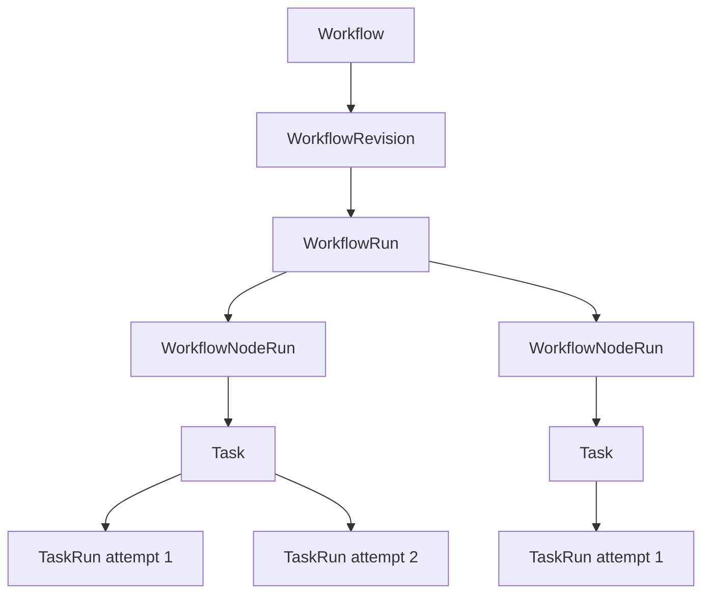
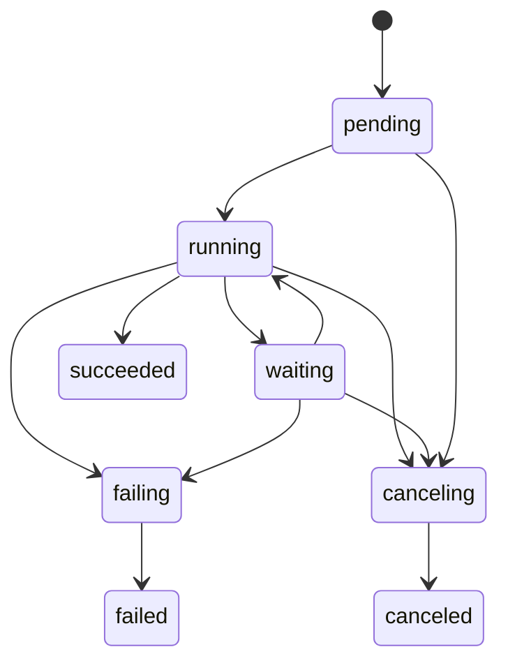
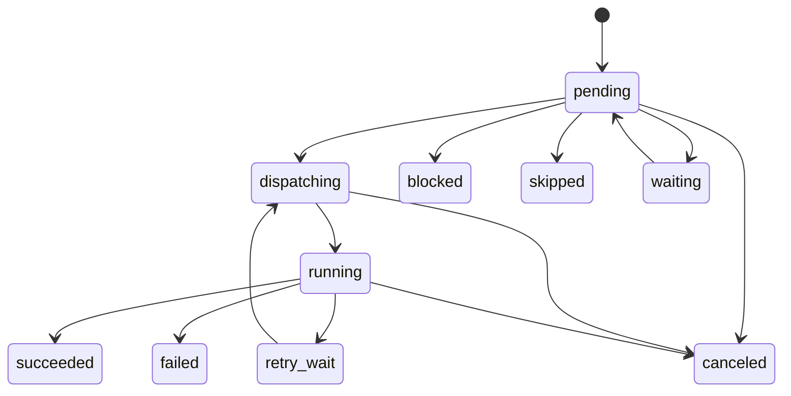

# Workflow 运行时

> **翻译说明：** 本文是[英文原文](../../design/workflow-runtime.md)的简体中文派生翻译。若中英文存在语义冲突，以英文原文为准。

> **受众：** 贡献者、产品评审者与运维人员 · **状态：** 部分实现——已接受的自适应图方向仍在计划中，持久化线性雏形已经交付。带保护的 compare-and-set Run/步骤转换、失败步骤原子收口、幂等 Task 准入、协调租约、线性协调器，以及由 Server 持有的到期 Run 恢复循环均已实现。`Service.Reconcile` 从持久状态中折叠某个步骤终态的 TaskRun、派发下一个步骤并安排该 Run 的下次协调；启动时和周期性扫描能够从回调丢失或 Server 重启中恢复。线性步骤还可以声明并持久化经过校验的 `output_schema` 结果。类型化 `nodes`/`bindings`、`input_schema`、JSON Pointer 选择、静态 DAG、路由、等待与自适应控制仍待实现

相关文档：[路线图](../ROADMAP.md)、[产品愿景](产品愿景.md)、[界面定位](界面定位.md)、[Agent 执行与 Task 线程](Agent执行与Task线程.md)、[Space 治理](Space治理.md)、[统一 Artifact](统一工件.md)、[数据模型](../contribute/architecture/data-model.md)，以及[验证计划](验证计划.md)。

## 目录

- [1. 决策与当前状态](#1-决策与当前状态)
- [2. 问题与设计原则](#2-问题与设计原则)
- [3. 目标](#3-目标)
- [4. 非目标](#4-非目标)
- [5. 领域模型与所有权](#5-领域模型与所有权)
- [6. Workflow 定义契约](#6-workflow-定义契约)
- [7. 校验与发布](#7-校验与发布)
- [8. Run 与节点状态机](#8-run-与节点状态机)
- [9. 输入、输出与信任边界](#9-输入输出与信任边界)
- [10. 协调](#10-协调)
- [11. 调度与幂等性](#11-调度与幂等性)
- [12. 失败、重试、超时与取消](#12-失败重试超时与取消)
- [13. 自适应与模型决策控制](#13-自适应与模型决策控制)
- [14. 持久化的人工请求](#14-持久化的人工请求)
- [15. 服务、API 与存储契约](#15-服务api-与存储契约)
- [16. 持久化目标](#16-持久化目标)
- [17. Portal 与运维体验](#17-portal-与运维体验)
- [18. 安全、配额与执行策略](#18-安全配额与执行策略)
- [19. 交付与迁移](#19-交付与迁移)
- [20. 验证](#20-验证)
- [21. 考虑过的替代方案](#21-考虑过的替代方案)
- [22. 证据驱动的后续工作](#22-证据驱动的后续工作)

## 1. 决策与当前状态

BuildMax Workflow 是构建在既有 Task 与 TaskRun 执行平面之上的、**归属 Space、锁定修订版本、持久化、可自适应的图**。

Workflow 运行时是以下事项的权威来源：

- 已声明的依赖关系与路由；
- 不可变的运行输入,以及解析后的节点输入；
- 节点的就绪、重试、超时、等待、取消与完成；
- 持久化的调度与重启恢复；
- 每个逻辑节点被接受的输出；以及
- 一个权威的 WorkflowRun 结果。

一个 `agent_task` 节点会把开放式的工作委托给 Task 加 TaskRun，它自己不会另行实现一套模型循环、工具系统、会话格式、沙箱、插件加载器、轨迹或 Artifact 存储。一个 Agent 可以在自己的 TaskRun 内部规划、搜索、调用工具、创建子 Agent，或者调整自己的方案——这些都属于 Agent 执行的范畴。模型只有在返回一个已发布定义所允许、并且经过 Workflow 运行时验证和记录的值时，才能对 Workflow 的控制流产生影响。

这条边界可以用一句话概括：

> 模型可以提出一个决策；由 Workflow 运行时负责验证、提交并记录这个决策。

目标是让 Workflow 具备自适应能力，而不仅仅是静态图。第一个交付的图仍然是一个无环的声明式图；后续的规划器、路由、评估器和 map 模式，可能会根据声明式模板生成数量有限的运行时节点。任何模型都不会获得隐式修改一个正在运行的图的权力。

### 1.1 当前已有的内容

当前实现已经具备一些有用的基础：

- Workflow 和 WorkflowRun 归属于 Space；
- 定义与修订版本会被记录下来；
- 一次运行会锁定一个 Workflow 修订版本；
- 每个步骤都委托给共享的 Task/TaskRun worker 路径执行；
- Agent 的内容会被复制到步骤行上,以留存溯源信息；
- 手动发起的运行,以及由 Issue 发起的运行都已经存在；以及
- Portal 可以编写一个线性的定义,并查看它的运行情况。

但这还不是本文档要设计的那个运行时，不过它的执行平面如今已经是持久的了。当前的定义是一个带静态提示词、没有类型化输入契约或版本化节点结果信封的有序 `steps` 数组。步骤可以声明 `output_schema`；共享运行时会校验最终值，并把它持久化到 TaskRun 与步骤运行。步骤还可以把前一个步骤的完整输出绑定到自己的输入中，作为带标签的不可信数据——这是 §6 中 bindings 的线性雏形——它读取的是那个步骤 TaskRun 上的完整输出，而不是步骤为展示而保留的 500 字符摘要。推进是一次基于持久事实的协调：Task 准入在一个稳定键下是幂等的，一个有边界的租约减少重复的协调轮次，带保护的 compare-and-set 转换是正确性机制，而一个由 Server 拥有的恢复循环会去收尾那些因回调丢失或重启而搁浅的运行。相对目标而言仍然缺失的是：`input_schema`、带 JSON Pointer 选取的版本化 `nodes` 与类型化 `bindings`、DAG 的 `needs`、路由与等待，以及对已交付结构化值的消费方。

当前的 Agent 快照同样不具备执行权威性。Workflow 会把旧版本的 Agent 指令复制进 Task 的用户输入中，而 Task 准入和 worker 又可能重新解析出最新的 Agent 系统指令。于是一次编辑就可能出现这样的组合：旧指令作为不可信的用户内容，与新指令作为可信的系统策略混在一起。而本文档设想的目标设计,会锁定一个 Agent 修订版本，并在整个共享运行时中都使用它。

### 1.2 在路线图中的定位

本记录接受的是这套架构本身，而不是要求立即扩大范围。可靠性这个根基，必须先于新的 Workflow 控制流之前建成。静态图执行是一项 R5 能力，要等到 R0–R3 的 Beta 证据与后续产品证据证明其必要性后才会被选中；只有具体部署提出需求和优先级时才提前。动态扩展、人工等待、Workflow 级计划任务和入站事件仍然留待更晚的阶段；单个 Agent 的周期性运行已在 Task 平面上交付（参见[定时 Agent 执行](定时Agent执行.md)）。

本记录首先建设的持久协调 substrate——幂等的 Task 准入、协调、基于租约的恢复，以及 compare-and-set 状态转换——是刻意做到与形态无关的。线性运行或静态图运行所需的这套 substrate，与一次有界的 Agent 间委派所需的完全相同：委派同样需要准入持久的子 Task、在不占用 worker 的情况下等待、并在回调丢失后恢复父任务（参见[助手编排与 Workflow 边界](../proposals/assistant-orchestration-and-workflow-boundary.md)）。因此先建它是一笔无悔投入，不会把产品绑死在图的广度上：无论 Workflow 日后是拓宽为静态 DAG，还是收窄为围绕自适应委派的确定性 Automation 外壳，这一层都原样复用。要交付多少图的广度，被推迟到那批更晚的证据出现时再定；而 substrate 不必等。

## 2. 问题与设计原则

Agent 时代的 workflow 融合了两种截然不同的计算：

1. **语义计算**：正确的下一步取决于含义、不完整的信息、搜索和判断；以及
2. **有状态协调**：系统必须在各种故障之间,始终保留授权、幂等性、重试次数上限、截止时间、结果和恢复能力。

LLM 适合前者，但不能单独承担后者的权威；确定性的图适合后者，但无法穷举一个开放式任务的所有路径。把两者当作互相竞争的引擎来对待,最终只会得到脆弱的提示词链条,或者一个无法审计的自主流程。

本设计遵循以下原则：

### 2.1 确定性拥有权威，Agent 负责执行

Workflow 拥有事实和策略。Agent 节点负责语义层面的工作。一次模型输出在被一次确定性的状态转换根据已发布契约验证之前，只是数据而已。

### 2.2 持久化的事实，而非进程内存

一个 goroutine、一次 HTTP 请求、一次回调、一个套接字,或者某一个 Server 进程,都可以用来降低延迟,但它们中的任何一个都不能决定一次运行能否完成。即便这些进程内状态全部丢失，基于已持久化的 Workflow 和 TaskRun 事实进行的协调，也必须能够抵达同一个结果。

### 2.3 类型化的边界，而非提示词拼接

Workflow 输入、节点绑定、节点输出、路由和人工响应,都应当具有 schema,或者一个小型的标准信封结构。上游模型输出必须始终被明确标记为不可信的上下文；它绝不能被直接拼接进 Agent 的系统策略里。

### 2.4 静态的策略边界，受限的动态工作

一个已发布的修订版本会声明哪些 Agent 修订版本、节点模板、路由、预算和扩展上限是可用的。一个规划器可以在这个边界之内选择要做的工作，但它不能在运行时引入一个新的 Agent、工具授权、密钥、沙箱层级，或者一张无边界的图。

### 2.5 单一执行平面

Task 加 TaskRun 依然是唯一持久化的 Agent 执行平面。Workflow 不会复制一份 Agent 循环，也不会与 TaskRun 争夺结果、轨迹、用量、Artifact、worker 或取消操作的所有权。

### 2.6 先专用，后通用

BuildMax 不是一个 BPM 产品、集成产品、ETL 产品，也不是一个可以执行任意代码的产品。在某个具体用例证明一个确定性的第二执行器,比一次 Agent 工具调用更安全、更清晰之前，一个 `agent_task` 执行器就已经足够了。

这些原则,与 [OpenAI Agents SDK](https://openai.github.io/openai-agents-python/multi_agent/) 中代码决策与模型决策编排之间的区分、[Anthropic 的指导文档](https://www.anthropic.com/engineering/building-effective-agents) 和 [LangGraph](https://docs.langchain.com/oss/python/langgraph/workflows-agents) 中 Workflow 与 Agent 之间的区分，以及 [Temporal](https://docs.temporal.io/workflows) 中确定性历史与外部活动之间的边界，在思路上是一致的。BuildMax 采纳的是这种分离方式本身，而不是任何一个框架的运行时或 DSL。

## 3. 目标

- 在节点之间传递完整的、可检查的数据和 Artifact 引用。
- 以经过校验的不可变输入接纳一次 WorkflowRun，并产出一个持久化的结果。
- 在回调丢失、Server 重启、worker 丢失,以及并发协调之后，依然能够恢复已被接纳的运行。
- 保留 Task 加 TaskRun 作为 Agent 执行与尝试的模型。
- 锁定每一项对稳定重试语义而言至关重要、且与执行相关的定义。
- 用一个 DAG 模型来表达顺序、静态扇出和扇入。
- 加入模型路由和有边界的图扩展能力，但不把系统权威转交给模型。
- 让用户和运维人员能够看到尝试、绑定、路由、等待、跳过、失败和取消。
- 保持 Go 运行时的可移植性，普通的私有部署不需要新增任何服务。
- 先让 Portal 支持最简单、有用的形式，再考虑做一个大型画布。

## 4. 非目标

- 取代 Temporal、Airflow、n8n、Zapier，或者一个通用的业务流程引擎。
- 向 Workflow 添加任意的 shell、SQL、JavaScript 或 HTTP 节点。
- 把每一次工具调用、每一个子 Agent、每一次任务交接或每一轮模型对话，都表示成一个 Workflow 节点。
- 为 Agent 执行的外部副作用提供恰好一次的语义保证。BuildMax 只保证内部准入的幂等性；具体的副作用语义由被调用的系统自行负责。
- 创建一个可以被自由修改的全局共享状态字典。
- 让模型生成并执行任意的图、Agent id、工具集、凭证或策略。
- 在一次运行等待某个人或某个外部事件时占用一个 worker。
- 让 Conversation 或 Issue 成为执行的父级对象。两者依然只是可选的起点或结果的投影。
- 把 Space 的 Workflow 编写能力搬到 CLI 或 Desktop 上。Portal 依然是它完整的管理界面。
- 要求 Go 核心依赖某个外部 workflow 运行时、Node，或者 Python。
- 通过一个兼容性解释器，来保留当前 Alpha 阶段的定义或数据库结构。

## 5. 领域模型与所有权



| 对象 | 拥有什么 | 不拥有什么 |
|---|---|---|
| Workflow | 归属 Space 的身份标识、草稿指针、已发布指针、归档状态 | 可变的运行状态 |
| WorkflowRevision | 不可变的规范定义、schema、绑定关系、节点策略、Agent 修订版本引用 | 某次运行的输入或结果 |
| WorkflowRun | 修订版本锁定、输入、聚合状态、结果、触发来源、取消意图、协调调度计划 | Agent 会话内部状态 |
| WorkflowNodeRun | 一个已物化的逻辑节点、解析后的输入、被接受的输出、策略状态、与 Task 的关系、尝试次数聚合 | worker 租约或 Agent 循环 |
| Task | 一个 Agent 节点持久化的目标与会话身份 | 图的就绪状态或路由决策 |
| TaskRun | 一次尝试的输出、Artifact、轨迹、用量、运行时物化状态、以及失败信息 | Workflow 的成功判定策略 |
| WorkflowRequest | 未来的、针对审批或类型化信息的持久化请求 | 一个被阻塞的 worker，或一次普通的 Agent 完成 |
| Conversation | 可选的前台起点与结果卡片 | Workflow 状态或授权 |
| Issue | 共享的工作与结果上下文 | Workflow 协调状态 |

包的所有权划分遵循仓库的依赖方向：

- `internal/core/workflow` 拥有定义解析、规范化校验、纯粹的就绪状态计算，以及合法的运行/节点状态转换；
- `internal/service/workflow` 拥有发布、准入、协调，以及跨 Workflow、Task、Agent、Issue、配额与未来请求各端口之间的协调工作；
- `internal/infra/db` 拥有行结构、原子性的准入操作、比较并设置式的状态转换、唯一的幂等键、租约,以及到期运行的查询；
- `internal/service/task` 拥有 Task 与首个 TaskRun 的原子准入、重试和取消；
- `internal/agentapp/taskrun` 继续负责组装并执行被锁定的那个 Agent 运行时；以及
- 各个 handler 和 Portal 只在边界处做转换工作，绝不重新实现图的决策逻辑。

一个逻辑上的 `WorkflowNodeRun` 拥有一个 Task。重试会在这个 Task 之下创建额外的 TaskRun，并记录 `retry_of_task_run_id`。这样既保留了单一的目标和单一的 Agent 会话谱系，又让每一次尝试都能被独立调度、计量、追踪，并各自进入终态。用户可以查看一个由 Workflow 拥有的 Task，但不能直接对它执行 Continue 或 Retry；这些操作属于协调器的职责。

## 6. Workflow 定义契约

第一个带版本号的定义是 `schema_version: 1`。当前未带版本号的 `steps` 格式,只是 Alpha 阶段的一个雏形，它会被彻底替换掉，而不会被当作 schema 版本 0 来对待。

规范的结构是：

```json
{
  "schema_version": 1,
  "input_schema": {
    "type": "object",
    "required": ["topic"],
    "properties": {
      "topic": {"type": "string"}
    },
    "additionalProperties": false
  },
  "policy": {
    "max_parallel_nodes": 4
  },
  "nodes": [
    {
      "id": "research",
      "type": "agent_task",
      "agent": {
        "id": "agt_researcher",
        "revision": 3
      },
      "needs": [],
      "input": {
        "instruction": "Research the supplied topic and identify uncertainty.",
        "bindings": {
          "topic": {
            "source": "workflow.input",
            "pointer": "/topic"
          }
        }
      },
      "issue_access": "if_bound",
      "policy": {
        "timeout_seconds": 1800,
        "max_attempts": 2
      }
    },
    {
      "id": "write",
      "type": "agent_task",
      "agent": {
        "id": "agt_writer",
        "revision": 5
      },
      "needs": ["research"],
      "input": {
        "instruction": "Write the final report from the supplied research.",
        "bindings": {
          "research": {
            "source": "node.research.output",
            "pointer": ""
          }
        }
      },
      "issue_access": "none",
      "policy": {
        "timeout_seconds": 1800,
        "max_attempts": 1
      }
    }
  ],
  "result": {
    "source": "node.write.output",
    "pointer": ""
  }
}
```

### 6.1 定义中的字段

`input_schema` 是 JSON Schema 的一个受支持子集，用于运行准入时的校验，以及生成 Portal 的输入表单。这个受支持的子集会在实现落地时,随 API 一起给出文档；不受支持的关键字会导致发布失败。

`nodes` 在执行语义上是一个无序集合，即便 JSON 把它表示成了一个数组。节点的位置不代表控制流。一个节点仅由 `id` 标识，并根据 `needs` 以及未来的路由激活条件而变为就绪。

在一个规范的已发布修订版本中，`agent.id` 和 `agent.revision` 都是必填项。Portal 可以出于编辑便利，允许一个草稿指向“latest”，但发布操作会把它解析为一个已经存在的、不可变的 Agent 修订版本，并把这个编号保存下来。启动一次运行永远不会去解析“latest”。

`input.instruction` 是这个节点的任务指令。`input.bindings` 用来命名 Task 可以使用的值。一个绑定的来源,要么是 `workflow.input`，要么是 `node.<node_id>.output`。

`pointer` 是一个 RFC 6901 JSON Pointer。空字符串代表选中整个值。BuildMax 在这份契约中不实现 JSONPath 过滤器、函数、表达式，或者文本模板求值。

`issue_access` 取以下三个值之一：

- `none`：这个 Task 不会获得任何 Issue 关系，也不会获得任何 Issue 范围内的运行时访问权限；
- `if_bound`：当这次运行确实绑定了一个 Issue 时，它会获得这个运行的 Issue；或者
- `required`：除非这次 WorkflowRun 本身就有一个 Issue，否则准入会失败。

这样一来，一个节点是否具备 Issue 能力就变得明确了，而不是意外地把这项能力授予了每一个节点，或者悄无声息地不给任何节点。

`max_attempts` 默认为一次。自动重试是需要显式开启的，因为一次 Agent 执行,在失败之前可能已经产生了外部副作用。定义中设定的上限和部署层面的最大值，都会在发布和准入时被校验。

`result` 从一个节点输出中选取 WorkflowRun 的结果。被选中的这个节点必须是可达的，并且在任何一条合法的首版路径上都不能被跳过。

### 6.2 第一版图的规则

- `needs` 构成一个有向无环图。
- 每一个被引用的前驱节点都必须存在。
- 一个绑定只能引用 Workflow 输入，或者一个可传递到达的前驱节点。
- 一个节点在它所有必需的前驱节点都成功之后，才会变为就绪。
- 若干个已就绪的节点,可以在 Workflow 和 Space 的限制范围内并发执行。
- 失败即快速失败；在第一版的图中，不存在“出错后继续”这样的策略。
- 目前只有一种执行器类型：`agent_task`。
- 未知字段会导致校验失败。
- UI 布局不属于执行定义的一部分。展示相关的元数据可以单独存储，这样移动一个方框,就不会催生一个新的行为修订版本。

## 7. 校验与发布

Workflow 的身份标识、草稿历史、发布状态和归档状态是彼此分离的：

```text
Workflow
  draft_revision -------- save / validate / test
  published_revision ---- immutable target for new runs
  archived_at ------------ refuses new runs; preserves history
```

每一次语义层面的编辑，都会追加一个新的 WorkflowRevision，并有条件地推进 `draft_revision`。修订版本是不可变的。发布操作不会重写这个修订版本：它执行的是把 `published_revision` 从一个预期的当前值，比较并设置为所选定的那个草稿版本。既有的审计轨迹会记录下操作者、旧指针、新指针,以及发生的时间。

发布之后再进行的编辑，会追加一个新的草稿修订版本，并让 `published_revision` 保持不变。恢复较早的内容,会把它作为一个新的草稿追加进去；它不会被悄悄地直接部署。归档操作会拒绝新的运行准入，但不会改变任何一个修订版本指针，也不会影响那些已经被准入的运行。

发布操作会对整份契约进行校验和规范化，具体包括：

1. 以拒绝未知字段、并施加大小限制的方式解码；
2. 校验受支持的输入 schema 子集,以及可选的输出 schema 子集；
3. 校验节点 id、类型、图的无环性、引用关系，以及结果的可达性；
4. 在 Space 内部解析每一个 Agent id 和修订版本，包括针对已经记录下来的修订版本、关于已删除 Agent 的策略；
5. 校验 Issue 相关要求、重试、超时、并发,以及扩展上限；
6. 对 JSON 进行规范化并计算出定义的哈希值；以及
7. 只有在预期的草稿指针和已发布指针依然匹配的情况下，才会移动已发布指针。

运行准入会重新执行那些可能在发布之后发生变化的授权与可用性检查，但它执行的始终是那份规范化后的修订版本。它不会替换掉已锁定的 Agent 修订版本，也不会用当前的 Agent 内容重写这张图。

一次测试运行,是一个真正的 WorkflowRun，只是被标记了触发来源为 `workflow_test`。它享有正常的配额、策略、轨迹和 Artifact 行为，并且在界面上会明确显示为一次测试。一个干跑校验器不会调用模型，也不会声称自己能预测 Agent 是否会成功。

## 8. Run 与节点状态机

### 8.1 Run 准入

`StartRun` 会在一个数据库事务内完成以下动作：

1. 解析出这个归属 Space 的 Workflow,以及它当前已发布的修订版本；
2. 对调用者和触发来源进行授权；
3. 校验提供的输入,以及必需的 Issue 关系；
4. 插入一条 WorkflowRun 记录，携带确切的修订版本、不可变的输入、触发来源、幂等键，以及 `pending` 状态；
5. 为每一个静态节点物化出一条 WorkflowNodeRun 记录，状态为 `pending`；以及
6. 追加这条准入事件。

这个事务内部不会创建任何 Task。事务提交之后，调用方会唤醒协调器。如果在唤醒之前发生崩溃，会由到期运行扫描机制来恢复。

### 8.2 WorkflowRun 的状态



- `pending`：已经被准入并完成物化；尚未提交任何调度动作。
- `running`：至少有一个节点可能处于就绪、调度中、运行中或重试中的状态。
- `waiting`：没有任何 worker 工作正在进行，这次运行正在等待一个持久化的外部请求。在请求类节点交付之前，这个状态暂时不会被用到。
- `failing`：快速失败机制已经提交了一个终态原因，仍在活跃的兄弟节点工作正在被取消或排空。
- `canceling`：用户发起或系统授权的取消操作赢得了这次运行状态转换；此后不会再调度任何新节点。
- `succeeded`、`failed`、`canceled`：均为终态。

只有当声明的结果绑定能够被成功解析和校验时，运行才算成功。只要一次运行仍然拥有一个活跃的 TaskRun，它就不会进入终态。设置 `failing` 和 `canceling` 这两个状态，是为了让排空过程本身可见，而不是在 worker 的效果还有可能到达的时候，就把一次运行直接标记为终态。

### 8.3 WorkflowNodeRun 的状态



- `pending`：尚未被认领；就绪状态是推导出来的，而不是存储下来的。
- `dispatching`：某个协调器持有对这次尝试准入的认领权。
- `running`：关联的 TaskRun 处于非终态。
- `retry_wait`：前一次尝试失败了，而明确设置的重试策略允许再进行一次后续尝试。
- `waiting`：这是一个未来的请求类节点，它有一个尚未完成的持久化请求，且不占用任何 worker。
- `succeeded`：某一次 TaskRun 的结果，被接受为这个逻辑节点的输出。
- `failed`：尝试次数已经用尽，或者这个节点的契约无法被满足。
- `blocked`：某个必需的前驱节点失败了，导致这个节点无法执行。
- `skipped`：一条合法的未来路由,没有选中这个节点。
- `canceled`：运行取消操作阻止或终止了这个节点的执行。

每一次状态转换都会指明预期的先前状态，并在相关的情况下,指明预期的尝试次数编号。一次在竞争中落败的更新，只会返回一个普通的冲突/空操作结果；调用方会重新读取事实，绝不会投机性地重复执行一次外部动作。

## 9. 输入、输出与信任边界

一次 WorkflowRun 的输入,在准入之后就是不可变的。一个节点被解析出来的输入,只会由这份输入、不可变的、成功完成的前驱节点输出，以及一次已被接受的持久化请求响应计算得出。它在这个节点被认领去执行第一次尝试时,就变为不可变，并且在重试时会被逐字节原样复用。

第一版的节点输出契约是一个标准信封：

```json
{
  "text": "full TaskRun output",
  "structured": null,
  "artifacts": [
    {
      "id": "art_example",
      "path": "report.md",
      "media_type": "text/markdown"
    }
  ],
  "task_id": "tsk_example",
  "task_run_id": "trn_example"
}
```

`text` 是这次 TaskRun 完整的输出内容，而不是当前那种展示用的摘要。`artifacts` 包含的是明确归属于这次被接受的 TaskRun 的、稳定的 Artifact 引用。协调器不会把任意文件复制到后续的工作区里。后续的 Agent 收到的只是作为数据的引用，并通过正常的、经过授权的能力去访问一个 Artifact。

步骤没有声明 `output_schema` 时，`structured` 字段缺失或为 `null`。一旦声明，值会由共享 Agent 运行时——而不是 Portal 解析器——校验，之后线性步骤才能成功，并持久化到 TaskRun 与步骤运行。上面展示的版本化节点信封、JSON Pointer 绑定、路由和规划器仍属于目标状态工作；它们会消费已经校验的值，而不会引入第二套解析器。

一次被接受的成功尝试，只会追加一次这个逻辑节点的输出。失败尝试的输出依然会保留在各自的 TaskRun 上以便诊断，但它们永远不会覆盖这个逻辑节点的输出，也不会成为绑定的数据来源。

WorkflowRun 的结果,使用相同的信封结构，或者一个被选中的 JSON 子树，并独立存储在这次运行上。Issue 和 Conversation 界面可以只投影这一个结果，同时保留指向各节点 Task 和 TaskRun 的链接作为溯源信息。并不是所有的中间节点输出,都会被当作互相竞争的最终答案展示出来。

### 9.1 提示词与策略的分离

一次 Agent TaskRun 的组装,包含四类彼此分明的输入：

1. 来自被锁定的那个 Agent 修订版本的系统策略和 Agent 指令；
2. 这个节点自身撰写的任务 `instruction`，作为用户意图；
3. 解析出来的绑定值，以一种稳定的、带标签的数据信封形式呈现；以及
4. 在带外提供的运行能力和运行时物化信息。

即便上游输出是由同一个 Space 里的另一个 Agent 产生的，它依然是不可信的。渲染器必须对它加以界定,并明确表示这是数据，而不是指令。它绝不能把 Agent 指令拷贝进用户输入里，不能对来自上游内容的模板进行求值，也不能把模型输出的文本提升为系统策略。

这张图本身,就足以构成完整的 Workflow 状态：

```text
immutable run input
+ immutable accepted node outputs
+ durable request responses
```

这套设计中不存在一个可变的全局字典。未来如果要加入共享状态这项功能，需要的是一套明确的冲突处理、溯源和 schema 模型，而不是一列不带类型的 JSON。

## 10. 协调

协调器是一个持久化的状态机，而不是一个长期运行的单一进程。从概念上讲，它推进状态的唯一入口是：

```go
func (s *Service) Reconcile(ctx context.Context, workflowRunID string) error
```

同一个操作,无论是在准入之后被调用、由一次 TaskRun 终态通知触发、由周期性的到期运行扫描触发、在 Server 启动恢复期间触发，还是由两个 Server 副本相互竞争触发，都必须是安全的。

一轮协调过程会：

1. 在没有未过期租约的情况下，获取一个有边界的 WorkflowRun 租约；
2. 读取被锁定的修订版本、运行本身、节点各行、关联的 Task 和 TaskRun，以及持久化请求相关的事实；
3. 用比较并设置式的状态转换，把终态的 TaskRun 事实折叠进对应的 NodeRun 里；
4. 提交超时、重试、失败传播和取消这些决策；
5. 推导出每一个依赖关系和路由激活条件都已满足的待处理节点；
6. 解析并存储每一个被认领节点的输入；
7. 幂等地准入或恢复对应的 Task 和 TaskRun；
8. 推导出聚合的运行状态和已声明的结果；
9. 为那些仍需被观察的工作，设置 `next_reconcile_at`；以及
10. 释放这个租约。

租约的作用是减少重复计算，它本身并不是正确性的来源。正确性来自唯一的准入键、不可变的事实，以及有条件的状态转换。如果一个租约在其持有者仍然存活的情况下过期了，另一个进程可以重新执行一遍协调过程，而不会重复创建一个 Task，也不会重复接受同一个结果。

TaskRun 的终态回调,只在“唤醒”这一件事上还有用。它的失败会被记录下来，并由到期运行查询机制加以恢复。上报一次已经处于终态的 TaskRun，并不需要重放这次回调，因为 Workflow 的协调器自己会去读取那条终态记录。

到期运行扫描器会选出那些 `next_reconcile_at` 已到期、或者租约已过期的非终态运行。它使用有边界的批次和退避策略。当回调机制工作正常时，一个拥有活跃 TaskRun 的运行会被检查得不那么频繁；而当回调机制失效时，它依然有一个有限的恢复时限。

### 10.1 决策是一个作用于持久事实之上的纯函数

一次协调过程把“做决策”和“提交”分开。决策——哪些 pending 节点已就绪、哪些路由被激活、一次有界展开物化出哪些子节点，以及运行的聚合状态与结果——是钉死的修订版本与那些已经落库的事实的纯函数：

```text
Plan(now, RunState) -> Decision
```

`RunState` 是修订版本、当前的节点行，以及各已成功节点的已接受输出。`Plan` 不做任何 I/O、不调用任何模型、除了被传入的 `now` 之外不读任何时钟，因此一个丢失的协调过程会重算出同一个 Decision。服务外壳读取事实、调用 `Plan`，再通过幂等的 Task 准入与 compare-and-set 状态转换来提交这个 Decision。`Plan`、绑定解析与状态转换校验器构成 `internal/core/workflow` 中的纯核心；负责加租约、读取与提交的外壳是 `internal/service/workflow`。

这样保持的是一个平面，而不是两个调度器。模型永远不会在一次协调过程*内部*做决策。模型的选择——一个带类型的路由值，或一个规划器列表——由一个普通的 `agent_task` TaskRun 产出，被折叠进它的节点成为已接受输出（见第 9 节），此后才被更晚的一次 `Plan` 当作又一条持久事实读取。而一条静态边的就绪性，则是按需从 `needs` 与各已成功节点推导出来的，无需存储。分界规则是可重算性：无法廉价且确定性地重算的值——每一份模型输出——必须在 `Plan` 依赖它之前成为一条持久事实；能重算的值则现算即可。

因此，加入由模型决定的控制流，是往 `Plan` 里添加一种节点类型及其纯求值器，而不是在确定性调度器旁边再加一个会调用模型的第二调度器。不存在一个带有图实现与 LLM 实现的 `Scheduler` 接口。把一次模型调用放进决策路径，会把模型延迟耦合进事务，并放弃恢复所依赖的免费重放。

## 11. 调度与幂等性

节点的调度会横跨 Workflow 和 Task 两套存储。它不能依赖某一个横跨 worker 执行过程的单一数据库事务，而且 Task 的创建必须经由 Task 服务完成，不能直接写 Workflow 的表。

每一个逻辑节点都有一个稳定的 Task 准入键：

```text
workflow/<workflow_run_id>/node/<node_id>
```

每一次重试尝试都有一个稳定的 TaskRun 准入键：

```text
workflow/<workflow_run_id>/node/<node_id>/attempt/<attempt_number>
```

Task 应用服务接受这些键，并保证：

- 一个 Space 和一个准入键的组合，只会解析到一个 Task；
- 第一次调用会原子性地同时创建这个 Task 和它的第一个 TaskRun；
- 重复的调用会返回同一个 Task 和 TaskRun；
- 一个重试键,只会解析到既有 Task 之下的一个 TaskRun；以及
- 针对一个既有键提交了冲突的载荷时，请求会被拒绝，而不是被忽略。

调度过程如下：

```text
CAS node pending/retry_wait -> dispatching
                    |
                    v
idempotently admit Task or retry TaskRun
                    |
                    v
CAS node dispatching -> running and link ids
```

这里最关键的一个崩溃窗口，出现在 Task 准入完成之后、NodeRun 关联完成之前。恢复时，协调器会用同一个键再次调用准入操作，拿到既有的 Task/TaskRun，然后完成关联。它绝不会去猜测一个尚未关联的 Task 是不存在的。

存储层至少要强制以下约束：

```text
UNIQUE(workflow_run_id, node_id)
UNIQUE(space_id, task_admission_key)
UNIQUE(task_id, task_run_admission_key)
```

公开 id 会出现在 API 和日志里。内部的数值键，按照实体身份设计文档的规定,用于实现关系型索引。

## 12. 失败、重试、超时与取消

### 12.1 失败策略

第一版图的策略是快速失败。当一个必需的节点用尽了所有尝试次数时：

1. 这个节点变为 `failed`，带有一个稳定的错误码和诊断信息；
2. 这次运行有条件地进入 `failing` 状态；
3. 不再调度任何新节点；
4. 仍处于活跃状态的兄弟 TaskRun 会收到取消意图；
5. 那些因此已不可能执行的待处理后继节点变为 `blocked`；以及
6. 等到所有活跃工作都进入终态之后，这次运行变为 `failed`。

协调器故障、worker 故障、提供商故障、契约校验失败、超时，以及 Agent 自己报告的失败，这些依然是彼此可区分的。一次模型质量层面的失败，不会被重新贴上协调器崩溃的标签。

### 12.2 重试

`max_attempts` 把第一次尝试也计算在内，默认值为一次。重试必须显式开启，因为一次 TaskRun 在返回失败之前，可能已经产生了外部副作用。

对于一次被启用的重试：

- 会复用同一个 WorkflowNodeRun 和同一个 Task；
- 下一次 TaskRun 会记录 `retry_of_task_run_id`；
- 解析出来的节点输入是逐字节相同的；
- Agent id 与修订版本、插件发行版锁定、请求的沙箱策略、指定名称的密钥消费、Issue 关系，以及模型请求，都保持不变；
- 每一次尝试都各自保留自己的输出、轨迹、用量、Artifact 归属,以及失败信息；以及
- 有边界的退避，由 `retry_wait` 状态和 `next_attempt_at` 字段来表示。

密钥的值不会被复制进 Workflow 状态里。由于 Space Secret 目前是不带版本的，每一次尝试都会通过正常的运行分发机制，为那些已经锁定的密钥名称拿到当前的取值，并记录下这次物化过程。一次凭证轮换会被有意地表现为可见的行为，而不是逐比特的重放。

当基础设施发生故障时，实际的提供商路由可能会发生变化，但依然要遵循同一份模型请求和网关策略。这次运行会记录下每一次尝试实际使用的是什么。

### 12.3 超时

一个节点的超时，是由协调器根据存储下来的截止时间提交的。它会请求取消当前活跃的 TaskRun，并且在这个 TaskRun 进入终态之前，不会创建新的尝试。如果一个 worker 消失了，worker 存活性检测机制会最终提供这个终态事实。

一个 Workflow 层面的截止时间会阻止新的调度，并把这次运行推向 `failing` 状态，除非一次已被接受的用户取消操作,已经把它推向了 `canceling`。

### 12.4 取消与竞态

取消是记录在 WorkflowRun 上的一个意图，而不是对某个 HTTP handler 恰好看到的那些行做一次循环遍历。成功地将状态 CAS 为 `canceling`，就确立了此后任何一轮协调都不会再调度新的工作。活跃的 TaskRun 会通过 Task 服务收到取消请求；处于等待或重试状态的节点会变为 `canceled`；被一条已经提交的路由排除在外的节点，依然保持为 `skipped`。

第一个被提交的、运行级别的状态转换将会获胜：

- 如果结果完成先被提交，那么之后的取消请求会返回一个终态冲突；
- 如果进入 `canceling` 先被提交，那么之后的 TaskRun 成功不会重新给这次运行贴上别的标签；
- 如果进入 `failing` 先被提交，那么之后的取消请求不会掩盖这次失败；以及
- 重复的取消操作是幂等的。

这条规则是通过预期状态更新来实现的，而不是靠比较时间戳。

## 13. 自适应与模型决策控制

静态 DAG 是交付的根基，而不是最终的表达能力上限。自适应控制,是通过一个已发布修订版本预先设想好的那些取值加进来的。

### 13.1 类型化路由

一个普通的 `agent_task` 可以声明这样一个输出 schema：

```json
{
  "type": "object",
  "required": ["route"],
  "properties": {
    "route": {
      "enum": ["approved", "needs_revision", "reject"]
    }
  },
  "additionalProperties": false
}
```

这份定义会把每一个允许的取值,映射到声明好的后继节点激活规则上。运行时会校验这个结构化输出，记录下原始的 TaskRun 结果、经过校验的取值、Agent/模型修订版本、被选中的路由，以及被跳过的后继节点，然后执行一次确定性的状态转换。无效的输出会遵循这个节点明确设置的重试策略，否则就会让这个节点失败。

目前还不存在一个独立的路由器执行器类型。只有当它日后真正拥有实质上不同的策略或执行方式，而不只是在 Portal 上换一个图标时，一个独立的类型才有存在的必要。

### 13.2 有边界的规划器与 map

一个规划器返回的是数据，比如：

```json
{
  "tasks": [
    {"key": "market", "objective": "Research the market"},
    {"key": "technology", "objective": "Research the technology"}
  ]
}
```

已发布的定义中包含了工作节点模板和相应的限制：

```json
{
  "expand": {
    "source": "node.plan.output",
    "pointer": "/structured/tasks",
    "template": "research_worker",
    "key_pointer": "/key",
    "max_items": 10,
    "max_parallel": 4
  }
}
```

运行时会校验条目数量、键的唯一性、条目 schema、整张图的边界，以及模板引用是否有效，然后以诸如 `research_worker[market]` 这样确定性的 id 物化出子 NodeRun。这个模板固定了 Agent 修订版本、绑定关系、Issue 访问权限、重试、超时、工具策略,以及成本边界。规划器的输出无法选择这个模板之外的其他选项。

### 13.3 评估器循环

已发布的图始终保持无环。一个评估器可以请求 `pass` 或者 `revise`；一个声明好的、有边界的迭代模板,会物化出下一轮的撰写节点和评估节点：

```text
write[1] -> evaluate[1] -> write[2] -> evaluate[2]
```

这份定义必须设置最大迭代次数、总扩展规模、截止时间和预算。每一轮迭代都有各自不可变的输入，以及各自独立的 TaskRun 溯源信息。运行时绝不会覆盖前一轮迭代来模拟出一个循环。

### 13.4 产品边界

一个一次性的开放式目标，通常应该直接做成一个 Agent Task。只有当一个流程需要被复用、需要稳定的数据契约、需要治理、需要跨多个阶段的所有权、需要持久性，或者需要一个可检查的结果时，才值得使用一个 Workflow。这样可以防止一张自动生成的图，变成围绕着一件本来一个 Agent 就能做得更好的工作、搭建起来的繁文缛节。

## 14. 持久化的人工请求

审批和信息缺失,是未来才会加入的持久化请求类型，它们既不是阻塞式的 Agent 调用，也不是 NodeRun 上的布尔字段。

一个 WorkflowRequest 拥有：

- Space、WorkflowRun 和 NodeRun 的身份标识；
- 请求类型和带类型的请求载荷；
- 允许的响应 schema；
- 发起请求者，以及有资格响应的角色或身份；
- `pending`、`answered`、`expired` 或 `canceled` 状态；
- 过期时间，以及响应操作者/时间；
- 响应载荷和审计关联信息；以及
- 一个用于响应的幂等键。

一个存在未完成请求的节点处于 `waiting` 状态；当没有其他工作在进行时，整次运行也处于 `waiting` 状态。它不会占用任何 worker。一次响应事务会记录下这个答案，并唤醒协调过程。重复的或未经授权的回答，不能同时让两条路径都恢复执行。

这项能力必须在 Space 治理的审批模型设计出来之后，与之集成。Workflow 不应该用一个孤立的审批功能，去抢先决定委派、角色、过期、升级和审计这些语义应该如何设计。

## 15. 服务、API 与存储契约

### 15.1 应用服务

从概念上讲，Workflow 服务拥有以下这些操作：

```go
type Service interface {
    SaveDraft(context.Context, SaveDraftCmd) (*Revision, error)
    Publish(context.Context, PublishCmd) (*Workflow, error)
    StartRun(context.Context, StartRunCmd) (*Run, error)
    CancelRun(context.Context, CancelRunCmd) (*Run, error)
    Reconcile(context.Context, string) error
}
```

`PublishCmd` 携带的是预期的草稿修订版本和已发布修订版本。`StartRunCmd` 携带的是 Space、Workflow、可选的显式已发布修订版本、不可变的输入、可选的 Issue、触发来源、操作者，以及调用方提供的幂等键。

Workflow 所需要的 Task 端口是很窄的：

```go
type TaskExecution interface {
    AdmitWorkflowTask(context.Context, AdmitWorkflowTaskCmd) (*Task, *TaskRun, error)
    RetryWorkflowTask(context.Context, RetryWorkflowTaskCmd) (*TaskRun, error)
    RequestCancel(context.Context, string, Actor) error
}
```

Workflow 不会直接调用基础设施层的数据库类型，也不会直接调用 Agent 运行时。

### 15.2 存储层能力

存储层暴露出来的是面向意图的原子操作，而不是通用的、可以做局部更新的接口：

- 以预期的当前修订版本为前提，追加一个草稿修订版本；
- 以一个预期的修订版本为前提，执行发布；
- 原子性地准入一次运行,以及其静态的各个 NodeRun；
- 返回一份运行快照，包含它锁定的修订版本和各个节点；
- 列出已到期的非终态运行；
- 认领并续期一个有边界的协调租约；
- 从一个预期的状态和尝试次数出发，认领一个节点；
- 关联一个被幂等准入的 TaskRun；
- 只接受一次终态结果；
- 从一个预期的尝试次数出发，调度一次重试；
- 记录取消或失败意图；
- 以文档化的原因,终结掉待处理的节点；以及
- 以一个预期的聚合状态为前提,连同一个结果一起，完成一次运行。

一个 handler 或服务,绝不能用一连串通用的 `Update` 调用去拼凑出同样的效果，因为这些调用的中间状态会违反这套模型。

### 15.3 HTTP 界面

目标界面是对现有的、归属 Space 的路由的扩展：

```text
POST /api/spaces/{space_id}/workflows/{workflow_id}/revisions
POST /api/spaces/{space_id}/workflows/{workflow_id}/publish
POST /api/spaces/{space_id}/workflows/{workflow_id}/runs
GET  /api/spaces/{space_id}/workflow-runs/{workflow_run_id}
POST /api/spaces/{space_id}/workflow-runs/{workflow_run_id}/cancel
```

运行准入接受的载荷是：

```json
{
  "workflow_revision": 7,
  "input": {"topic": "Agent workflow"},
  "issue_id": "iss_example",
  "idempotency_key": "caller-generated-key"
}
```

不传 `workflow_revision`，会在准入事务内部选中当前已发布的修订版本。传入这个字段，只有在它是一个被允许的已发布/测试修订版本时，才允许一次经过授权的测试，或者一次锁定版本的调用生效。普通用户无法靠猜一个数字，来执行任意一个历史定义。

准入操作会连同这次持久化的运行一起，返回 `202 Accepted`。HTTP 请求的生命周期,从来都不代表 Workflow 的生命周期。这次运行的详情响应中，包含聚合状态、输入、结果、各节点摘要、尝试次数、等待情况、错误信息和链接；TaskRun 的轨迹以及大体积的 Artifact 内容，依然留在它们各自归属的 API 之后。

未来的请求响应会使用：

```text
POST /api/spaces/{space_id}/workflow-requests/{request_id}/respond
```

## 16. 持久化目标

`internal/infra/db` 中的行结构体,依然是 schema 的权威来源。下面各小节描述的是目标形态，而不是当前 schema 的文档；数据模型参考文档,只会在实现真正落地时才会随之改变。

### 16.1 `workflow`

保留身份标识、Space、展示字段、创建者和时间戳。把原来单一的、可变的定义/状态/修订版本权威，替换成：

- `draft_revision`；
- 可为空的 `published_revision`；以及
- 可为空的 `archived_at`。

展示名称和描述,属于经过修订版本管理的语义内容。只有当测试能够保证修订版本才是权威来源时，Workflow 这张表才可以出于列表性能考虑，缓存当前草稿的取值。

### 16.2 `workflow_revision`

这是一张只追加的表，每一行包含：

- Workflow 及其修订版本号；
- 名称和描述；
- 规范化后的定义 JSON；
- schema 版本号和定义哈希值；
- 作者和创建时间。

唯一键依然是 `(workflow_id, revision)`。生命周期状态不属于修订版本本身的内容。发布,是 Workflow 上的指针加上一条审计事件。

### 16.3 `workflow_run`

新增或保留：

- 公开 id、Workflow id，以及确切的 Workflow 修订版本；
- 可选的 Issue id，以及带类型的触发来源；
- 调用方的幂等键；
- 不可变的 `input_json`；
- 可为空的、一旦进入终态就不可变的 `result_json`；
- 运行状态,以及稳定的错误码/错误信息；
- 取消操作者/时间；
- 协调所有者、租约到期时间，以及 `next_reconcile_at`；
- 创建者和生命周期各时间戳。

运行准入,在其归属的 Space 和触发范围内,拥有一个唯一的调用方键，因此一次被重试的 HTTP 请求不会创建出第二次运行。

### 16.4 `workflow_node_run`

用来替换 `workflow_step_run`。每一行包含：

- 公开 id、WorkflowRun id，以及作者撰写/运行时物化出的节点 id；
- 执行器类型；
- 状态,以及预期状态的版本号；
- 被锁定的 Agent id 和修订版本；
- 用于诊断所需的规范化节点定义或定义哈希值；
- 不可变的、已解析的输入 JSON；
- 只在成功时追加一次的输出 JSON；
- Task id，以及被接受的那次成功 TaskRun 的 id；
- 当前 TaskRun 的 id、尝试次数，以及下一次尝试的时间；
- 稳定的 Task 准入键；
- 超时截止时间；
- 跳过/阻塞/取消/失败的原因,以及诊断信息；以及
- 生命周期各时间戳。

唯一约束 `(workflow_run_id, node_id)` 标识出这个逻辑节点。尝试历史是从这个 Task 之下的各个 TaskRun 中读取出来的，而不是被覆写到某一行节点记录上。

### 16.5 `workflow_run_event`

这是从第一个持久化运行时切片开始就新增的、只追加的运维时间线。每一条事件都包含 WorkflowRun、单调递增的序号、可选的 NodeRun、事件类型、操作者类型/id、有边界且经过脱敏的载荷、关联 id，以及时间戳。

这张事件表是为了可审计性和界面重建服务的，不是用来做事件溯源式回放的。运行行和节点行,依然是当前状态的权威来源。一次会改变状态的事务，会在同一个事务内追加它对应的事件，这样时间线就不会声称发生过一次实际没有提交成功的状态转换。

### 16.6 `workflow_request`

这张表只有在持久化人工请求这项能力加入时才会新增。它的目标契约在第 14 节；对于静态图这几个交付切片来说，它并非必需。

## 17. Portal 与运维体验

编写能力会按以下顺序交付：

1. 基于表单的节点、Agent 修订版本选择、依赖关系、绑定关系、结果和策略；
2. 带有循环依赖/引用/schema 错误提示的内联校验；
3. 与表单并列展示的、只读的拓扑可视化视图；
4. 提供输入的测试运行,以及完整的时间线；
5. 草稿与当前已发布修订版本之间的发布差异对比；以及
6. 只有在观察到的编写行为能够证明其必要性时，才加入直接的画布操作。

主要的编写单元是一个语义化的表单，而不是原始 JSON，也不是一个画布。JSON 可以作为一个从同一份经过校验的定义生成出来的高级视图保留下来。

运行详情页面要回答：

- 这次运行是由什么输入和触发方式启动的；
- 执行的是哪个 Workflow 修订版本和哪个 Agent 修订版本；
- 哪些节点处于就绪、调度中、运行中、重试中、等待中、已跳过、被阻塞，或者已进入终态；
- 一个节点为什么走了某条路由，或者为什么没有运行；
- 进行过哪些尝试，每一次尝试各自消耗和产出了什么；
- 是什么样的截止时间、配额、策略或请求，正在阻碍进展；
- 取消操作或快速失败排空是否正在进行中；以及
- 这次 Workflow 权威的结果是什么。

它会链接到 Task 和 TaskRun 页面，以查看会话、轨迹、工具、用量和 Artifact 相关的细节。它不会把完整的轨迹复制进 Workflow 的记录中。

运维人员需要看到到期运行的积压量、最旧的未协调运行、租约存活时长、重试次数、恢复延迟、活跃/等待中的数量，以及按失败类别划分的终态结果统计。这些指标描述的是协调器本身的健康状况，与模型任务质量是分开看待的。

## 18. 安全、配额与执行策略

Space 依然是所有权和授权的边界。所有者和管理员管理定义和发布；成员可以在既有治理决策允许的范围内启动已发布的 Workflow。仅仅拥有读取权限，并不会隐式地授予执行某个历史修订版本的权限。

发布和准入都会校验：每一个 Agent 修订版本都必须属于这个 Space。对于已经被准入的运行来说，被删除的 Agent 修订版本依然可读，但除非既有的 Agent 生命周期规则明确允许，否则不能被重新选中。

Workflow 定义无法授予超出所选 Agent 修订版本和 Space 策略范围之外的工具、插件、密钥、沙箱访问权限或 Issue 访问权限。动态规划器的输出,只能在一个已声明模板的范围内收窄或实例化，它不能扩大权限范围。

WorkflowRun 和 NodeRun 的 JSON 遵守有边界的大小限制和脱敏规则。密钥的值永远不会进入定义、输入、输出、事件载荷或错误列里。TaskRun 的轨迹,依然由它既有的所有者负责设定边界和进行脱敏。

配额检查会在运行准入,以及每一次 TaskRun 准入时进行。这次运行会汇总实际的 TaskRun 用量和成本用于展示和未来的策略参考，但 TaskRun 和 LLM 调用台账依然是记账层面的权威来源。并发调度会遵循定义、Space、调度器和部署层面并发限制中最小的那个。

重试、循环和动态扩展都要声明硬性的上限。触及一个上限,是一次带类型的 Workflow 策略失败，而不是邀请模型来协商出另一个限制。

没有任何一种自动重试机制,能让外部副作用变成恰好一次。Portal 必须显示出一个 Agent 节点是否启用了重试，编写指南也必须要求使用幂等的工具，或者明确接受重复执行的风险。

## 19. 交付与迁移

### 阶段 0：锁定基线

- 增加一个“先研究后综合”的评估用例，并记录下当前引擎无法通过完整输出这一事实。
- 增加一个失败测试：提交 TaskRun 结果、丢弃回调，并演示出当前会出现的卡死运行。
- 增加针对重复观察到终态、以及 Workflow 修订版本推进这两种情况的 MySQL 并发争用覆盖测试。
- 记录延迟、Task 数量、用量,以及当前运维人员的恢复行为。

### 阶段 1：让这个线性雏形变得持久可靠

- 引入基于预期状态的 Workflow 和步骤状态转换。**已交付：** Run 与步骤状态已经类型化，终态不可变，转换使用 compare-and-set，失败步骤与 Run 的收口具备原子性。
- 为归属 Workflow 的 Task 和 TaskRun,加入幂等的准入机制。
- 加入 `Reconcile`、到期运行扫描，以及重启恢复。
- 让回调只承担唤醒协调过程这一件事。
- 加入 WorkflowRun 取消功能，以及一致的排空行为。
- 停止把 Agent 指令复制进 Task 用户输入,并让 Agent 修订版本在整个 worker 执行过程中都具有权威性。
- 按照一条明确的过渡期规则来传播 Issue 关系。

这个阶段不会新增任何图相关的功能。它降低的是迁移风险，即便后续的产品证据推迟了 R5，这个阶段本身依然有价值。

### 阶段 2：切换到带版本的数据契约

- 用 `schema_version: 1` 替换掉不带版本号的 `steps` 定义。
- 把草稿指针和已发布指针分离开。
- 准入不可变的 WorkflowRun 输入。
- 用 NodeRun 替换掉 StepRun，并持久化解析后的输入/完整的输出；
- 通过 RFC 6901 指针,暴露文本和 Artifact 绑定关系；
- 存储声明好的 WorkflowRun 结果；以及
- 把一个结果投影进 Issue 界面,以及可选的 Conversation 界面。

BuildMax 处于 Alpha 阶段。要把领域模型、行结构体、handler、OpenAPI、Portal、测试和文档一起改动。不要同时维护两套定义解释器，也不要把陈旧的表结构当作兼容层保留下来。

### 阶段 3：静态 DAG

- 用 `needs` 替换掉“数组位置即执行权威”的做法。
- 在并发限制之内，调度所有已就绪的节点；
- 实现确定性的扇出/扇入,以及快速失败式的阻塞语义；
- 加入完整的发布校验,以及一个只读的图视图；以及
- 把线性形式保留下来，作为最简单的一种 DAG，而不是一个独立的引擎。

### 阶段 4：有边界的策略与类型化的决策

- 加入归属 Workflow 的重试机制,以及节点/运行级别的超时。
- 在类型化路由和决策节点中消费已经交付的、与提供商无关的结构化 Agent 输出。
- 加入类型化的条件路由,以及可见的决策记录。
- 加入聚合的用量/成本策略,以及运维指标。

### 阶段 5：证据驱动的自适应能力

- 只有在 Space 治理拥有了这项能力之后，才加入持久化的外部请求。
- 加入有边界的规划器/map 扩展。
- 加入有边界的评估器迭代。
- 只有在有复用证据要求时，才加入嵌套的 Workflow 模板。
- 只有在准入的幂等性、协调、配额、取消和运维恢复都已经得到验证之后，才加入计划任务、webhook 或事件触发器。

数据模型参考文档保持真实反映现状，并随着每一个存储切片的落地而变化。用户侧的编写与运行文档，会随对应的 Portal 界面一起加入。面向用户可见的切片，会收到正常的变更日志条目。

## 20. 验证

### 20.1 纯领域测试

- 严格解码与规范化；
- 节点 id 与引用关系校验；
- 环检测,以及结果可达性；
- RFC 6901 绑定的成功与失败场景；
- 顺序、扇出和扇入场景下的就绪状态计算；
- 每一种合法和非法的运行/节点状态转换；
- 当这些功能交付时，路由激活以及确定性物化 id 的生成；以及
- 策略和扩展上限。

### 20.2 MySQL 存储测试

每一次存储层面的改动,都要跑一遍 `./make test mysql`。这些测试要证明：

- 一次运行,以及它的静态节点,是原子性准入的；
- 重复的调用方准入,只会得到一次运行；
- 两个协调器,只会各自认领到一个节点一次；
- Task 准入的恢复机制，能够关闭“先创建后关联”之间的崩溃窗口；
- 重复观察到的终态,只会接受一份输出；
- 租约过期允许安全地被接管；
- 发布操作的比较并设置,能够防止更新丢失；
- 取消、失败和成功之间的竞态，都有一个明确记录下来的赢家；以及
- 事件序号和当前状态,是一起提交的。

### 20.3 服务与端到端测试

| 场景 | 需要证明的证据 |
|---|---|
| 先研究后综合 | 完整的文本和 Artifact 引用能跨越边界传递，并产出一个 Workflow 结果 |
| 并行评审后合并 | 扇出在配额范围内并发运行；扇入会等待所有必需的输出 |
| 绑定 Issue 的 Workflow | 只有主动选择接入的节点才能获得 Issue 能力；Issue 上只展示一个带溯源信息的结果 |
| Task 准入后 Server 重启 | 这个节点能够恢复到同一个 Task，且不会重复执行 |
| 终态回调丢失 | 到期运行扫描能够观察到 TaskRun 的状态,并让这次 Workflow 完结 |
| 两个协调器与重复完成 | 只会得到一个 Task、一个被接受的节点输出，以及一个终态结果 |
| Agent 编辑之后重试 | 重试使用的是被锁定的修订版本,以及完全相同的解析输入 |
| 扇出过程中取消 | 不会发生新的调度；活跃的 TaskRun 会收到取消请求；这次运行会排空至 canceled |
| 无效的结构化路由 | 会明确触发重试/失败,不会有任何未声明的边被执行 |
| 审批等待（交付之后） | 不会占用任何 worker；一次经过授权的回答，能在重启之后恢复一条路径的执行 |

要度量最终结果质量、耗时、用量和模型成本、恢复延迟、内部重复执行的效果、人工介入次数、编写错误，以及失败类别。要依照评估设计,把 Agent 质量,与协调器、worker、提供商和评估器各自的故障区分开来看待。

在每个阶段交付之前，要运行范围狭窄的 Workflow 服务和 handler 测试、针对持久化层的 MySQL 范围测试、相关的 Portal 检查、文档检查，以及 `git diff --check`。对外部模型的评估是一项有意为之的独立工作，绝不能因为一套确定性测试套件全部通过,就默认它也已经完成。

## 21. 考虑过的替代方案

### 21.1 扩展现有的回调式顺序执行器

直接在当前的数组结构上增加模板、分支和并行步骤，短期内成本很低，但会继续保留回调丢失后的恢复问题、重复调度的窗口、部分准入,以及隐式的数据流动。这种做法是在执行语义之前,先去优化肉眼可见的功能，因此除了阶段 1 的可靠性修复之外，这个方向被否决了。

### 21.2 让一个 LLM 编排整个 Workflow

一个管理者 Agent 在一个开放式 Task 内部是有用的，它可以创建子 Agent。但它不是一个持久化的 Space Workflow：它的上下文不是一份事务日志，它选择工具的方式是概率性的，它也不能单独承担权限、截止时间、审批、取消或重放这些方面的权威。纯粹依靠 LLM 编排,作为 Workflow 的控制平面这个方案被否决了。

### 21.3 要求引入一个外部的持久化运行时

Temporal、Dapr、Restate、DBOS 以及类似的系统,提供了成熟的定时器、重试、等待和运维工具。强制要求使用其中一个，会引入一个额外的服务或运行时依赖，会重复实现或绕开 Task/TaskRun 本身的调度和策略，并会制造出彼此竞争的状态权威来源。这与可移植的单一二进制/私有部署这个基准要求相冲突，因此被否决作为默认方案。

这条领域边界不应该妨碍未来出现一个面向企业的适配器，但在某个已经拥有一套既有运行时的部署,证明了这个需求，并明确定义清楚哪些 BuildMax 的事实依然具备权威性之前，不会加入任何这样的抽象层。

### 21.4 专用的数据库协调器

一个基于 MySQL、构建在既有 Task 之上的状态机，能够保持单一的授权、执行、轨迹、Artifact、配额和结果平面，也符合当前的部署模型。BuildMax 必须自己承担协调和并发争用正确性方面的责任，因此这个选择,只有连同第 20 节中的故障注入测试和 MySQL 证据一起，才会被接受。

## 22. 证据驱动的后续工作

以下这些事项不会阻塞静态持久化图的交付，也都不是承诺：

1. 只有当一个真实用例无法通过一次 Agent 工具调用安全地表达出来，并且它自己拥有独立的授权和幂等性契约时，才加入一个确定性的、非 Agent 的执行器。
2. 只有当重复出现的子图带来的维护成本,是模板机制无法解决的时候，才加入嵌套 Workflow。
3. 只有具备了具体的部分成功或回退语义时，才在快速失败之外加入别的失败策略；不要加入一个通用的 `continue_on_error` 开关。
4. 只有当不可变引用被证明不够用，并且拷贝、授权、大小和生命周期方面的契约被单独设计出来之后，才把 Artifact 内容物化进后续的工作区。
5. 只有当某个用例明确定义好了冲突处理、溯源、schema 迁移和重试行为之后，才加入可共享的可变 Workflow 状态。
6. 只有当某个运维方本身已经拥有这项依赖，并且接受把 BuildMax 的 TaskRun 当作执行事实、而把这个适配器仅仅当作协调基础设施时，才加入一个外部持久化运行时的适配器。
7. 只有在幂等的运行准入、限流/配额策略、取消,以及运维恢复都已经通过资格验证之后，才加入计划任务和入站触发器。
