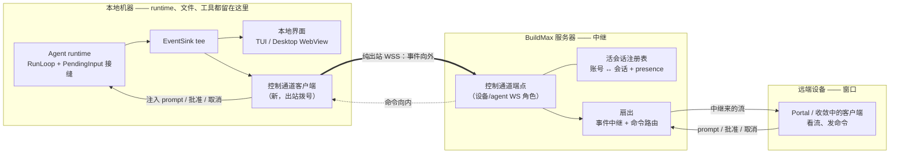

# Remote Control：从另一台设备驱动本地 Agent 会话

> **翻译说明：** 本文是[英文原文](../../proposals/remote-control.md)的简体中文派生翻译。若中英文存在语义冲突，以英文原文为准。

> **受众：** 贡献者、产品设计师和早期采用者 · **状态：** 提案 — 讨论中
>
> **开启时间：** 2026-09-20

相关文档：[路线图](../ROADMAP.md)、
[客户端界面收敛](client-surface-convergence.md)、
[界面定位](../design/界面定位.md)、
[客户端模式](../design/客户端模式.md)、
[Agent 执行与 Task 线程](../design/Agent执行与Task线程.md)、
[Agent 桥接 CLI](../design/Agent 桥接 CLI.md)、
[排队消息](../design/排队消息.md)、
[Worker 运行令牌](../design/Worker运行令牌.md)，以及
[Agent 沙箱策略](../design/Agent沙箱策略.md)。

## 目录

- [1. 摘要](#1-摘要)
- [2. 引出这份提案的问题](#2-引出这份提案的问题)
- [3. 什么是 Remote Control](#3-什么是-remote-control)
- [4. 问题与当前背景](#4-问题与当前背景)
- [5. 分解 两根轴与两块共享底座](#5-分解-两根轴与两块共享底座)
- [6. 第一性原理 Remote Control 需要什么](#6-第一性原理-remote-control-需要什么)
- [7. 目标](#7-目标)
- [8. 非目标](#8-非目标)
- [9. 控制平面](#9-控制平面)
- [10. 复用什么与构建什么](#10-复用什么与构建什么)
- [11. 安全与信任](#11-安全与信任)
- [12. 分阶段计划](#12-分阶段计划)
- [13. 方案与权衡](#13-方案与权衡)
- [14. 待解决问题与所需证据](#14-待解决问题与所需证据)
- [15. 获采纳后的可能归宿](#15-获采纳后的可能归宿)

## 1. 摘要

开发者在本地 CLI/TUI 或 Desktop 里开了一个 Agent 会话，然后离开了机器，想从手机
或另一台电脑继续：看运行流、发一条追加指令、批准一次工具调用。这正是 Claude Code
以 **Remote Control** 形态提供的能力——本地进程持续运行、独占执行与文件系统，而
远端界面只是它的又一个窗口，由服务器居中转发。

BuildMax 已经覆盖了"离开终端也能干活"里**云端执行**的那一半：Task/TaskRun 执行面
在 worker 上跑 Agent，任何设备都能通过已有的服务器 API 观测它。BuildMax 没有答案的
是**本地执行**的那一半：一个正在运行的 CLI/TUI 或 Desktop 会话完全在进程内、从不向
服务器注册，因此机器之外的任何东西都看不到、也管不到它。

本文主张：Remote Control 是一个真正独立的能力——云端环境永远无法提供的一件事，就是
远程访问**这台笔记本上**的活会话、它的未提交改动、它的本地工具与 MCP 服务器；并且
BuildMax 现有的零件（run-bridge 的出站代理范式、WebSocket 与流式 hub、按设备的
`AuthSession` 模型，以及——关键——本地运行时**已经**接好的一条 mid-run 输入接缝）
让它成为低风险的构建。本文同时表明（§5）：Remote Control 与
[客户端界面收敛](client-surface-convergence.md)提案的 Environment 平面并非互斥的两个
产品，而是一张"宿主 × 交互面"网格上的两个点，各自立足于两块正交底座——一块控制面、一块
云端环境底座——其中控制面可以作为本机 Remote Control 独立先行发布。§9–§12 给出这块控制
面的设计与分阶段计划。

## 2. 引出这份提案的问题

问题很直接：在 BuildMax 里实现 Claude Code 的 Remote Control 功能。Remote Control
让用户从 claude.ai/code 或 Claude 手机 App 驱动一个本地 Claude Code 会话；会话持续
运行在用户机器上，浏览器或手机是它的一个窗口。

从字面看，"把这个功能搬过来"是一项大工程，其中一部分——在 Web 与移动端提供丰富的
远端界面——与[客户端界面收敛](client-surface-convergence.md)已经界定的工作重叠。本文
把 **Remote Control 特有的新东西**（让本地会话可通过服务器被触达和驾驭）与**共享的
客户端工作**（远端界面本身）分开，并从第一性原理推导前者。

## 3. 什么是 Remote Control

Remote Control 有一个定义性属性：**执行与文件系统访问留在本地机器上，远端设备只是
一个窗口。** 它不是"在云上跑"。Claude Code 对"离开终端也能干活"给了三个不同答案，这
个区分对 BuildMax 很重要：

- **云端会话（cloud session）**——Agent 跑在云基础设施上。BuildMax 的对应是
  Task/TaskRun worker 面。
- **Remote Control**——Agent 跑在你的机器上；服务器居中转发一个远端窗口。BuildMax
  没有对应。
- **Dispatch / channels**——外部触发抵达一个本地或云端会话。BuildMax 有部分对应
  （schedules、inbound webhook）。

三条机制定义了 Remote Control 的形态，下文每一条都成为设计约束：

1. **纯出站连接。** 本地进程不开任何入站端口。它对中继发起出站 HTTPS、注册会话，然后
   轮询或保持一条流式连接来拉取工作。这一笔就同时解决了安全与 NAT：机器上没有任何
   东西可被外部触达。
2. **服务端持有的转录，用于同步与重连。** 连接期间，对话在服务器上被镜像一份，让多台
   设备保持同步、让掉线的连接可以重放。执行与文件从不离开机器。
3. **presence 与通知。** 会话上报存活状态（在线指示），并能在长 turn 完成或需要决策
   时推送通知。

## 4. 问题与当前背景

在共享 runtime 之下，本地 Agent 会话在构造上就与服务器隔离。要点有三：

- **本地会话从不向服务器注册。** CLI/TUI 构建一个进程内 runtime，并通过内存 Go
  channel 把事件流给终端（`internal/interface/cli/tui_model.go`）；Desktop 跑同一个
  进程内 runtime，通过 Wails IPC 把事件送到它的 WebView（`internal/interface/desktop/app.go`）。
  本地路径上唯一的服务器流量是模型推理和登录。agent"会话"本身
  （`internal/core/session/meta.go`）是 `internal/config/config.go` 指定的 sessions
  目录下的一组本地文件，按本地 project 组织、不携带用户身份——服务器对用户的活会话
  没有任何模型。

- **服务器已经在居中转发 *worker* 运行，但方向相反。** run bridge
  （`internal/infra/runbridge/bridge.go`）是一个 per-run、出站拨号的 Unix 域套接字
  反向代理，注入一个受限 run token，只转发 `/api/worker/` 路由空间——恰好是 Remote
  Control 所需的"携带受限凭证的出站隧道"范式，只不过它在服务器拥有的运行期间指向
  subprocess→server，而非 server→本地会话。见
  [Agent 桥接 CLI](../design/Agent 桥接 CLI.md)。

- **runtime 已经有一条 mid-run 输入接缝——但只在本地接线。** 共享循环在每次迭代开头
  排空 `RunLoopOpts.PendingInput`（`internal/core/agent/agent.go`），背后是一个消息
  队列（`internal/core/agent/queue.go`）。**本地** app 路径把它接好了
  （`internal/agentapp/app.go`），所以 CLI/TUI 和 Desktop 已经能往运行中的 turn 注入
  消息。**durable worker** 路径则刻意没接（`internal/agentapp/taskrun/runtime.go`；见
  [排队消息](../design/排队消息.md)）。这是决定性的不对称：驾驭一个 *本地* 运行——正是
  Remote Control 的目标——恰恰是 runtime 已经支持的情形。

中继所需的传输与身份原语也已存在。服务器有一条 per-space WebSocket，带协调总线
fan-out（`internal/server/websocket/registry.go`、`internal/server/websocket/protocol.go`），
其协议甚至声明了 `subscribe.task`/`unsubscribe.task` 事件却还没有 handler——一个天然
的挂载点。它有一个 run-scoped、带缓冲的流式 hub 供实时输出使用
（`internal/server/websocket/hub.go`、`internal/server/handlers/work/stream.go`）。而
`AuthSession`（`internal/core/identity/auth_session.go`）已经按设备建模了用户的登录
——平台（`cli`/`desktop`/`portal`）、last-seen、按设备吊销——这正是会话 presence 与
信任的天然骨架。

缺什么同样清楚：没有把用户账号关联到其活本地会话的服务端注册表；没有从本地会话向外的
事件中继；没有进入本地会话的入站命令通道；也没有任何形式的推送/通知机制（无 SMTP、
无出站 webhook、无浏览器推送）。

## 5. 分解 两根轴与两块共享底座

Remote Control 与[客户端界面收敛](client-surface-convergence.md)提案的 Environment
平面，很容易被读成对同一个问题的两个互斥答案。更好的理解是：它们是一个两轴空间里的
点；把两根轴分开，就能把"二选一"的产品抉择降级成"先建哪块"的排序决定。

两根正交的轴：

- **runtime 宿主** —— agent 会话真正跑在哪：用户自己的机器，还是云端分配的机器。
- **交互面** —— 远端窗口有多宽。*窄*：agent 会话（它的对话、subagent/workflow 进度、
  批准，以及一个工作区 diff）就是全部交互。*宽*：一个 codespace，还提供 terminal、
  文件浏览、以及启动任意应用。

四个象限：

| | 窄面（agent 会话） | 宽面（codespace：terminal / 文件 / 应用） |
| :--- | :--- | :--- |
| **本机宿主（笔记本）** | **Remote Control（本提案）** | 本地 Desktop app（已有）；远程暴露它是非目标（§8） |
| **云端宿主** | 云端 agent 会话（Remote Control 扩到云端） | **Environment 平面**（收敛提案 §10） |

把两个提案落到网格上：Remote Control 是左列收窄到 agent 会话；Environment 平面是右下；
"Remote Control 扩到云端"是右上，它与 Environment 平面共享一块基础。

**沿两根轴各析出一块可复用底座：**

1. **环境底座** —— 分配、lease、空闲休眠、配额、回收。*凡是云端宿主象限都需要它*，无论
   窄面还是宽面。这正是收敛提案 §10 为 Environment 平面界定的新设计工作，也是两个云端
   象限共享的基础。
2. **控制面** —— §9 里的活会话注册表、出站事件中继、入站命令投递、presence。*凡是窄面
   象限都能用它*，无论本机还是云端。它是 Remote Control 的签名贡献。

**一个非对称决定了排序。** 控制面对本机宿主是*必需*，对云端宿主只是*统一化*：

- **本机宿主：** 服务器够不到笔记本，所以会话必须出站拨号、注册、被居中转发。这条出站
  控制面正是 Remote Control 需要新管线的全部理由。因为它纯出站——本地进程不开任何入站
  端口——它不会把任何客户端变成网络服务器，因此不违反收敛提案"不把 Desktop 进程暴露给
  远程浏览器"那条非目标。
- **云端宿主：** 机器是服务器自己分配的、地址已知，浏览器可直接经 `buildmax-server`
  触达——就是收敛已假设的瘦客户端模型。控制面在那里不是必需；它只是额外提供一个统一的
  "我所有的活会话，无论跑在哪"的视图，以及一种驾驭它们的方式。

这与 Claude Code 自身的形态吻合：它的 cloud session 与 Remote Control **共用同一个以
agent 为中心的窗口**（窄面），但 cloud session 是直连、唯有 Remote Control 从笔记本经
中继。面共享、宿主不同、云端宿主另需环境管理。

**定位结论。** 因为两块底座正交、且 BuildMax 迟早两块都会想要，问题就不是"Remote
Control *还是* Environment 平面"，而是两块底座的建设顺序：

- 先建**控制面**，本机 Remote Control（左上）立刻到手，复用既有 runtime、WebSocket 和
  已接线的 `PendingInput` 接缝——一个小而低风险、不依赖任何云端环境工作的增量。
- 再建**环境底座**，Environment 平面（宽面，右下）与收敛提案汇合，而云端 agent 会话
  （窄面，右上）几乎作为"控制面 + 环境底座"免费落地。

所以 Remote Control 不必等待、也不必与 Environment 平面竞争。它可以作为控制面切片先
发布，两者日后在云端象限会合。其余各节在此基础上描述控制面及其分阶段交付。

## 6. 第一性原理 Remote Control 需要什么

从结果出发——"安全地从另一台设备观测并驾驭*这台机器*的活会话"——而不是从任何既有
schema 出发，本质需求是：

- **一个服务端可见的活本地会话身份**，关联到用户账号，让远端界面能找到它并向它寻址
  消息。这是新的：今天本地会话没有服务端身份。
- **一条出站事件中继**，让今天只抵达本地终端或 WebView 的事件也抵达服务器，由服务器
  扇出给已连接的远端界面。
- **一条入站命令通道**，让远程 prompt、批准、取消抵达本地 runtime。对 prompt 与批准，
  runtime 接缝已在本地存在（§4）；缺的是*从服务器到本地进程的投递*。
- **会话级 presence**——这个会话此刻是否在线——超越今天已有的 run 级和 login 级存活。
- **一条安全边界**：暴露一台机器的显式同意、一个 kill switch、按设备信任，因为远程控制
  一个本地会话就是以用户账号在那台机器上远程执行代码。

Remote Control 看起来还需要的其他一切——丰富的移动界面、diff 面板、会话列表 UI——要么
是[客户端界面收敛](client-surface-convergence.md)拥有的共享客户端工作，要么是上述五个
原语之上的一层薄展示。在此应用奥卡姆剃刀意味着：只加控制平面，让远端*窗口*是既有且正在
收敛的客户端界面，而不是为 Remote Control 另建一个。

## 7. 目标

- 让用户把一个本地 CLI/TUI 或 Desktop 会话选择性地开放为可通过服务器触达、按其账号
  注册、并能从另一台设备看到它在线。
- 把该会话的实时事件流向外中继到服务器，让远端界面能实时看运行。
- 把远程追加 prompt 与远程工具批准决策送回运行中的本地会话，复用 runtime 已有的本地
  输入接缝。
- 把远程取消送进本地会话。
- 让执行、文件系统、本地工具、本地 MCP 服务器完全留在用户机器上；服务器只中继消息，
  并只持有同步与重连所必需的部分。
- 使用纯出站连接：本地进程不开任何入站端口。
- 复用既有的用户凭证与按设备的 `AuthSession` 模型，并加上远程代码执行所要求的最小信任
  控制（§11）。
- 通过既有/收敛中的客户端界面呈现远端窗口，而不是新建一个。

## 8. 非目标

- 让 agent runtime——工具循环、沙箱、子进程执行——跑在用户机器以外的任何地方。那是
  Environment 平面的活，不是本平面的。
- 在用户机器上打开任何入站网络端口，或把 CLI/Desktop 变成网络服务器。
- 在服务端镜像超出实时同步与短窗口重连所需的完整对话转录；本文不提议在服务端持久化
  本地会话历史。
- 为 Remote Control 构建专用移动应用；移动端是[客户端界面收敛](client-surface-convergence.md)
  的瘦客户端。
- 改动 Task/TaskRun 执行模型。Remote Control 是一个凌驾于已在运行的本地会话之上的独立
  控制平面，不是一种新的 TaskRun（§9）。
- 用户在不同机器上的会话之间的跨会话消息；它是同一通道日后合理的扩展，但不在本文范围。

## 9. 控制平面

Remote Control 是凌驾于活本地会话之上的一个新**控制平面**——与 Task 平面相区分，方式
和收敛提案的 Environment 平面相同。Task 平面是一个 bounded-turn、服务端执行的模型；一个
Remote Control 会话则是持久、设备驻留、交互式驾驭的会话，服务器只做居中转发。硬塞进
TaskRun 会倒置它的归属（运行源自笔记本，而非服务器 dispatch），并扭曲两个模型。

一眼看去，该平面把本地会话的事件向外中继、把远程命令送回，全都走同一条出站拨号的连接：

这条 WebSocket 由本地进程出站拨号建立，因此机器不开任何入站端口；随后这一条连接同时
承载事件向外与命令向内。该平面有五个部分，每个都映射到它复用了什么：

1. **活会话注册表（新，服务端）。** 一条把用户账号关联到当前已连接的本地会话的记录：
   一个 id、归属用户、显示名、来源平台与主机、一个 last-seen 心跳。它是服务器对"我此刻
   的会话"的模型。它天然的姊妹是 `AuthSession`
   （`internal/core/identity/auth_session.go`），后者已跟踪按设备登录与吊销；注册表补上
   `AuthSession` 未建模的*活 agent 会话*。它的授权范围是一个开放问题（§14）：它比起
   Space 归属更天然是账号归属，这偏离了 Portal"Space 拥有资源"的惯例。

2. **出站控制通道（既有传输上的新本地角色）。** 本地进程通过 WebSocket 拨向服务器
   ——一个新的设备/agent 连接角色，而非浏览器的 per-space socket——以既有 access token
   和 `AuthSession` 作为用户鉴权。它注册会话，然后向外携带事件、向内携带命令。这是把
   run-bridge 的思路（`internal/infra/runbridge/bridge.go`）在方向上反转：出站拨号、
   受限凭证、一组狭窄的消息集。

3. **事件中继（扩展一个既有 sink）。** 今天本地 runtime 把事件 tee 给 trace recorder
   和调用方 sink（`internal/agentapp/app.go`）。Remote Control 再加一个 tee：到控制通道。
   服务器用与流式 hub（`internal/server/websocket/hub.go`）相同的"缓冲+重放"形态把中继
   来的事件扇出给已连接的远端界面，从而让 run 途中才连上的设备先拿到 backlog、再拿实时
   增量。

4. **入站命令投递（补上接缝留下的缺口）。** 远程 prompt、批准或取消抵达服务器，被路由到
   归属会话的控制通道，交给本地 runtime。prompt 与批准喂给本地路径已接好的输入接缝
   ——`RunLoopOpts.PendingInput` 和消息队列（`internal/core/agent/agent.go`、
   `internal/core/agent/queue.go`）——取消则映射到既有取消路径。除了把消息*投递*到本地
   进程之外不需要任何新的 runtime 行为；鉴于接缝已存在，这是可能的最小新增。

5. **presence 与通知。** 控制通道的心跳驱动在线指示，复用 `AuthSession` 已有的 last-seen
   范式。通知（推送）完全是新的，推迟到后期阶段（§12）；今天没有任何出站机制。

远端**窗口**不属于本平面。它是既有的 Portal 界面（并随收敛推进，成为共享客户端界面），
读取中继来的流、通过服务器投递命令。

## 10. 复用什么与构建什么

| 能力 | 复用 | 构建 |
| :--- | :--- | :--- |
| 出站受限隧道 | run-bridge 范式（`internal/infra/runbridge/bridge.go`） | 反转为 server→本地，走 WebSocket |
| 传输 / fan-out | per-space WS + 协调总线（`internal/server/websocket/registry.go`）；留桩的 `subscribe.*` 事件（`internal/server/websocket/protocol.go`） | 一个设备/agent 连接角色；控制消息集 |
| 实时输出中继 | 带缓冲的流式 hub（`internal/server/websocket/hub.go`、`internal/server/handlers/work/stream.go`） | 从 `internal/agentapp/app.go` 出站 tee 事件 |
| mid-run 驾驭 | `RunLoopOpts.PendingInput` + 队列，本地已接线（`internal/core/agent/agent.go`、`internal/core/agent/queue.go`） | server→本地投递排队消息 |
| 取消 | 既有取消路径 | 把远程取消路由到本地会话 |
| 身份 / 按设备信任 | `AuthSession` 平台 + last-seen + 吊销（`internal/core/identity/auth_session.go`） | 在它旁边加一个活会话注册表 |
| 远端窗口 | Portal / 收敛中的客户端界面 | Remote Control 本身不新建界面 |
| 通知 | — | 完全新增；推迟 |

规律是：*难*的那些零件——携带 token 的出站隧道、可重放的带缓冲流、按设备身份、mid-run
输入接缝——全都已存在。构建工作主要是*换个方向接线*，外加一个真正新的概念：活会话
注册表。

## 11. 安全与信任

远程控制一个本地会话，就是以用户账号在其机器上远程执行代码，因此信任是承重的，不是
事后补的。本文采用 Claude Code 的姿态，并结合 BuildMax 自托管的优势加以调整：

- **按会话或按机器的显式 opt-in**，绝不隐式。会话只有在用户开启后才可触达。
- **一个 kill switch**：一个无视账号状态、在机器上禁用 Remote Control 的设置，以及从
  任何设备终止某会话可触达性的能力。
- **按设备信任与吊销**，建立在 `AuthSession` 已有的按设备吊销之上，让丢失的设备无需
  轮换一切即可被切断。
- **纯出站**连接（§7）让机器不能被网络直接触达。
- **自托管中继相对参考功能是隐私增益。** 因为中继是用户自己的 `buildmax-server`，中继
  的转录与控制流量从不离开用户掌控的基础设施——比第三方中继在数据层面明显更好。
- **沙箱姿态是继承的，不做改动。** Remote Control 不改变代码在哪运行、也不改本地沙箱
  默认；这是同一个本地会话，只是现在也可被触达。这与 Environment 平面不同，后者因网络
  暴露而主张 fail-closed 的沙箱默认（见 [Agent 沙箱策略](../design/Agent沙箱策略.md)）。

按仓库规则，实现前须对照 [`SECURITY.md`](../../../SECURITY.md) 以及沙箱与 hook 信任边界
评估完整设计。

## 12. 分阶段计划

每个阶段独立交付价值，并可独立验证。

1. **只读远程观测。** 活会话注册表、带注册与心跳的出站控制通道、出站事件中继、presence
   指示，以及 Portal 对本地会话流的只读视图。端到端证明通道与注册表，不含任何入站权限。
2. **远程追加 prompt。** 把 prompt 入站投递进本地会话已有的 `PendingInput` 接缝。第一个
   驾驭能力。
3. **远程工具批准。** 把权限提示转发到远端界面并取回决策，让用户能从另一台设备解阻一个
   运行。
4. **远程取消与重连加固。** 把取消路由到本地会话；跨短暂断连排队并重放事件/命令。
5. **通知与按设备信任。** 加入出站推送（代码库中的第一个此类机制）以及触达用的
   trusted-devices step-up。

阶段 1–3 是功能核心；4 加固；5 是打磨与纵深防御。一个有用的前置阶段是只覆盖阶段 1 的
通道与中继的 PoC，用真实 Portal 验证"出站 WebSocket + 注册表"这一假设，再投入完整设计。

这五个阶段都属于控制面，不依赖任何云端环境工作。把 Remote Control 扩到云端宿主——§5
右上象限——是另一条基于环境底座的轨道，不在本计划内。

## 13. 方案与权衡

按 §5 的分解框定，这些选项是两块底座的排序，而非两个产品之间的取舍。

- **C — 两块底座并建，控制面先行（推荐）。** 现在为本机 Remote Control（§5 左上）建控制
  面，复用 run-bridge、各 hub、输入接缝和 `AuthSession`；随后建环境底座以触达云端象限，
  与 Environment 平面汇合，并几乎免费拿到云端 agent 会话。能力覆盖最全；与 Claude Code
  一致。按 §5，控制面独立于任何云端环境工作即可发布，所以这是排序，而非工作量翻倍。
  代价：长期要维护两块底座，以及一套足够清晰、能让用户不混淆两种界面的产品叙事。
- **A — 只建控制面，本机宿主。** 把 Remote Control 作为控制面建起来即止，不做云端宿主。
  交付 Environment 平面无法交付的设备驻留能力的最小范围。代价：一个新的账号归属服务端
  概念、"笔记本必须保持唤醒"的约束，以及没有通往云端托管会话的路径。
- **B — 只建环境底座。** 不建控制面；仅用 Environment 平面的 Desktop-in-Cloud 回答"从
  另一台设备干活"。与收敛完全对齐。代价：永远无法服务*你本地机器*的活会话与文件——那是
  另一种能力，不是替代品。
- **D — 现在什么都不做。** 本地会话仍绑定终端；离开终端的工作只走 Task 平面。成本最低；
  设备驻留的缺口继续敞开。

## 14. 待解决问题与所需证据

- **授权范围。** 一个活本地会话比起 Space 资源更天然是账号资源，这偏离了 Portal
  "Space 拥有并授权资源"的惯例。账号归属的控制平面可接受吗，还是 Remote Control 会话
  必须绑定到某个 Space？
- **相对路线图的优先级。** Remote Control 是净新增，且不在当前 R2–R5 关键路径上
  （见 [ROADMAP.md](../ROADMAP.md)）。什么真实用户需求能证明现在做它、而非放到耐久性与
  恢复工作之后？
- **与收敛的关系。** 在推荐的控制面先行排序（§13 选项 C）下，窄 agent 面与宽 codespace
  面之间清晰的分工是什么，才不会让两者把用户搞混？
- **服务端上的转录。** 为同步与重连，服务器必须持有多少对话状态、持有多久，才不至于变成
  对本地会话历史的持久化存储（一条明示的非目标）？
- **多副本投递。** 流式 hub 是 per-instance 内存态；控制通道的 fan-out 必须搭乘协调
  总线。把一条命令路由到持有某会话通道的那个副本，最小正确设计是什么？
- **最小证明。** 一条携带注册、心跳和中继流的出站 WebSocket，在 Portal 里只读观测，是否
  能在构建阶段 2–3 的入站权限之前，廉价地验证该方案？

## 15. 获采纳后的可能归宿

若获采纳，控制平面设计将成为一份[设计记录](../design/设计文档索引.md)——最自然是一份新
记录，从[客户端模式](../design/客户端模式.md)和[界面定位](../design/界面定位.md)交叉
链接，并与 [Agent 执行与 Task 线程](../design/Agent执行与Task线程.md)记录配对，以明确
控制平面与 Task 平面的关系。分阶段计划（§12）随后作为拆解后的
[backlog](../../backlog/README.md)条目进入 [ROADMAP.md](../ROADMAP.md)，§5 的定位决策被
记录下来，以免在没有新证据时被重新翻案。届时本提案被删除。
